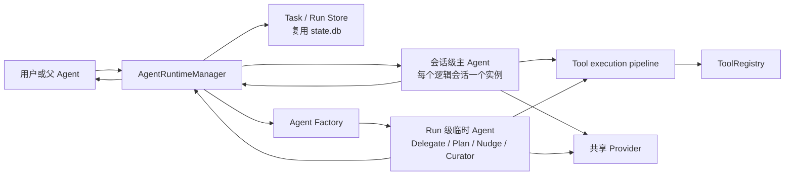
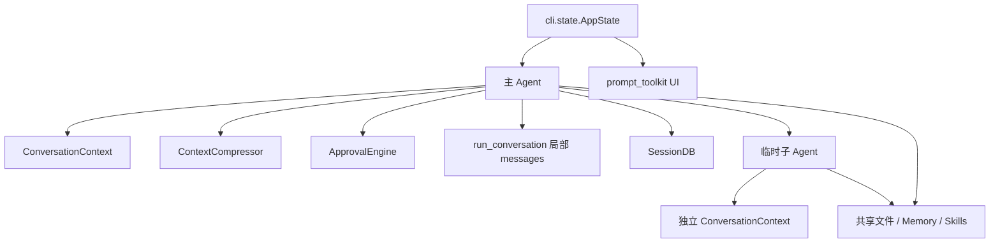
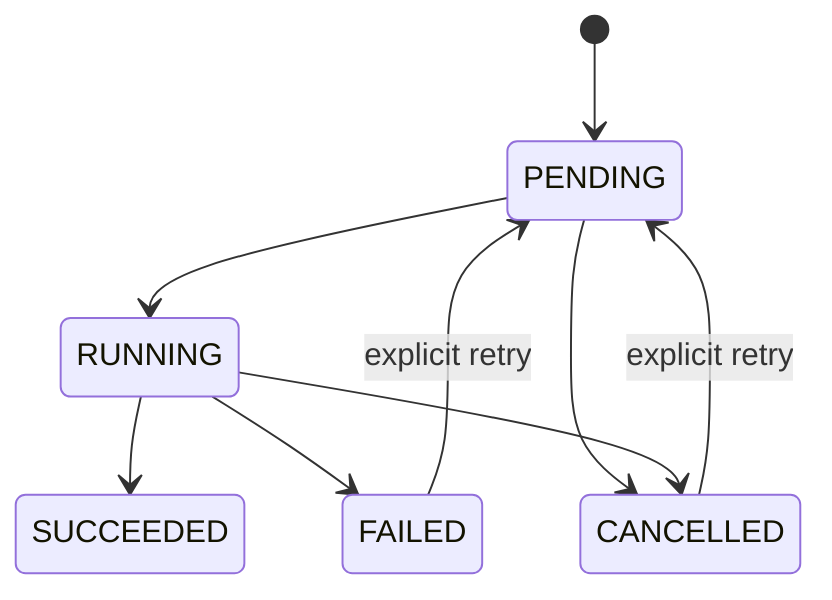

# 11 - 多 Agent 运行时与生命周期开发规划

> 状态：实施中（Phase 0、Phase 1、Phase 2、Phase 3 已完成）
> 适用版本：MiniHermes 1.1.7 当前代码
> 核对日期：2026-08-11
> 目标：在不推翻现有 Agent Loop、工具系统、审批系统和 SessionDB 的前提下，逐步建立统一的 Agent 生命周期、任务状态、工具错误、取消超时和受控并行能力。

实施进度（2026-08-11）：

- Phase 0 已完成：pytest 基线、每 Run 迭代预算、Plan 消息隔离、空白名单语义和 tool result 配对均已通过测试。
- Phase 1 已完成开发门禁：串行 Runtime、Task/Run/Event 持久化、主 Agent 会话句柄、`/clear`/`/resume` 重建、Provider 失败收尾、Ctrl+C 状态迁移、压缩链关联和启动恢复均已通过测试。
- Phase 2 已完成：Delegate、Plan 统一通过 Runtime `run_ephemeral()` 登记，父子关系、隔离、取消前置、Factory 失败收尾和 `/agents`、`/agent` 查询均已通过测试。
- Phase 3 已完成：工具权限快照、参数级白名单、结构化执行结果、工具执行审计、ApprovalMode、typed retry、Provider attempt 记账和脱敏诊断均已接入。
- 当前共 42 个离线测试通过，完整编译通过，wheel 已验证包含 Runtime、ToolAccessPolicy 和 ToolExecutionResult 且可直接导入。
- 按本文第 19 节门禁，Phase 1 到 Phase 3 仍是不可单独发布的迁移阶段；Nudge/Curator 暂停自动执行并记录待处理类型，必须在 Phase 4 纳入 Runtime 后恢复。

---

## 0. 文档用途

这份文档不是要求一次性重写项目，而是后续多 Agent 改造的顺序、边界和验收依据。

后续实现必须遵守以下原则：

1. 先修正状态边界，再增加并发。
2. 先让串行委派可登记、可观察、可取消，再允许多个子 Agent 同时运行。
3. 优先复用现有目录和模块，不因为概念增多就创建大量文件。
4. 数据库采用增量迁移，不删除现有 Session 和 Message 数据。
5. 工具权限、审批和重试必须由执行层强制，不能只依赖 Prompt。
6. 每个阶段都必须可以单独运行、测试和回退；如果某阶段为迁移安全临时暂停现有功能，必须明确标成“不可单独发布”，不能长期保持半迁移状态。
7. 本文标记为“固定”的规则，在实现中不得随意改变；标记为“暂定”的细节可以根据测试结果调整。

决策强度统一按以下三类理解：

| 标记 | 含义 | 修改条件 |
|---|---|---|
| 固定 | 生命周期边界、安全不变量、状态所有权 | 必须先更新本文，说明兼容和迁移影响 |
| 暂定 | 数值、文件拆分点、CLI 展示细节 | 可依据测试和真实使用数据调整 |
| 阶段门禁 | 并发、自动重试、恢复等高风险能力 | 前置 Phase 验收全部通过后才能启用 |

本文只规划架构，不在当前阶段直接修改运行时代码。

---

## 1. 先给结论

MiniHermes 不需要提前启动一批常驻子 Agent，也不需要引入第二套数据库、消息队列或分布式系统。

适合当前项目的路线是：

```text
现有 Agent 类
+ 每个活动逻辑会话复用一个主 Agent 实例
+ 每个专项 Run 按需创建临时 Agent 实例
+ 一个 AgentRuntimeManager
+ 现有 SQLite 中的任务/运行状态表
+ 现有 ToolRegistry 上的结构化执行结果与策略元数据
```

目标形态：



这里固定区分两种对象生命周期：

- **主 Agent 是逻辑会话级对象**：当前代码本来就跨多个用户回合复用主 Agent；后续继续保留，以承载 ContextCompressor、Token 基准和进化计数器等会话级状态。同一逻辑会话同一时刻只能运行一个主 Agent Run。
- **Delegate、Plan、Nudge、Curator 是 Run 级对象**：按需创建，运行结束后销毁，不保存 Python 对象；任务、运行状态、错误、耗时和结果摘要保存在数据库中。

RuntimeManager 统一登记两者，但“统一登记”不等于“每个用户回合都重新创建主 Agent”。若未来要把主 Agent 也改成每轮临时实例，必须先把所有会话级状态提取成独立对象；当前路线不提前做这次重构。

---

## 2. 当前真实基线

### 2.1 当前存在的 Agent 类型

这些 Agent 都是同一个 `agent.agent.Agent` 类的不同实例。

| 类型 | 创建位置 | 上下文 | DB | 工具策略 | 执行方式 |
|---|---|---|---|---|---|
| 主 Agent | `main.py` | System Prompt + 主历史 | 主 SessionDB | 默认全部工具 | CLI 对话线程中运行 |
| Delegate SubAgent | `agent/delegate.py` | 固定子 Prompt + task/context，`history=[]` | `db=None` | 排除 `delegate_task`、`clarify` | 同步阻塞 |
| Plan Agent | `cli/conversation.py` | 主 Prompt + Plan Prompt，`history=[]` | 当前复用主 DB 和 session_id | `PLAN_ALLOWED_TOOLS` 白名单 | 同步阻塞 |
| Memory Nudge Agent | `evolution/nudge.py` | 最近 20 条消息的精简文本 | `db=None` | 仅 `memory` | daemon 线程 |
| Skill Nudge Agent | `evolution/nudge.py` | 最近 20 条消息的精简文本 | `db=None` | skill 相关工具 | daemon 线程 |
| Curator Agent | `evolution/curator.py` | 技能整理 Prompt | `db=None` | skill 相关工具 | daemon 线程 |

当前没有中央 Agent 调度器。每个创建点自行决定 Prompt、DB、工具过滤、审批方式和预算。

### 2.2 当前状态分布



当前主要状态来源：

- `AppState.conversation_history`：主会话的内存历史。
- `AppState.session_id`：当前 Session。
- `Agent._ctx`：Token、迭代预算、压缩标志、进化计数器。
- `Agent._compressor`：上一份摘要、冷却时间、无效压缩计数。
- `ApprovalEngine` 和 `tools.approval._session_approved`：审批状态。
- `SessionDB`：Session、Message、FTS5 搜索和 Token 统计。
- `MEMORY.md`、`USER.md`、Skills 文件：跨会话持久状态。

### 2.3 当前工具基线

当前注册了 17 个工具：

```text
bash
read_file
write_file
list_dir
web_search
web_extract
web_open
execute_code
process
memory
session_search
skill_view
skill_manage
todo
clarify
delegate_task
generate_image
```

当前工具执行链：

```text
Agent._process_tool_call
  -> JSON 参数解析
  -> ApprovalEngine.check / resolve
  -> Agent._execute_tool
  -> ToolRegistry.execute
  -> tools.retry.execute_with_retry
  -> 具体工具函数
  -> 字符串结果
  -> tool message / SessionDB
```

当前重试仅覆盖 `bash`、`web_extract`、`web_search`，错误分类依赖返回字符串中的 `Error:`、`429`、`rate limit` 等文本。

### 2.4 当前线程基线

```text
主线程：prompt_toolkit UI
对话 daemon 线程：读取 AppState.input_queue，运行主 Agent
Memory Nudge daemon 线程：按阈值启动
Skill Nudge daemon 线程：按阈值启动
Curator daemon 线程：退出阶段按周期启动
```

SQLite 使用 WAL、`check_same_thread=False` 和同一个连接，但当前没有显式写锁或状态迁移事务。

### 2.5 当前值得保留的设计

以下机制应当保留，不做无目的重写：

1. `Agent.run_conversation()` 的 ReAct 循环。
2. Provider 的流式聚合、推理内容处理和 API 重试。
3. ToolRegistry 的装饰器注册方式。
4. ApprovalEngine 的 HARDLINE / confirm 两层检查。
5. ConversationContext 与 ContextCompressor 的上下文控制思路。
6. SessionDB 的 SQLite WAL、消息持久化和 FTS5。
7. 子 Agent 的空历史、独立预算和无独立会话历史设计。
8. CLI 主线程与对话线程通过 Queue 通信的方式。
9. 配置模板对用户配置的顶层兼容合并。

---

## 3. 当前必须正视的问题

这些问题不是要求在第一步全部修复，但后续设计必须覆盖。

### 3.1 没有统一身份和生命周期

子 Agent 没有 `task_id`、`run_id`、父运行 ID、状态、取消信号和持久记录。结束后只剩 `DelegationResult` 字符串。

### 3.2 Agent 创建策略散落

Delegate、Plan、Nudge、Curator 都直接调用 `Agent(...)`。新增一种 Agent 时容易重复定义预算、工具、审批和异常处理。

### 3.3 迭代预算与会话状态混在一起

当前 `ConversationContext` 在 Agent 初始化时创建，内部 `IterationBudget` 不会在每次 `run_conversation()` 开始时重建。

目标语义应当明确为：

- 主 Agent 的最大迭代数是“每次用户请求”的预算。
- 子 Agent 的最大迭代数是“本次委派运行”的预算。
- Token 追踪、压缩器和进化计数器可以跨主会话轮次保留。

因此运行级预算与会话级上下文需要拆开，不能继续使用同一个生命周期。

### 3.4 `/clear` 没有完整重置 Session 级状态

`/clear` 当前清空历史并创建新 Session，但仍复用原 Agent，因此以下状态可能继续保留：

- IterationBudget 已用次数。
- 压缩器上一摘要和 anti-thrashing 状态。
- 审批 session 白名单。
- 冻结 Memory 快照。
- 进化计数器。

目标固定为通过 `start_session()` 关闭旧句柄并重建主 Agent；不提供继续复用旧 Agent 的零散 `reset_session_state()` 路径。

### 3.5 Plan Agent 有双份历史

Plan Agent 使用 `history=[]`，但传入主 `db` 和主 `session_id`。因此规划过程写入 SQLite，却没有进入 `AppState.conversation_history`。

目标规则固定为：

> Plan 分析过程作为独立 Agent Run 记录，不写入主 conversation messages；用户批准后的 plan 文本才作为主 Agent 的新用户消息进入主历史。

### 3.6 工具过滤只控制 Schema 可见性

当前 `tool_filter` 用于 `_get_tool_schemas()`，但 `ToolRegistry.execute()` 不知道当前 Agent 权限。模型如果产生一个未展示但已注册的工具名，执行层仍可能执行。

另外，`ToolRegistry.get_schemas()` 使用 `if include`，导致空集合 `include=set()` 被解释为“全部工具”，而不是“禁止全部”。

目标规则固定为：

> 同一份 ToolAccessPolicy 同时用于 Schema 过滤和执行前强制检查；空白名单必须表示零工具。

这项规则不等于现在就增加多个固定角色，也不要求扩大子 Agent 永久禁用集合。

### 3.7 子 Agent 自动审批风险

Delegate、Plan、Nudge、Curator 普遍使用 `auto_approve=True`。这会绕过 confirm 规则，尤其 Delegate 当前仍能看到大量有副作用的工具。

目标审批模式固定为三类，而不是一个布尔值：

```text
interactive      需要确认时交给主 UI
deny_sensitive   无交互环境下遇到 confirm 自动拒绝
trusted          仅显式受信内部流程可使用，默认禁止配置
```

HARDLINE 在任何模式下都不能绕过。

### 3.8 工具错误是字符串，不是状态

当前工具返回 `str`，重试器通过字符串判断错误。存在以下问题：

- 无法可靠区分业务输出中包含 `Error:` 和真实执行失败。
- 无法统一记录 attempt、duration、retryable、error_code。
- 权限拒绝、用户拒绝、超时、取消、参数错误混在同一返回类型中。
- Agent Run 无法判断工具失败是否已恢复。

### 3.9 `bash` 自动重试可能重复副作用

当前所有 `bash` 超时都会重试并扩大 timeout。命令可能已经部分执行，例如写文件、安装依赖或推送远程，再次执行可能重复副作用。

目标规则固定为：

> 有副作用或幂等性未知的工具默认不自动重试；首版完全关闭 `bash` 自动重试，不尝试解析 Shell 文本猜测幂等性。

`web_search`、`web_extract` 可以按瞬时错误重试；以后只有出现独立、结构化且可证明只读的命令工具时，才重新评估命令重试。

### 3.10 后台 Agent 缺少统一收尾

Nudge 和 Curator 使用 daemon 线程，主进程退出时可能被直接终止。当前没有运行登记、完成状态或失败记录。

### 3.11 共享资源缺少并发策略

即使 Agent 上下文独立，它们仍共享：

- Provider。
- SQLite 连接。
- 当前工作目录。
- MemoryStore 单例。
- Skills 和 usage 文件。
- 终端输出。

没有资源锁时，直接并行可能产生文件覆盖、Memory 丢失更新、终端输出交错和数据库状态竞争。

### 3.12 压缩 Session 与逻辑会话不是同一概念

ContextCompressor 会调用 `SessionDB.create_child_session()`，结束当前 Session 并创建带 `parent_session_id` 的新 Session。也就是说，一次用户理解中的连续对话可能横跨多个 SQLite `sessions` 行。

如果 Runtime 只保存当前 `session_id`，会产生三个问题：

- 压缩后旧 Run 和新 Run 看起来属于不同会话。
- 审批白名单可能在压缩时意外丢失或越界继承。
- `/agents`、取消和清理无法稳定定位整条压缩链。

目标固定区分：

```text
conversation_id  逻辑会话 ID，取压缩链根 Session ID，整条链保持不变
session_id       当前物理 Session 段，压缩后会改变
```

不新增 `conversations` 表。现阶段利用现有 `sessions.parent_session_id` 解析根 ID，并在 Task/Run 中保存稳定的 `conversation_id`。

### 3.13 任务正文不能无条件重复持久化

主用户消息已经保存在 `messages`，Delegate 的 context 还可能包含源码、环境信息或凭证。若 Task 表再次保存完整 `request_text`、`context_text` 和 `result_text`，会扩大数据库、增加敏感信息副本，并与“暂不支持重启恢复完整任务”冲突。

第一版只在 Runtime 表中保存经过截断、脱敏的 preview，不保存原文或原文 hash。完整主对话继续由 `messages` 保存；临时 Agent 的完整 task/context 默认只存在于本次运行内存中。是否持久化可恢复 payload 留到恢复能力阶段单独设计。

### 3.14 中断可能留下孤立 tool call

当前主循环在遍历 `result.tool_calls` 时发现 `_interrupt_requested` 会直接 `break`。已经写入 history/DB 的 assistant message 仍包含整批 tool calls，但尚未执行的调用没有对应 tool result，下一次请求可能违反 Provider 的消息配对要求。

固定规则：只要 assistant tool_calls 已经进入消息历史，这一批每个 `tool_call_id` 都必须得到结果。中断前未开始的调用写入结构化 `CANCELLED` 结果，权限拒绝写 `DENIED`，参数错误写 `FAILED`，不能简单跳过。

### 3.15 Run 失败可能让内存历史与数据库历史分叉

`Agent.run_conversation()` 当前先把 user message 写入 SQLite，再调用 Provider。若 Provider 或后续代码抛出未捕获异常，CLI 的 `AppState.conversation_history` 不会更新，但数据库已经多出本轮的部分消息。恢复 Session 后看到的历史会与失败前内存状态不同。

Phase 1 为 `messages` 增加可空的 `agent_run_id`，新消息都关联到 Run；旧消息保持 `NULL`。Run Finalizer 必须保证主对话消息形成可恢复的合法边界：

- Provider 在产生 assistant message 前失败：追加经过脱敏的 `runtime_status` assistant 占位消息。
- assistant 已声明 tool calls 后失败或取消：先为所有缺失调用补齐失败/取消 tool result。
- 不通过回滚长事务删除已经展示给用户的流式内容；用明确的 finish_reason 和 Run 状态记录不完整结束。
- `get_messages_for_llm()` 和 ContextCompressor 必须有测试证明能够处理这些状态消息和旧的 `agent_run_id=NULL` 数据。

ContextCompressor 在当前主 Run 中创建的 summary message 也必须带同一个 `agent_run_id`；压缩后的物理 Session 写入 `AgentRun.end_session_id`，并追加 `session_segment_changed` 事件。摘要 LLM 调用不是 Runtime 之外的隐藏调用：它必须接收当前 Run 的取消、deadline、usage 和 Provider attempt 上下文，不能继续直接绕过 Provider 的统一调用边界。

### 3.16 当前配置只补顶层默认值

`config/config.py:load()` 只遍历默认配置的顶层 key。用户配置一旦已有 `agent_runtime`，以后模板新增 `agent_runtime.run_timeout_seconds` 等嵌套项不会被自动补齐。

另外，`Config(config_path=...)` 虽然声明支持测试注入，但 `_ensure_loaded()` 当前仍调用全局 `load()`，没有真正读取实例的 `_config_path`。Runtime 配置测试不能建立在这个失效注入点上。

Phase 4 在首次新增 Runtime 配置前修复实例路径加载，并实现“递归补缺失值”的兼容合并：字典递归、标量和列表以用户值为准、只填不存在的 key。该操作不得覆盖用户 API Key，并必须使用临时配置文件测试。

### 3.17 工具名白名单不能限制多动作工具

Plan 的工具白名单包含 `memory`，但 `memory` 同一个 Schema 同时支持 `add/update/delete/view`。只按工具名允许就无法真正保证 Plan 只读。同类问题也存在于 `skill_manage` 的 list 与写动作。

目标 ToolAccessPolicy 必须同时支持工具名和参数级约束。例如 Plan 的 `memory.action` 只允许 `view`。LLM 看到的 Schema 应尽量把 action enum 收窄，执行入口还要再次验证实际参数；不能只靠 Prompt 中的“只读”要求。

---

## 4. 目标设计原则与不变量

以下规则属于后续实现的固定约束。

### 4.1 状态所有权

```text
AppState
  只负责 UI 展示、输入队列、审批/澄清交互和当前会话引用。

AgentRuntimeManager
  是 Agent Task / Run 当前状态和主 Agent 会话句柄的唯一管理者。

SessionDB
  是 Agent Task / Run / Event 的持久化来源。

Agent
  负责执行一次对话 Run；主 Agent 实例可跨 Run 保留会话级上下文，
  但不直接决定持久状态迁移。

Renderer
  只展示事件，不作为状态来源。
```

### 4.2 必须长期成立的不变量

1. 每次 Agent 调用 LLM 前必须已有 `task_id` 和 `run_id`。
2. 一个 Run 只能进入一个终态；终态 Run 不得重新打开，重试必须创建新 Run。
3. Task 只有通过专用、可审计的显式重试操作才能从失败态重新排队，普通状态更新不能重开 Task。
4. 每个 OpenAI `tool_call_id` 必须产生一个对应的 tool result，包括错误、拒绝和取消。
5. 工具访问策略必须在 Schema 层和执行层使用同一份不可变快照。
6. 子 Agent 的有效权限不能超过父 Agent 当前权限和该 Agent kind 的权限上限。
7. 后台 Agent 遇到需要交互审批的操作必须 fail closed。
8. 收到取消后不得开始新的 LLM 请求或新的工具调用；请求取消不等于已经取消完成。
9. Run 结束后必须从 live handles 中移除，即使发生异常。
10. 数据库中的 Run 终态不可被普通更新覆盖。
11. 同一 `conversation_id` 同一时刻最多有一个主 Agent Run。
12. Context 压缩只能改变物理 `session_id`，不能改变逻辑 `conversation_id`。
13. 运行表和事件不得保存 API Key、密码、完整敏感工具参数或未脱敏任务正文。
14. 单个工具失败不自动等于 Agent Run 失败；Agent 可以根据 tool result 恢复。
15. 并发数默认保持 1，只有并发阶段验收完成后才能提高。
16. 同一 Task 同一时刻最多有一个非终态 Run；重试只能在上一 Run 已终态后创建新 attempt。

---

## 5. 目标领域模型

### 5.1 AgentTask：逻辑任务

一个 Task 表示需要完成的逻辑目标，与具体执行尝试分离。

建议字段：

```python
AgentTask:
    task_id: str
    conversation_id: str | None
    session_id: str | None
    parent_task_id: str | None
    kind: str
    title: str
    request_preview: str
    context_preview: str
    status: TaskStatus
    last_run_id: str | None
    created_at: float
    finished_at: float | None
    result_preview: str | None
    error_code: str | None
    error_message: str | None
```

`session_id` 是创建任务时的物理 Session 段，`conversation_id` 是压缩链根 ID。`title` 和 preview 都必须先截断和脱敏；不得额外保存基于未脱敏原文计算的 hash，避免低熵凭证或隐私数据被离线猜测。

`kind` 初始支持：

```text
main_turn
delegate
plan
memory_nudge
skill_nudge
curator
```

暂不引入 explorer/editor 等 Profile。Profile 是以后可以挂到 Run 上的配置，不是生命周期成立的前提。

### 5.2 AgentRun：一次执行尝试

一个 Task 可以因为手动重试产生多个 Run。

```python
AgentRun:
    run_id: str
    task_id: str
    parent_run_id: str | None
    conversation_id: str | None
    start_session_id: str | None
    end_session_id: str | None
    attempt: int
    agent_kind: str
    status: RunStatus
    model: str
    tool_policy_json: str
    approval_mode: str
    max_iterations: int
    timeout_seconds: float | None
    iterations_used: int
    provider_attempts: int
    prompt_tokens: int
    completion_tokens: int
    reasoning_tokens: int
    created_at: float
    started_at: float | None
    finished_at: float | None
    completion_reason: str | None
    error_code: str | None
    error_message: str | None
```

`completion_reason` 与 `status` 分开。例如：

```text
status=FAILED, completion_reason=budget_exhausted
status=CANCELLED, completion_reason=user_interrupt
status=FAILED, completion_reason=provider_auth_error
status=SUCCEEDED, completion_reason=stop
```

这样不需要为每种错误增加一个状态。

### 5.3 SessionAgentHandle：主 Agent 的会话级句柄

```python
SessionAgentHandle:
    conversation_id: str
    current_session_id: str
    agent: Agent
    session_cancel_event: threading.Event
    run_lock: threading.Lock
```

该句柄只存在于 RuntimeManager 内存中。`run_lock` 保证同一逻辑会话不会同时执行两个主 Agent Run；压缩发生时只更新 `current_session_id`，不更换 `conversation_id`。

`run_lock` 与后文 Runtime 级串行执行门不是同一把锁：前者负责单个逻辑会话的主 Run 准入，并在 Phase 5 并发后继续保留；后者只负责 Phase 1 到 Phase 4 的全局 Agent Loop 串行。主 Run 的固定加锁顺序是先 `run_lock`、再 Runtime 执行门；同步 Delegate 只重入 Runtime 的 `RLock`，不获取父会话的 `run_lock`。SessionDB 的短事务锁是第三类锁，不能覆盖 LLM、工具或 UI 等待。

`/clear` 和 `/resume` 会销毁旧句柄并通过统一 Factory 重建主 Agent，避免 Compressor、审批或冻结 Memory 状态泄漏。普通用户回合不重建主 Agent。

### 5.4 LiveRunHandle：仅内存存在

```python
LiveRunHandle:
    run_id: str
    agent: Agent | None
    owns_agent: bool
    cancel_event: threading.Event
    started_monotonic: float
    deadline_monotonic: float | None
    future: Future | None
```

Agent 对象、Lock、Future、Event 不能写入 SQLite，也不能 pickle。`owns_agent=False` 表示本 Run 借用会话级主 Agent，结束 Run 时不能销毁该 Agent。临时 Run 在 Factory 构造前先以 `agent=None` 注册 handle，使构造阶段也能接收取消；构造成功后再填入 Agent。

### 5.5 ToolExecution：工具调用状态

工具状态在结构化工具阶段增加：

```python
ToolExecution:
    execution_id: str
    run_id: str
    tool_call_id: str
    tool_name: str
    status: ToolStatus
    attempts: int
    retryable: bool
    created_at: float
    started_at: float | None
    finished_at: float | None
    error_code: str | None
    error_message: str | None
    output_preview: str | None
```

主 Agent 的完整 tool output 继续保存在现有 `messages`；`persist_messages=false` 的临时 Agent 只在本次 Run 内存中保留中间输出，结束后不写 SQLite。Runtime 表对两者都只保存经过截断和脱敏的 preview，父 Agent 最终收到的 Delegate 结果仍按普通 tool message 写入主历史。

### 5.6 AgentEvent：追加式审计事件

只保存生命周期和关键决策：

```text
task_created
task_requeued
task_succeeded
task_failed
task_cancelled
run_queued
run_started
provider_retrying
tool_started
tool_retrying
tool_finished
session_segment_changed
skill_lifecycle_changed
curator_proposal_created
cancel_requested
run_succeeded
run_failed
run_cancelled
run_timed_out
run_interrupted
```

`AgentEvent` 至少保存递增 `event_id`、`task_id`、可空 `run_id`、`event_type`、脱敏 payload 和 `created_at`。`task_created/task_requeued` 发生时可以还没有 Run，因此不能强制每个事件都有 `run_id`。状态行更新和对应事件必须在同一事务提交。

事件写入后只能追加，不能修改旧事件。用户明确删除逻辑会话时，允许按隐私删除规则级联删除对应 Runtime 记录和事件；这不属于篡改审计历史。

---

## 6. 状态机

### 6.1 Task 状态



Task 是多个执行尝试的聚合状态，只有 `SUCCEEDED` 是永久终态。Run 的 `TIMED_OUT`、`INTERRUPTED` 或 `FAILED` 最终都把 Task 聚合为 `FAILED`；Run 的取消把 Task 聚合为 `CANCELLED`。

`FAILED/CANCELLED -> PENDING` 只能由 `requeue_task()` 完成：必须写入审计事件，清空 Task 聚合字段中的 `finished_at/result_preview/error_*`，并通过副作用重放检查；随后创建的新 Run 使用 `max(existing attempt) + 1`。旧 Run 及其终态保持不变。Phase 1 不提供用户重试命令，只把这一语义固定下来。

### 6.2 Run 状态

```text
QUEUED
RUNNING
CANCEL_REQUESTED
SUCCEEDED
FAILED
CANCELLED
TIMED_OUT
INTERRUPTED
```

允许的迁移必须写成中央映射，由 Store 执行条件更新：

```python
ALLOWED_TRANSITIONS = {
    "QUEUED": {"RUNNING", "CANCELLED"},
    "RUNNING": {
        "SUCCEEDED", "FAILED", "CANCEL_REQUESTED",
        "INTERRUPTED",
    },
    "CANCEL_REQUESTED": {
        "CANCELLED", "FAILED", "TIMED_OUT", "INTERRUPTED",
    },
}
```

deadline 到达时先进入 `CANCEL_REQUESTED`，并记录 `completion_reason=deadline_exceeded`；只有 worker 实际停止后才进入 `TIMED_OUT`。这避免数据库显示“已超时结束”，但后台线程仍继续执行。

数据库更新必须包含旧状态条件：

```sql
UPDATE agent_runs
SET status = ?, finished_at = ?
WHERE id = ? AND status IN (...);
```

若 `rowcount != 1`，说明发生非法迁移或并发竞争，不能静默覆盖。

完成与取消竞争时采用“数据库中第一个成功的条件更新获胜”：若完成先把 `RUNNING -> SUCCEEDED`，随后取消应报告已经结束；若取消先把 `RUNNING -> CANCEL_REQUESTED`，随后普通完成不能覆盖取消请求，worker 按取消路径收尾。

### 6.3 Tool 状态

```text
PENDING -> RUNNING
PENDING -> FAILED | CANCELLED | DENIED
RUNNING -> SUCCEEDED | FAILED | TIMED_OUT | CANCELLED
```

`PENDING -> FAILED` 用于参数解析失败，`PENDING -> DENIED` 用于执行前权限/审批拒绝，`PENDING -> CANCELLED` 用于同批尚未开始就收到取消的调用。`DENIED` 是正常安全结果，不应该记录成内部异常。

---

## 7. 数据库规划

### 7.1 复用现有 state.db

固定决定：继续使用 `~/.minihermes/state.db`，不新建 `agents.db`。

原因：

- Agent Run 与 Session 有直接关系。
- 当前已经启用 WAL 和增量迁移。
- 一个 CLI 不需要跨数据库事务。
- 避免用户备份、迁移和排障时面对多个状态文件。

### 7.2 建议新增表

第一阶段新增：

```text
agent_tasks
agent_runs
agent_events
```

同时对现有 `messages` 安全增加一个可空列：

```text
agent_run_id TEXT NULL
```

旧消息保持 `NULL`。该列第一版只建普通索引，不加跨表外键，避免 Runtime 记录清理与历史消息保留互相锁死。

结构化工具阶段再新增：

```text
tool_executions
```

不要在第一阶段提前创建暂时不用的表。

关系约束固定为：

```text
agent_runs.task_id -> agent_tasks.task_id
agent_events.task_id -> agent_tasks.task_id
agent_events.run_id -> agent_runs.run_id (nullable)
tool_executions.run_id -> agent_runs.run_id
```

这些 Runtime 内部关系使用外键和级联删除；`parent_task_id` 和 `parent_run_id` 使用可空自引用，删除父记录时置空，避免为了保留子任务审计而意外删除无关记录。`agent_tasks.session_id/conversation_id` 第一版保留为普通索引字段，不直接对旧 `sessions` 表增加强外键：当前数据库可能已有压缩链或手工删除后的历史数据，不能未经验证就启用全库约束。

建议索引：

```text
agent_tasks(session_id, created_at)
agent_tasks(conversation_id, created_at)
agent_tasks(parent_task_id)
agent_runs(task_id, attempt) UNIQUE
agent_runs(task_id) UNIQUE WHERE status IN ('QUEUED', 'RUNNING', 'CANCEL_REQUESTED')
agent_runs(conversation_id, created_at)
agent_runs(status, created_at)
agent_runs(parent_run_id)
agent_events(run_id, created_at)
agent_events(task_id, created_at)
messages(agent_run_id)
tool_executions(run_id, started_at)
tool_executions(run_id, tool_call_id) UNIQUE
```

### 7.3 迁移规则

1. 使用 SQLite `PRAGMA user_version` 记录 Schema 版本，不为迁移记录再创建一张表。
2. 每个版本对应一个明确的迁移函数，按版本顺序执行；迁移在显式事务中完成，成功后才提高 `user_version`。
3. 只使用 `CREATE TABLE IF NOT EXISTS` 和经过兼容检查的增量 `ALTER TABLE`，不通过删表重建处理线上数据。
4. 不修改或删除现有 `sessions`、`messages`、FTS 表中的用户数据。
5. 每次迁移必须可重复验证；迁移失败时回滚并禁止 RuntimeManager 启动。
6. 在测试中构造 `user_version=0` 的旧数据库，验证升级后旧 Session、Message、FTS 数据仍可读取。
7. 启用外键前先运行完整性检查；不能直接假定旧数据完整。新连接必须显式执行 `PRAGMA foreign_keys=ON`。
8. Session 删除逻辑必须先解析压缩链根，再在同一事务中按“FTS 索引行、messages、Runtime 子表、sessions”的依赖顺序删除该 `conversation_id` 的全部物理 Session 和 Runtime 记录，避免用户删除会话后仍残留任务 preview；不能只删除链中的一行。由于现有 `messages.session_id` 不是 `ON DELETE CASCADE`，不能只执行 `DELETE FROM sessions`。
9. 迁移时补齐或显式验证 messages FTS 的删除同步；普通迁移不得清空 FTS，用户明确删除会话时才按 FTS5 external-content 的删除协议移除对应索引行。

### 7.4 SQLite 并发策略

Phase 1 到 Phase 3 的 Agent 执行是串行的，现有连接可以继续使用，但所有多语句状态迁移从 Phase 1 起就必须使用显式事务。

Phase 4 引入跨线程取消和后台 Run，因此必须在 Phase 4 用同一个 `threading.RLock` 保护该连接的全部访问，而不只是部分写操作；多语句状态迁移必须在锁内使用显式事务。这样才能避免同一连接上的事务被其他线程语句插入。不能等到 Phase 5 并行 Delegate 时才补数据库锁。

对于当前预计 2 到 4 个 Agent 的并发规模，单连接加锁足够，不需要连接池。数据库锁不允许覆盖 LLM 请求或工具执行全过程，只包住短数据库操作。

`session_search` 不能在并行 worker 内随意创建未纳管的 `SessionDB` 实例并执行初始化/迁移；Phase 3 应改为使用 Runtime 注入的共享查询入口，或明确使用只读连接并纳入同一数据库路径的锁策略。所有方案都必须保证搜索不会与状态迁移、压缩写入互相插入事务。

锁的实现不得形成反向嵌套：主 Run 只按“会话 `run_lock` -> Runtime 执行门”进入 Agent Loop；数据库锁不在此两把锁持有期间包住远程调用。`cancel()` 先在 live registry 中取得并设置 Event，释放 registry 锁后再做数据库条件迁移；Run Finalizer 先完成短数据库迁移，再移除 live handle。若 worker 恰好在数据库迁移前观察到 Event，必须重新读取 Run 状态并等待/重试条件迁移，不能从普通 `RUNNING` 直接写 `CANCELLED`。这样取消路径不会为了拿数据库锁等待整个 Agent Loop，也不会与收尾路径互相等待。

如未来并发明显增加，再评估每线程连接；当前不提前实现。

---

## 8. AgentRuntimeManager 的职责

建议仅新增一个生产文件：

```text
agent/runtime.py
```

初期在该文件中集中放置：

- 状态 Enum。
- Task / Run / SessionAgentHandle / LiveRunHandle 数据类。
- 状态迁移校验。
- AgentRuntimeManager。
- Agent 创建参数 `AgentSpec`。

核心接口：

```python
class AgentRuntimeManager:
    # Phase 1
    def open_session(...): ...
    def close_session(...): ...
    def create_task(...): ...
    def run_main_turn(...): ...
    def get_run(run_id): ...
    def list_runs(...): ...
    def reconcile_interrupted_runs(): ...
    def shutdown(...): ...

    # Phase 2 新增
    def run_ephemeral(...): ...

    # Phase 4 新增
    def submit_background(...): ...
    def cancel(run_id, reason): ...

    # Phase 5 新增
    def submit_delegate_batch(...): ...
```

每个方法只在对应 Phase 实现，不提前写空壳。Phase 1 只使用同步的 `run_main_turn()`；Phase 2 接入 Delegate/Plan 时才增加 `run_ephemeral()`；Phase 4 的 `submit_background()` 必须先持久化 Task/QUEUED Run 再放入单 worker 队列，因此排队任务也可查询、可取消；Phase 5 的批量提交接口只接受满足并行资格的纯 Delegate 批次。

两个同步入口的差异固定为：

```text
run_main_turn
  从 SessionAgentHandle 借用主 Agent，持有该 conversation_id 的 run_lock，
  Run 结束后保留 Agent；压缩后更新 current_session_id。

run_ephemeral
  通过 Factory 创建 Agent，history 默认空，Run 结束后释放 Agent，
  用于 Delegate / Plan / Nudge / Curator。
```

Curator 保留现有的确定性 lifecycle transitions，不强迫这部分逻辑伪装成 LLM 工具调用。`submit_background()` 用一个 `curator` Task/Run 包住“确定性整理 + 可选 LLM consolidation”完整工作流；只有达到 consolidation 条件时，才由 Factory 创建临时 Curator Agent，并把其 usage 计入同一个 Run。这样没有隐藏的 Agent 实例，也不会为了无事可做的周期检查浪费模型调用。

核心流程：

```python
def _run_registered(spec, request, agent=None, parent_run_id=None):
    task = store.get_task(request.task_id) if request.task_id else store.create_task(...)
    run = store.create_run(status="QUEUED", ...)
    run_context = build_run_context(task, run, request)
    handle = LiveRunHandle(agent=agent, cancel_event=run_context.cancel_event, ...)
    live_runs[run.id] = handle

    try:
        raise_if_cancelled(run_context)
        store.start_run_and_task(run.id, task.id)  # 同一事务更新 Run 与 Task
        owns_agent = agent is None
        if owns_agent:
            agent = factory.create(spec, run_context)
            handle.agent = agent
        raise_if_cancelled(run_context)
        result = agent.run_conversation(..., run_context=run_context)
        terminal_status = map_completion_reason(result.completion_reason)
        store.finish_run_and_task(run.id, task.id, terminal_status, result)
        return AgentRunOutcome(
            run_id=run.id, status=terminal_status,
            completion_reason=result.completion_reason, result=result,
        )
    except AgentRunAborted as exc:
        store.fail_run_and_task(run.id, task.id, exc.error_code, exc.safe_message)
        return AgentRunOutcome(
            run_id=run.id, status="FAILED", completion_reason=exc.completion_reason,
            result=exc.partial_result, error_code=exc.error_code,
        )
    except AgentCancelled as exc:
        store.finish_cancelled(run.id, task.id, exc.completion_reason, exc.safe_message)
        return AgentRunOutcome(
            run_id=run.id, status="CANCELLED", completion_reason=exc.completion_reason,
            result=exc.partial_result, error_code=exc.error_code,
        )
    except AgentTimedOut as exc:
        store.finish_timed_out(run.id, task.id, exc.completion_reason, exc.safe_message)
        return AgentRunOutcome(
            run_id=run.id, status="TIMED_OUT", completion_reason=exc.completion_reason,
            result=exc.partial_result, error_code=exc.error_code,
        )
    except Exception as exc:
        store.fail_run_and_task(run.id, task.id, "internal_error", sanitize_error(exc))
        return AgentRunOutcome(
            run_id=run.id, status="FAILED", completion_reason="internal_error", result=None,
            error_code="internal_error",
        )
    finally:
        live_runs.pop(run.id, None)
```

Task/Run 和 LiveRunHandle 必须在 Agent 构造失败之前创建。Factory 构造失败也要得到一个 `FAILED` Run，而不能留下没有身份的异常。`finish_cancelled()` 和 `finish_timed_out()` 对已经启动的 Run 都只允许从 `CANCEL_REQUESTED` 收尾；它们不能绕过状态机直接把普通 RUNNING 写成终态。尚未启动的 QUEUED Run 仍可由取消入口直接原子写成 `CANCELLED`。

为解决失败时历史分叉，Agent 内部异常不能只丢出一个裸 Exception。目标接口使用携带部分结果的 `AgentRunAborted`（或等价结构）：

```python
AgentRunOutcome:
    run_id: str
    status: RunStatus
    completion_reason: str
    result: ConversationResult | None  # 成功结果或已闭合的 partial result
    error_code: str | None

AgentRunAborted:
    error_code: str
    safe_message: str
    partial_result: ConversationResult  # 含已闭合的 messages 和最新 session_id
    completion_reason: str
```

`AgentRunAborted` 只表示不可恢复的失败；`AgentCancelled` 和 `AgentTimedOut` 也必须携带同样结构的 `partial_result`，分别映射到 `CANCELLED` 和 `TIMED_OUT`。Factory 构造失败发生在消息边界建立前，可以没有 `partial_result`。因此伪代码中的 `result=...` 不是省略的普通成功值，而是对应异常携带的部分结果。

Runtime 将 Run 标记失败后仍把 `partial_result` 交还 CLI，CLI 像正常结果一样更新 `AppState.conversation_history` 和压缩后的 session_id。具体类名暂定，但“失败也必须返回可恢复消息边界”是固定要求。

`run_main_turn()` 和 `run_ephemeral()` 始终返回统一的 `AgentRunOutcome`，其中同时包含 Run 终态和可选 `ConversationResult`。失败、取消和超时不能伪装成普通成功结果；CLI 用其中的 partial result 修复历史，Delegate 则根据 `status` 构造成功或失败 tool result。

Agent Loop 必须在 ConversationResult 或结构化异常中报告明确的 completion reason，Runtime 统一映射。普通 `ConversationResult` 只承载 `stop/completed/budget_exhausted`；用户取消和 deadline 应抛出携带 partial result 的结构化异常，保证先经过 `CANCEL_REQUESTED` 再收尾：

```text
stop / completed       -> SUCCEEDED
budget_exhausted       -> FAILED
user_interrupt         -> CANCELLED
deadline_exceeded      -> TIMED_OUT（执行线程实际退出后）
provider/tool internal -> FAILED（若 Agent 无法恢复）
```

不能再通过 `final_response` 是否为空猜测 Run 是否成功。

Phase 1 到 Phase 4 使用一个 Runtime 级 `threading.RLock` 作为串行执行门：

- 主 Agent 调用同步 Delegate 时，父 Agent Loop 已暂停在工具调用位置；同一个对话线程可以重入该锁执行子 Run，不会自锁。
- 其他线程不能重入，会排队到当前 Agent 调用栈结束后再运行。Phase 1 接入 Runtime 时先暂停 Nudge/Curator 的自动 daemon 执行，仅保留触发计数；Phase 4 具备取消能力后再通过 Runtime 恢复后台执行。
- 因而数据库中父 Run 和子 Run 可以同时显示为 RUNNING，但任何时刻只有一个 Agent Loop 真正在执行。
- Phase 5 才用受控 worker pool 替换这一全局串行门；在此之前不能通过临时启动线程绕开它。

RuntimeManager 不负责：

- 拼装主 Agent 的聊天历史。
- 实现具体工具。
- 直接绘制终端 UI。
- 判断业务任务是否完成。
- 把 Agent Python 对象持久化。

---

## 9. AgentSpec：统一创建参数，不等于固定角色

不同 Agent 当前散落的构造参数应收敛成可审计的 `AgentSpec`：

```python
AgentSpec:
    kind: str
    system_prompt: str
    tool_policy: ToolAccessPolicy
    approval_mode: ApprovalMode
    max_iterations: int
    timeout_seconds: float | None
    persist_messages: bool
    background: bool
```

初始 Spec：

| kind | 生命周期 | Prompt | 工具策略 | 审批 | 总时限 | 持久消息 |
|---|---|---|---|---|---|---|
| main_turn | 逻辑会话级 Agent / Run 级预算 | 主 System Prompt | 主 Agent 权限 | interactive | 默认无 | 是 |
| delegate | Run 级 Agent | 当前 `_CHILD_SYSTEM_PROMPT` | 父权限 ∩ delegate 上限 ∩ 请求工具 | 前台 interactive；后台 deny_sensitive | 300s 暂定 | 否 |
| plan | Run 级 Agent | 主 Prompt + Plan Prompt | `PLAN_ALLOWED_TOOLS` + 多动作工具只读参数约束 | deny_sensitive | 600s 暂定 | 否 |
| memory_nudge | Run 级 Agent | Memory Nudge Prompt | 仅 `memory` | deny_sensitive | 120s 暂定 | 否 |
| skill_nudge | Run 级 Agent | Skill Nudge Prompt | `skill_view`、`read_file`、`skill_manage(list)` | deny_sensitive | 180s 暂定 | 否 |
| curator | Run 级 Agent/工作流 | Curator Prompt | LLM 仅 `skill_view`、`read_file`、`skill_manage(list)`；确定性 lifecycle 使用内部固定能力 | deny_sensitive | 300s 暂定 | 否 |

这里不预先规定 explorer、researcher、editor、verifier。以后确实需要角色模板时，在 `AgentSpec` 上增加 Profile 解析，不改变 RuntimeManager 生命周期。

`model_override` 也不在初始 AgentSpec 中预留空字段；等 Phase 6 真正实现模型路由时再增加，并同步定义 Provider 创建与费用记录语义。

---

## 10. 运行级状态与会话级状态拆分

当前 `ConversationContext` 混合了不同生命周期。目标拆分：

### 10.1 ConversationContext 保留的 Session 级状态

```text
Token 真实 usage 基准
消息数量基准
force_compress
iters_since_skill
turns_since_memory
```

`ContextCompressor` 继续由主 Agent 跨轮持有。

该阶段暂时保留 `ConversationContext` 类名以控制改动范围，但文档语义以“主 Agent 的会话级上下文”为准；其中的 IterationBudget 必须移出或在每个 Run 开始时重建。临时 Agent 因为只执行一个 Run，可以在 Agent 销毁时一起释放它的 ContextCompressor 和 Token 状态。

### 10.2 RunContext 新增的运行级状态

```python
RunContext:
    task_id
    run_id
    parent_run_id
    conversation_id
    start_session_id
    iteration_budget
    cancel_event
    deadline_monotonic
    started_monotonic
    usage_accumulator
```

每次 `run_conversation()` 必须创建或接收新的 RunContext，因此迭代预算自然按运行重置。

### 10.3 `/clear` 的固定语义

`/clear` 后应当：

1. 结束旧 Session。
2. 取消旧 Session 仍在运行的子任务。
3. 清空主 conversation history。
4. 清空旧 conversation_id 的进程内审批白名单。
5. 丢弃旧主 Agent 的 Session 级 ContextCompressor。
6. 显式从磁盘重新加载 MemoryStore 后再构建新的冻结快照，不能只复用模块级单例中的旧 `_snapshot`。
7. 创建新 Session，并通过 Factory 创建新的主 Agent Session 上下文。

固定采用“关闭旧 SessionAgentHandle，通过统一 Factory 重建主 Agent”，不在原 Agent 上逐字段 reset。当前 Agent 构造成本可接受，而重建更容易证明 Compressor、审批、冻结 Memory 和进化计数器没有泄漏。

`/resume` 同样重建主 Agent 和 SessionAgentHandle，并清空本进程内的审批授权；它恢复消息历史，但不恢复旧的瞬时审批、预算、取消令牌或 Compressor 冷却状态。

Context 压缩与 `/clear` 不同：压缩只切换 `SessionAgentHandle.current_session_id`，继续复用同一个主 Agent 和 `conversation_id`。

---

## 11. 工具权限与策略

### 11.1 ToolAccessPolicy

```python
ToolAccessPolicy:
    policy_id: str
    include: frozenset[str] | None
    exclude: frozenset[str]
    argument_allow: Mapping[str, Mapping[str, frozenset[JsonScalar]]]
    parent_policy_id: str | None
    effective_tools: frozenset[str]
```

其中 `JsonScalar` 仅指 `str | int | float | bool | None`，确保策略可以稳定序列化到 Run 记录。

有效权限：

```text
若 include=None：注册工具全集 - exclude
若 include=集合：include ∩ 注册工具全集 - exclude
子 Agent：自身策略 ∩ 父 Agent 有效权限
```

`include=frozenset()` 必须得到空集合。

创建 Run 时一次性计算 `effective_tools` 和参数约束并冻结，之后 Schema 和执行检查都使用该快照，不能在 Run 中途因全局注册表变化而扩大权限。

示例：

```python
plan_policy.argument_allow = {
    "memory": {"action": frozenset({"view"})},
}
```

参数规则第一版只支持“字段值允许集合”这种可序列化约束，不把任意 Python Callable 写进权限策略。更复杂的副作用判断属于 ToolMetadata resolver，不与访问授权混为一套不可审计逻辑。

每种 `kind` 还有 Runtime 固定的权限上限：Plan、Memory Nudge、Skill Nudge、Curator 使用明确白名单；Delegate 至少永久排除 `delegate_task` 和 `clarify`。Plan 的有效权限还要与当前主 Agent 权限求交集，不能借 Plan 模式扩大主 Agent 权限。Phase 3 为 `delegate_task` Schema 增加可选 `tools` 字段，让父 Agent 按任务主动缩小子 Agent 工具集；Schema 中的工具名 enum 只列父 Run 当前可授予的工具：

```text
effective_tools
  = 已注册工具
  ∩ 父 Run 的 effective_tools
  ∩ Agent kind 权限上限
  ∩ delegate_task 请求的 tools（若提供）
  - 显式 exclude
```

`delegate_task.tools` 的 Schema `enum` 必须由“父 Run 当前 `effective_tools` ∩ Delegate kind 上限”计算，不能把全局注册表中的工具名泄露给父模型；创建子 Run 时还要再次计算并冻结同一结果。`tools=[]` 表示零工具；省略 `tools` 时使用 kind 上限以保持兼容。父模型请求的列表只是“向下收窄提示”，不是独立安全边界，真正的边界仍是父权限、kind 上限、执行层检查和审批。

Plan 的初始策略必须与现有 `PLAN_ALLOWED_TOOLS` 对齐：允许 `read_file/list_dir/web_search/web_extract/session_search/process/memory/clarify/todo/skill_view`，其中 `memory.action` 只允许 `view`；`clarify` 是前台规划交互，不属于敏感审批，仍须接入可取消的 UI broker；`todo` 只允许规划 Run 的局部内存状态，不得写项目文件或共享持久状态。没有在白名单中的 `skill_manage`、`write_file`、`bash` 等动作即使被模型手工生成也必须在执行层拒绝。

### 11.2 双层强制

```text
LLM 前：只发送允许工具的 Schema
          多动作工具按 argument_allow 收窄 enum
执行前：ToolExecutor 再次调用 policy.allows(tool_name, args)
```

被拒绝时返回结构化 `DENIED` tool result，并记录事件，不执行工具。

### 11.3 ToolRegistry 元数据

不新增独立策略目录。优先扩展现有 `tools/registry.py` 的注册项：

```python
ToolMetadata:
    side_effect: "none" | "local" | "external" | "unknown"
    approval: "none" | "policy"
    retry: "never" | "transient" | "idempotent"
    concurrency_key: str | Callable | None
```

部分工具需要根据参数决定策略：

- `memory(view)` 只读，`memory(add/update/delete)` 写入共享状态。
- `skill_manage(list)` 只读，其他 action 修改 Skills。
- `bash` 默认 `unknown`，不能仅靠工具名认定只读。
- `web_open` 会打开本地浏览器，属于外部/UI 副作用。
- `generate_image` 会联网、写文件并打开查看器。

因此 Metadata 必须允许参数感知，不能只做静态标签。

后台 Agent 的“允许自动写入”必须是明确的 kind 级能力，不等于 `TRUSTED`：`memory_nudge` 的 `memory.action` 只允许 `view/add/update`，且受目标、索引和大小约束；禁止后台自动删除记忆。`skill_nudge` 的模型调用首版只允许读取和产出建议，不允许 `skill_manage` 的 mutation；Curator 的自动 mutation 只保留现有确定性 lifecycle 逻辑，并且只能作用于 agent-created、非 pinned、固定 Skills 目录中的对象，所有变更写入同一 Curator Run 事件。LLM consolidation 首版只生成 proposal，真正的 create/edit/archive 需要前台审批或后续专门的内部维护 capability。这样 `DENY_SENSITIVE` 不会被一个宽泛的“skill 工具集合”绕过，也不会把内部维护能力误标成通用 `TRUSTED`。

确定性归档遇到 `_archived/<name>` 已存在时必须失败并记录原因，不能先删除目标目录再移动；归档动作还应使用路径边界、provenance 和 pinned 三重校验。这样自动维护的权限边界不会因为文件碰撞变成破坏性覆盖。

---

## 12. 结构化工具执行与错误模型

### 12.1 兼容改造方式

现有工具函数暂时继续返回字符串，避免一次重写 17 个工具。

在 ToolRegistry 内新增详细执行入口：

```python
execute_detailed(tool_call, execution_context) -> ToolExecutionResult
```

保留旧接口：

```python
execute(tool_call) -> str
```

旧接口作为兼容适配器，内部调用 `execute_detailed()` 后返回 `result.model_output`。

### 12.2 ToolExecutionResult

```python
ToolExecutionResult:
    status: ToolStatus
    output: str
    model_output: str
    error_code: str | None
    error_message: str | None
    retryable: bool
    attempts: int
    duration_seconds: float
    side_effects_possible: bool
```

结构化外壳不能凭空消除旧工具的字符串歧义。Phase 3 采用以下兼容边界：

- 参数解析、权限、审批、取消、Executor timeout 和 Python 异常由执行层直接产生可靠的结构化状态。
- `bash`、`web_search`、`web_extract` 这些涉及自动重试的工具必须在 Phase 3 改为 typed adapter，重试不再依据任意正文中的 `Error:`。
- 其他旧工具如果正常返回一个符合旧约定的错误样式字符串，兼容适配器将 `status=FAILED`、`error_code=legacy_reported_error`，同时原样保留 `model_output` 交给 LLM；默认不自动重试，且不能声称已经可靠识别其业务失败。普通业务正文中偶然出现 `Error:` 不得仅凭关键词判失败。
- 后续迁移工具时可以让工具直接返回 typed payload，但旧 `str` 返回接口在当前版本继续兼容。

### 12.3 错误分类

| error_code | 是否默认重试 | Agent Run 是否立即失败 |
|---|---:|---:|
| `invalid_arguments` | 否，交给 LLM 修正 | 否 |
| `tool_not_found` | 否 | 否 |
| `tool_not_allowed` | 否 | 否 |
| `approval_denied` | 否 | 否 |
| `timeout` | 仅幂等调用 | 否 |
| `rate_limited` | 是，受 deadline 限制 | 否 |
| `network_transient` | 是，受 deadline 限制 | 否 |
| `permanent_failure` | 否 | 否 |
| `legacy_reported_error` | 否 | 否（作为 tool result 交给 LLM） |
| `cancelled` | 否 | 通常取消 Run |
| `internal_error` | 否 | 视 Agent 是否可恢复 |

工具失败后仍要把结果交给 LLM，让模型决定换工具、修改参数或向用户说明。

### 12.4 重试规则

1. 重试次数和退避属于 ToolExecutor，不属于具体工具 UI。
2. 每次重试前检查取消和剩余 deadline。
3. 重试等待必须可中断，替换当前不可中断的 `time.sleep(2.0)`。
4. 用户拒绝、权限拒绝、参数错误永不自动重试。
5. 写文件、Memory 写、Skill 写、浏览器打开等副作用操作默认不重试。
6. Phase 3 将 `bash` 的 retry policy 固定为 `never`；超时结果直接返回模型，不接受模型参数要求自动重试。
7. API Provider 重试与 Tool 重试继续分层，但都要记录 attempt。

---

## 13. 审批系统演进

### 13.1 ApprovalMode

用 Enum 替换 `auto_approve: bool`：

```text
INTERACTIVE
DENY_SENSITIVE
TRUSTED
```

兼容阶段可以暂时接收 `auto_approve`，但映射规则必须固定且 fail closed：`False -> INTERACTIVE`，`True -> DENY_SENSITIVE`，并给出弃用提示。`TRUSTED` 只能由内部代码显式传入 ApprovalMode，不能由旧布尔值、用户配置或模型参数推导。所有仓库内调用点在 Phase 3 同一提交中改完，后续再删除布尔参数。

### 13.2 逻辑会话白名单归属

当前 `_session_approved` 是模块级全局集合。目标改为按逻辑会话管理：

```text
conversation_id -> approved pattern keys
```

压缩产生的 child session 因 `conversation_id` 不变而继续使用当前授权；`/clear` 创建新 `conversation_id`，不继承；`/resume` 即使回到旧 `conversation_id`，也清空该 ID 在本进程中的历史批准项，要求敏感操作重新确认。审批白名单不写入 SQLite，不跨进程恢复。

### 13.3 子 Agent 审批

同步 Delegate 可以复用父 Agent 的审批 broker，把请求交给 CLI 主线程。

后台 Nudge/Curator 不能弹出 UI，遇到 confirm 必须返回 `DENIED`。

即使未来并行，也只能由主 UI 串行展示审批请求，不能让多个 worker 直接操作 prompt_toolkit 状态。

---

## 14. 取消、超时与失败

### 14.1 两级取消令牌

```text
Session cancel_event
  -> Run cancel_event
```

Task 是持久化聚合，不额外持有第三个内存 Event。取消 Task 时，Runtime 找出该 Task 当前非终态 Run 并设置对应 Run Event；当前设计同一 Task 最多只有一个活跃 Run。

Session 取消必须传播到该 `conversation_id` 的主 Run 以及其尚未结束的子 Run；子 Run 自己的 Event 仍由 Runtime 单独登记。`session_cancel_event` 只表达会话级取消意图，不直接写数据库状态，最终状态仍由每个 Run 的条件迁移决定。

取消检查点：

- 每轮 Agent Loop 开始前。
- API 请求前。
- Provider 流式 chunk 和重试等待期间。
- 每个工具执行前。
- 工具执行结束后、进入下一轮前。

审批和澄清也是可阻塞点，不能遗漏：`approval_callback`、`clarify_callback` 必须收到当前 Run 的取消探针和 deadline，以短间隔轮询 Queue。取消或 deadline 到达时，broker 清理与该 `run_id` 对应的 UI 状态并抛出可识别的 `AgentCancelled/AgentTimedOut`；不能把它伪装成用户主动 `deny` 或普通 clarify 超时，否则 Agent 会误以为工具已经正常返回并继续执行。UI 只允许清理仍匹配该 `run_id` 的面板，避免晚到的旧回调清掉新请求。

取消不能篡改已经发生的事实：如果工具在取消请求前已经返回成功，ToolExecution 仍记 `SUCCEEDED`，随后 Run 按取消路径停止；如果超时/取消时无法确认外部副作用是否已发生，tool result 必须带 `side_effects_possible=true` 和明确提示，不能简单声称“未执行”。这类不确定结果永不自动重试。

`cancel(run_id)` 按当前状态处理：QUEUED Run 尚未执行，可以原子写成 `CANCELLED`；RUNNING Run 只能原子写成 `CANCEL_REQUESTED`、设置 Event 并追加 `cancel_requested` 事件。对于已经开始的 Run，它不能直接写 `CANCELLED`，只有执行线程观察到 Event、停止工作并退出清理后才能进入终态。终态 Run 的 cancel 请求返回“已经结束”，不改状态。

`cancel()` 不获取覆盖整个 Agent Loop 的串行执行门，否则无法从 UI 线程打断正在持有该门的 Run；它只短暂获取 live-runs 锁和 SessionDB 的数据库锁。

若第三方阻塞调用在宽限期后仍未返回，CLI 必须显示“取消中”，Run 保持 `CANCEL_REQUESTED`；不能为了界面好看伪造终态。进程退出后，下次启动将它协调为 `INTERRUPTED`。

### 14.2 超时定义

```text
queue_timeout：排队最长时间，后续并发阶段再启用
run_timeout：从 Run 真正开始后的最长时间
batch_timeout：一组并行子任务的总等待时间
tool_timeout：单次工具尝试的最长时间
```

Phase 5 首版不单独暴露 `queue_timeout`：尚未开始的子 Run 由所属 batch deadline 约束。batch 到期时，QUEUED 子 Run 以 `CANCELLED/batch_timeout_before_start` 收尾，已经 RUNNING 的子 Run 先进入 `CANCEL_REQUESTED`，实际退出后以 `TIMED_OUT/batch_timeout` 收尾；这些子任务失败作为 Delegate tool result 返回父 Agent，不自动把仍可恢复的父 Run 判为失败。

工具实际超时：

```text
min(工具配置 timeout, Run 剩余时间)
```

持久化使用 `time.time()`，运行 deadline 使用 `time.monotonic()`。

deadline 到达和用户取消走同一套协作停止流程，区别只在 reason。由 deadline 触发且 worker 已实际停止时最终写 `TIMED_OUT`；由用户触发时写 `CANCELLED`。

### 14.3 Python 线程的限制

`Future.cancel()` 不能终止已运行线程。因此线程模式只能做到协作取消。

第一版要求所有内置阻塞操作都有边界：

- Provider 连接/读取超时。
- 可中断的 API 重试等待。
- ContextCompressor 的摘要请求和摘要重试也必须使用同一 Provider 取消/deadline 边界，不能直接调用没有取消约束的 client。
- `bash` 使用可终止进程树的实现。
- HTTP 工具有请求 timeout。
- 远程沙箱有生命周期和执行 timeout。

若未来需要对未知第三方工具提供强制终止，再评估进程隔离。当前不提前引入 `multiprocessing`。

### 14.4 启动恢复

程序启动时：

```text
数据库中 RUNNING / CANCEL_REQUESTED
  -> 标记为 INTERRUPTED
  -> completion_reason=process_restarted

数据库中 QUEUED
  -> 标记为 CANCELLED
  -> completion_reason=process_restarted_before_start
```

第一版不自动恢复运行中的 Agent，也不自动重放有副作用的任务。

第一版固定不恢复 `QUEUED`。将来若实现完整 payload 持久化和副作用重放检查，再在 Phase 6 单独设计恢复开关；当前不提前暴露无效配置。

---

## 15. 并发策略

### 15.1 不改变 Agent Loop

并发发生在 Agent Runtime 层，不把单个 Agent 的 ReAct Loop 改成多线程。

```text
一个 Agent Run 内部：仍然串行执行 LLM -> tool -> LLM
多个独立 Agent Run 之间：允许受控并发
```

### 15.2 首个并发版本

目标只支持同一轮中多个互相独立的 `delegate_task` 并发：

1. 主 Agent 一次返回两个或更多 tool calls，并且这一批全部是 `delegate_task`。
2. 主线程解析并建立多个 Task/Run。
3. Scheduler 最多启动 `max_concurrency` 个 Run。
4. Worker 只执行子 Agent，不直接修改主 `messages`。
5. 所有结果完成后，在主对话线程按原 tool call 顺序追加结果。
6. 主 Agent 再进行下一次 LLM 调用。

这不是“主 Agent 一边继续推理、一边后台等待”的全异步模式。后者暂不实现。

若同一响应混有 `delegate_task` 和其他工具，第一版整批继续按当前顺序串行执行，不猜测工具之间的依赖关系。普通工具调用即使一次返回多个，也保持 `_process_tool_call()` 的串行语义。只有“纯 Delegate 批次”进入并发路径。

### 15.3 资源冲突策略

首个并发版本在 Run 创建时根据冻结的 `effective_tools` 和参数约束判断资格。只有批次中每个 Delegate 的权限都属于并行安全集合时，整批才能进入 worker pool；只要有一个 Run 允许写入、UI 副作用或未知副作用工具，整批回退到现有串行路径，不把一个批次拆成半并行、半串行。

| 工具/动作 | Phase 5 初始策略 |
|---|---|
| `read_file`、`list_dir`、`process`、`session_search` | 可并发；session_search 经过数据库锁 |
| `web_search`、`web_extract` | 验证客户端线程安全后可并发，并受 API 并发限制；验证失败则工具级串行 |
| `execute_code` | 首版强制串行；当前实现会临时修改进程级 `E2B_API_URL/E2B_API_KEY` 环境变量 |
| `memory`、`skill_view`、`skill_manage` | 首版全部串行；前两者仍有单例懒加载或 usage 统计副作用 |
| `write_file`、`bash`、`web_open`、`generate_image` | 强制串行 |
| 未声明或元数据为 `unknown` 的工具 | 强制串行 |

Phase 5 仍要为 SessionDB、Renderer 事件队列和 Provider 限流加锁/信号量，但不在首版实现按文件路径并发写。规范化路径锁、Memory/Skills 写锁等细粒度并发属于后续优化，必须在真实需求出现后单独验收。锁只保护并发冲突，不能替代权限和审批。

### 15.4 Provider 限流

共享 Provider 可以继续保留，但必须先确认 OpenAI client 和 `Provider.stream()` 的聚合状态没有跨调用共享可变数据。RuntimeManager 在 Phase 5 创建共享 ProviderCallLimiter，Provider 的每次 HTTP/流式 attempt 都通过该 limiter 的 Semaphore，ContextCompressor 的非流式摘要 attempt 也不例外；permit 在 `finally` 中释放，重试退避等待不占 permit。具体上限暂定，默认与 Agent `max_concurrency` 相同。若压力测试发现底层 client 不支持并发，再改为每 worker 独立 client，不能只依赖猜测。

工具自有客户端也要单独验证：`web_search` 当前使用无锁懒加载的 Exa 单例，Phase 5 必须为初始化加锁并验证调用线程安全；无法证明时就在 ToolMetadata 中保持串行。Provider、工具重试器和 SubagentRenderer 在 worker 中不得直接 `_cprint`，所有提示统一转为 RuntimeEvent 进入 UI 队列。Provider 的 malformed-tool 调试文件必须使用脱敏后的有界内容和无覆盖竞争的唯一文件名。

后台 Nudge/Curator 即使进入 Phase 5 也继续低优先级串行：存在主 Agent Run、Delegate 批次或前台排队任务时不启动后台 Agent。Phase 5 唯一新增的 Agent 并发仍然是同一纯 Delegate 批次中的兄弟 Run。

Phase 4 已经为 Nudge/Curator 建立一个 Runtime 管理的单 worker 后台队列，但该 worker 仍受全局执行门约束，不会与前台 Agent Loop 重叠。Phase 5 新增的是独立的 Delegate worker pool；后台队列仍保持单 worker，不能混入 Delegate 池抢占前台并发额度。

---

## 16. CLI 与可观察性

### 16.1 建议命令

按阶段增加，不一次全部实现：

```text
/agents                  列出当前和最近 Agent Runs
/agent <run_id>          查看单个 Run 状态、耗时、错误
/cancel <run_id>         请求取消运行中 Agent
```

第一版不增加 `/retry`。重试涉及副作用语义，必须等 ToolExecution 和幂等策略完成。

### 16.2 Renderer

Renderer 接收结构化 RuntimeEvent：

```text
run_started
tool_started
tool_retrying
tool_finished
run_succeeded
run_failed
run_cancelled
run_timed_out
run_interrupted
```

Renderer 直接消费与 AgentEvent 同名的生命周期事件，不再维护第二套 `run_finished` 命名。worker 不直接更新 `AppState.conversation_history`，也不直接写主终端布局；事件由主 UI/对话线程统一消费。

后台 Nudge/Curator 默认不刷屏，但事件和结果仍可通过 `/agents` 查询。

### 16.3 示例输出

```text
RUN ID          KIND       STATUS       DURATION   TASK
run_a13f...     delegate   running      12.4s      Analyze auth flow
run_7bc2...     delegate   succeeded     8.1s      Inspect tests
run_53de...     nudge      failed        2.2s      Memory review
```

---

## 17. 配置规划

后续在 `config/config.yaml` 增加 `agent_runtime` 顶层配置，但按功能阶段逐项增加，不能提前放入尚未生效的开关：

```yaml
agent_runtime:
  # Phase 4 首次加入
  cancel_grace_seconds: 3
  run_timeout_seconds:
    main_turn: null
    delegate: 300
    plan: 600
    memory_nudge: 120
    skill_nudge: 180
    curator: 300

  # Phase 5 再加入
  max_concurrency: 1
  delegate_batch_timeout_seconds: 300
```

固定规则：

- AgentEvent 是生命周期审计依据，固定写入 SQLite，不提供 `persist_events` 关闭开关。
- Phase 4 在首次写入 `agent_runtime` 前，把 Config 的“只补顶层键”升级为递归补齐缺失默认值；只填缺失项，绝不覆盖用户已有值和凭证。
- 每次新增嵌套配置都要测试旧用户配置自动补齐，不能假定整个 `agent_runtime` 键不存在。
- Phase 5 首次暴露并发配置时默认仍为串行，`max_concurrency: 1`。
- `delegate_batch_timeout_seconds` 从批次提交时开始计时，同时约束排队和执行；到期后取消该批所有未结束的子 Run。
- 配置值必须经过类型和范围校验，非法值回退默认并给出不含敏感信息的警告。
- `main_turn: null` 表示不设置整轮总时限，仍受 Provider 和单工具 timeout 约束；临时/后台 Agent 必须有有限时长。
- `/setup` 是否立即展示这些高级选项暂定；第一版可以只允许手动编辑配置。
- 具体 timeout 数值允许根据真实运行数据调整。

---

## 18. 文件组织规则

### 18.1 第一批允许新增的生产文件

```text
agent/runtime.py
```

依据：当前缺少统一运行时管理职责，放进 `agent/` 与现有边界一致。

### 18.2 暂时不创建的文件和目录

```text
agents/                       不与现有 agent/ 重复
agent/profiles/               当前未确定固定 Profile
runtime_db/                   不创建第二套数据库层
event_bus/                    当前规模不需要通用事件总线
scheduler/                    并发阶段前不拆独立目录
agent/models.py               初期模型数量不值得拆分
session/agent_store.py        初期先复用 SessionDB
```

### 18.3 允许拆分的触发条件

如果 `agent/runtime.py` 同时满足以下任意两项，再拆文件：

- 超过约 450 行。
- 状态模型、持久化适配和调度逻辑已经形成三个独立职责。
- 单元测试必须大量 patch 私有实现才能覆盖。

届时建议拆为：

```text
agent/runtime.py              Manager / Scheduler
agent/runtime_models.py       Enum / dataclass / transitions
session/agent_store.py        SQLite persistence adapter
```

这是暂定拆分方式，到时根据真实代码调整，不提前创建空文件。

### 18.4 现有文件职责调整

| 文件 | 后续职责 |
|---|---|
| `agent/agent.py` | 保持 Agent Loop，接收 RunContext，不管理全局 Run 状态 |
| `agent/delegate.py` | 保留 DelegationRequest/Result、子 Prompt 和 AgentSpec 构建辅助；不再直接构造 Agent 或拥有生命周期 |
| `session/db.py` | Schema 迁移与初期 Task/Run/Event 持久化 |
| `tools/registry.py` | 工具注册、Metadata、权限检查、详细执行入口 |
| `tools/retry.py` | 结构化重试策略和可中断等待 |
| `approval/engine.py` | ApprovalMode 和按 conversation_id 的批准状态 |
| `cli/state.py` | UI 状态和 RuntimeManager 引用，不保存 Run 真相 |
| `cli/conversation.py` | 为主 turn/plan 提交 Runtime Task，并触发由 evolution 层提交的 nudge |
| `cli/commands.py` | `/agents`、`/agent`、`/cancel` |
| `renderer/renderer.py` | 展示 RuntimeEvent |
| `main.py` | 创建并注入唯一 RuntimeManager，启动时恢复，退出时 shutdown |
| `evolution/nudge.py` | 通过 RuntimeManager 提交后台任务 |
| `evolution/curator.py` | 通过 RuntimeManager 提交后台任务 |
| `config/config.py` | 增加 `agent_runtime` accessor |

`build_wheel.sh` 已复制整个 `agent` 目录，所以仅新增 `agent/runtime.py` 不需要修改打包清单。若未来新增顶层包，才需要同步构建脚本。

---

## 19. 分阶段实施路线

### Phase 0：测试地基与低风险语义修正

目标：先建立不依赖真实 API 的测试入口，并修复不需要 Runtime 就能独立解决的基础问题。

工作内容：

1. 创建 `tests/`，建立最小 pytest 基线。
2. 测试每次主 `run_conversation()` 都获得新的迭代预算。
3. 将 Plan Agent 改为 `db=None`，测试 Plan 分析不污染主 conversation messages。
4. 测试 `include=set()` 得到零工具。
5. 测试每个 tool call 即使参数错误也有对应 tool result。
6. 记录当前 Delegate 串行行为作为兼容测试。

Phase 0 只通过一个最小的 `ConversationContext.start_run()`（或等价入口）重建 IterationBudget，不提前引入 RunContext；Phase 1 再把该预算正式移入 RunContext，并复用同一组回归测试。`/clear` 的完整重建依赖 SessionAgentHandle，放在 Phase 1 一次完成，Phase 0 不增加临时 reset API。

预计修改：

```text
context/context.py
agent/agent.py
cli/conversation.py
tools/registry.py
tests/...
```

验收：

- 主 Agent 连续多个用户回合不会耗尽同一个全局 IterationBudget。
- Plan 分析消息不再写入主 SessionDB。
- 不改变现有 Delegate 对外 Schema 和串行结果。
- 全部新增测试通过。

### Phase 1：串行 Runtime 与持久化

目标：不增加并发，先让主 Agent 每个用户回合有身份、有状态、有记录，并建立正确的 SessionAgentHandle 生命周期。

工作内容：

1. 新增 `agent/runtime.py`。
2. 增加 AgentTask、AgentRun、SessionAgentHandle、LiveRunHandle 和状态迁移。
3. 在 SessionDB 增加 `agent_tasks`、`agent_runs`、`agent_events`，并为 messages 增加可空 `agent_run_id`。
4. `main.py` 创建唯一 RuntimeManager。
5. 主用户回合改由 `run_main_turn()` 登记后再调用现有 Agent Loop。
6. `/clear` 和 `/resume` 通过 Runtime 关闭旧句柄并重建主 Agent。
7. 压缩后更新物理 session_id，同时保持 conversation_id。
8. Run Finalizer 为 Provider 异常补齐合法的主历史收尾消息。
9. ConversationResult/异常报告 completion reason，Runtime 不再靠空文本判断成功。
10. 启动时将遗留 RUNNING 状态标记为 INTERRUPTED。
11. 现有 Ctrl+C 在 Phase 1 先作为 Runtime 内部取消请求，仍按 `CANCEL_REQUESTED -> CANCELLED` 收尾；本阶段不新增 `/cancel`。
12. Runtime 使用串行 RLock 执行门。
13. 暂停 Nudge/Curator 的自动 daemon 执行但保留触发计数，防止它们在 Phase 4 前绕过 Runtime。

第 13 项是临时迁移措施，不是期望的产品行为。由于当前模板默认 `evolution.enabled=true`，Phase 1 到 Phase 3 只能作为同一迁移分支上的开发提交，不能作为包含进化功能的正式版本单独发布；开发期间测试可显式关闭 evolution，Phase 4 必须在恢复自动执行并纳入 Runtime 后才形成可发布基线。触发计数不得在暂停期间伪造执行成功，恢复后只提交一次合并后的待处理 nudge。

预计修改：

```text
agent/runtime.py                 新增
session/db.py
main.py
agent/agent.py
context/context.py
context/compressor.py
approval/engine.py
tools/approval.py
cli/state.py
cli/conversation.py
cli/commands.py
tests/test_agent_runtime.py      新增
tests/test_agent_state_store.py  新增
```

验收：

- Runtime 的加入不改变前台对话行为；Nudge/Curator 的临时暂停按上述不可发布门禁处理，不伪装成行为完全等价。
- 每个已经接入 Runtime 的主 Agent Run 在调用 LLM 前已经写入数据库；Delegate/Plan 要到 Phase 2 才满足这条要求。
- 成功、异常和 KeyboardInterrupt 都进入正确终态。
- `/clear`、`/resume` 不继承旧审批、预算、Compressor 或取消状态。
- Context 压缩前后的 Run 可以按同一 conversation_id 查询。
- Provider 异常后内存历史和恢复历史仍处于同一个合法消息边界。
- 重启后无虚假的 RUNNING 记录。
- 旧 state.db 可以无损迁移。
- Phase 1 到 Phase 3 不会启动未登记的后台 Agent；自动 Nudge/Curator 在 Phase 4 恢复。

### Phase 2：统一前台专项 Agent 创建入口（已完成）

目标：Delegate、Plan 由 RuntimeManager 登记；后台 Nudge/Curator 继续保持暂停，避免在取消机制完成前阻塞前台或绕过串行门。

工作内容：

1. `delegate_task` 改为 Runtime `run_ephemeral()`。
2. Plan Agent 独立登记，不写主 conversation messages。
3. 增加父 Task / 父 Run 关系。
4. 增加 `/agents` 和 `/agent <run_id>` 只读查询。

预计修改：

```text
agent/runtime.py
agent/agent.py
agent/delegate.py
cli/conversation.py
cli/commands.py
cli/completers.py
cli/state.py
renderer/renderer.py
tests/test_agent_integration.py
```

验收：

- 主 Agent、Delegate 和 Plan 不再存在绕过 Runtime/Factory 的 `Agent(...)` 创建点；Nudge/Curator 的旧创建函数在 Phase 4 前不可达，并由测试明确列入待迁移清单。
- 子 Agent 中间消息仍不污染主对话历史。
- `/agents` 能看到主 Agent、Delegate、Plan 的终态。

### Phase 3：工具权限、结构化结果与错误处理

状态：已完成（2026-08-11）。Phase 3 保持串行执行，未提前启用并行 Delegate；Nudge/Curator 仍等待 Phase 4 纳入 Runtime。

目标：把工具执行从字符串约定升级为可管理状态。

工作内容：

1. ToolAccessPolicy 同时约束 Schema、参数 enum 和执行入口。
2. 为 Agent kind 定义权限上限，Delegate 支持可选 `tools` 向下收窄。
3. 增加 ToolMetadata 和参数感知策略。
4. 增加 `execute_detailed()` 和 ToolExecutionResult。
5. 现有 `execute()` 保持字符串兼容。
6. 重试器改为结构化 error_code 和可中断等待。
7. 新增 `tool_executions` 表。
8. ApprovalMode 替换内部 `auto_approve`。
9. 修正 `bash` 非幂等重试风险。
10. 将 `bash`、`web_search`、`web_extract` 接入 typed adapter；其他旧工具错误字符串按 `legacy_reported_error` 处理。
11. Provider API 重试继续保留，但把总 attempt 累计到 AgentRun 并追加脱敏的 `provider_retrying` 事件。
12. Provider 的 malformed-tool 诊断默认不落完整原始参数，只保存脱敏、截断后的调试信息。
13. 收窄后台 Skill Nudge/Curator 的参数级工具权限；模型只读分析和提案，禁止借 `skill_manage` mutation 绕过审批。

预计修改：

```text
agent/runtime.py
provider/provider.py
context/compressor.py
tools/registry.py
tools/retry.py
tools/__init__.py
tools/approval.py
tools/bash.py
tools/files.py
tools/search.py
tools/web_extract.py
tools/browser.py
tools/code_execution.py
tools/process_tool.py
tools/memory.py
tools/session_search.py
tools/skills_tool.py
tools/skill_manage.py
tools/todo.py
tools/clarify.py
tools/delegate.py
tools/image_gen.py
agent/agent.py
agent/delegate.py
approval/engine.py
cli/conversation.py
cli/plan.py
evolution/nudge.py
evolution/curator.py
session/db.py
renderer/renderer.py
tests/test_tool_access_policy.py
tests/test_tool_execution.py
tests/test_approval_modes.py
```

验收：

- 未授权工具即使被模型手工生成也不会执行。
- Plan Agent 调用 `memory(add/update/delete)` 会被执行层拒绝，只允许 `view`。
- 权限拒绝、用户拒绝、超时、瞬时错误可以区分。
- 未迁移工具的错误样式字符串明确标记为 `legacy_reported_error`，不会被透明自动重试。
- 每个 attempt 有准确记录。
- 单个工具失败后 Agent 可以继续选择替代方案。
- 有副作用工具不会被透明重复执行。

验证结果：42 个离线测试通过；完整源码编译通过；`git diff --check` 通过；wheel 构建并完成解压导入验证。

### Phase 4：取消、超时与后台 Agent 生命周期

状态：已完成（2026-08-11）。取消、deadline、审批/澄清 broker、工具时限和 Bash 进程树清理已统一接入 Runtime；Nudge/Curator 已迁入 Runtime 单 worker 后台队列，仍保持全局串行，不提前启用 Phase 5 并行 Delegate。

目标：做到状态和真实执行一致，不产生“数据库已取消、后台还在跑”，并在此基础上接管 Nudge/Curator。

工作内容：

1. RunContext 增加 cancel_event 和 deadline。
2. Ctrl+C 从主 Agent 扩展到当前 Session 的活跃子 Run。
3. Provider、ContextCompressor、重试等待、Agent Loop 接入统一取消检查，所有模型调用都经过同一 Provider attempt 边界。
4. 工具 timeout 不超过 Run 剩余时间。
5. 改造 `bash`，确保取消/超时后清理进程树。
6. 为同批未开始的 tool calls 补齐 `CANCELLED` tool result。
7. 审批和澄清 broker 接入 Run 取消/deadline，取消时唤醒等待并清理对应 UI。
8. 增加 `/cancel <run_id>`。
9. Runtime 建立一个可 shutdown/join 的单 worker 后台队列；Nudge/Curator 通过它登记为低优先级 Run，并恢复 Phase 1 暂停的自动执行，不再由 evolution 模块直接创建 daemon 线程。
10. 有前台任务排队时不启动新后台 Run；前台输入可请求取消正在运行的 Nudge。
11. SessionDB 全部访问接入数据库 RLock，验证取消与完成的条件更新竞争。
12. 修复 `Config(config_path)` 实例加载，支持递归补齐嵌套默认值，再增加首批 `agent_runtime` timeout 配置。
13. Runtime shutdown 处理活跃任务和宽限期，Curator 受同一规则管理。

预计修改：

```text
agent/runtime.py
agent/agent.py
context/context.py
context/compressor.py
provider/provider.py
session/db.py
approval/engine.py
tools/registry.py
tools/retry.py
tools/bash.py
tools/search.py
tools/web_extract.py
tools/code_execution.py
tools/image_gen.py
tools/clarify.py
tools/approval.py
tools/browser.py
cli/keybindings.py
cli/commands.py
cli/state.py
cli/conversation.py
cli/approval.py
cli/clarify.py
main.py
config/config.py
config/config.yaml
evolution/nudge.py
evolution/curator.py
renderer/renderer.py
tests/test_agent_cancellation.py
tests/test_agent_timeout.py
tests/test_background_agent_lifecycle.py
tests/test_config_merge.py
```

验收：

- 取消后不再开始新的 LLM 或工具调用。
- 排队任务可以立即取消。
- Bash 超时后没有可识别的遗留进程树。
- 超时与正常完成竞争时只产生一个终态。
- `CANCEL_REQUESTED` 的遗留 Run 在重启后正确转为 `INTERRUPTED`。
- 每个中断的 tool call 仍有合法 tool result。
- 在审批、澄清或 ContextCompressor 摘要等待期间取消，Run 能退出且不会遗留旧 UI 面板，也不会被误记成用户拒绝。
- 搜索代码库后，除 Runtime/Factory 外不再存在绕过登记的 `Agent(...)` 创建点。
- `/agents` 能看到 Nudge/Curator 的排队、取消、失败和完成状态。

验证结果：49 个离线测试通过；完整源码编译通过；`git diff --check` 通过；wheel 构建完成并从 wheel 直接导入验证。
- 后台 Agent 不会绕过审批，也不会无限阻塞下一次用户请求。
- UI 退出时先由 Runtime 取消并 join 活跃对话/后台 worker，再关闭 SessionDB；宽限期内无法停止的 Run 保持 `CANCEL_REQUESTED`，不能让数据库连接提前关闭。
- 旧配置中的模型 API Key 等已有值不被默认模板覆盖，新增嵌套键可以自动补齐。

### Phase 5：受控并行 Delegate

状态：已完成（2026-08-11）。默认配置保持 `max_concurrency: 1`；只有同一响应中的纯 `delegate_task` 批次、且所有子 Agent 的有效工具权限都落在显式只读安全集合时，才进入固定大小的 Delegate 线程池。写入、UI、未知、网络搜索和沙箱工具都会使整批回退串行。批次在父 Run 的执行门内运行，后台 Nudge/Curator 因此不会重叠；子 Agent 的渲染事件通过队列交回父线程。Provider 的流式与非流式请求共享可取消的 Semaphore，避免并发批次突破 API 并发上限。

目标：多个独立子任务同时运行，主 Agent 等待批次结果后继续。

工作内容：

1. Runtime 增加独立的固定大小 Delegate ThreadPoolExecutor；Phase 4 的单 worker 后台队列继续保留。
2. 增加 ProviderCallLimiter 和 API 并发 Semaphore。
3. 识别同一 LLM 响应中的纯 `delegate_task` 批次；混合工具批次继续串行。
4. 只有整批 Delegate 的 effective_tools 都满足并行安全集合时才并发，否则整批串行。
5. 主对话线程按原 tool call 顺序提交结果。
6. 保持后台 Agent 低优先级串行，不与主 Run 或 Delegate 批次重叠。
7. Renderer 使用事件队列，避免多线程直接打印。
8. `max_concurrency` 默认仍为 1，由用户显式提高。
9. 增加 Delegate batch 总 deadline；超时后取消未完成子 Run，并按原 tool call 顺序返回结构化失败结果。

预计修改：

```text
agent/runtime.py
agent/agent.py
agent/delegate.py
provider/provider.py
tools/registry.py
tools/retry.py
tools/search.py
renderer/renderer.py
cli/state.py
config/config.py
config/config.yaml
tests/test_agent_concurrency.py
tests/test_parallel_eligibility.py
tests/test_provider_limiter.py
```

验收：

- 测试中显式设置 `max_concurrency=2`，两个延时子任务的总耗时证明发生了重叠执行；默认配置 `1` 的测试仍必须证明完全串行。
- `max_concurrency` 永不超限。
- 一个子 Agent 失败不取消独立兄弟任务。
- 主 messages 中的 tool results 顺序稳定。
- 任一 Delegate 拥有写入、UI 或 unknown 工具权限时，整批回退串行。
- `execute_code` 因进程级临时环境变量而触发整批串行；Exa client 未通过线程安全测试时 `web_search` 同样串行。
- Nudge/Curator 不与前台 Run 或 Delegate 批次重叠。
- Ctrl+C 能取消整批任务。
- batch timeout 能取消排队和运行中的子 Run，父 Agent 收到完整且顺序稳定的 tool results。

验证结果：61 个离线测试通过，覆盖并行重叠、默认串行、并发上限、失败隔离、结果顺序、危险工具回退、Ctrl+C、批次 deadline、Provider limiter，以及可编辑安装与 wheel 入口；完整源码编译与 `git diff --check` 通过。

### Phase 6：可选 Profile、任务依赖与更高级调度

这一阶段不提前承诺具体实现，只定义扩展方向：

- 可配置 Agent Profile。
- 任务依赖图和前置条件。
- 针对只读/写入/验证任务的调度策略。
- 失败后人工或自动重试。
- 按模型成本、能力选择 Provider。
- 更严格的进程级隔离。
- 可恢复检查点。

只有真实需求和前面阶段的数据证明有必要时才实施。

---

## 20. 测试策略

### 20.1 测试层级

```text
单元测试
  状态迁移、权限计算、错误分类、重试策略

集成测试
  FakeProvider + Agent Loop + Runtime + 临时 SQLite

并发测试
  Event/Barrier 控制执行顺序，禁止依赖脆弱 sleep

恢复测试
  人工写入 RUNNING 状态后重启 Runtime

打包测试
  构建 wheel，安装后导入 agent.runtime 并启动 help
```

### 20.2 FakeProvider

测试不能调用真实中转站。FakeProvider 应支持脚本化返回：

```text
纯文本响应
单工具调用
多工具调用
429 后成功
流式中断
Malformed tool arguments
永久 Provider 错误
```

### 20.3 必测竞争条件

1. 完成与取消同时发生。
2. 超时与工具返回同时发生。
3. 多个 worker 同时更新不同 Run，取消线程与完成线程竞争同一 Run。
4. 带 `write_file`、`bash` 或 unknown 工具权限的 Delegate 批次回退串行。
5. 一个线程失败，其他线程继续。
6. shutdown 时仍有排队和运行任务。
7. Nudge 与主 Agent 竞争执行时，Nudge 排队或取消，二者不会同时写 Memory。
8. Curator 与 Skill Nudge 同时就绪时保持低优先级串行，不会同时修改 Skills。
9. Context 压缩切换 session_id 时 conversation_id 保持不变。
10. Phase 1 到 Phase 4 的同步 Delegate 可以重入 Runtime 执行门，后台 Nudge 不能插入父子调用栈；会话 `run_lock`、Runtime 执行门和 SessionDB 锁的获取顺序不产生死锁。
11. 未脱敏 task/context 不会进入 Runtime 表和事件。
12. ProviderCallLimiter 的并发上限在成功、异常和取消路径都不会泄漏 permit。
13. Plan 的 `memory.action` Schema 只展示 `view`，手工构造写 action 仍被执行层拒绝。
14. 在 approval/clarify Queue 等待期间取消或超时，等待线程被唤醒且只清理对应 Run 的 UI 状态。
15. ContextCompressor 的摘要消息带当前 `agent_run_id`，摘要请求计入 Provider attempt、deadline 和 limiter。
16. Phase 5 的并发测试显式设置 `max_concurrency=2`；默认值 `1` 的回归测试不允许出现重叠执行。
17. `session_search` 不创建绕过共享锁策略的可写 SessionDB 连接。
18. 并发搜索客户端初始化、Provider retry 提示和 malformed-tool 诊断不会产生竞态、交错终端输出或敏感原文落盘。

### 20.4 每阶段通用检查

```text
pytest -q
python -m compileall agent approval cli config context evolution provider renderer session skills tools
git diff --check
bash build_wheel.sh
```

Windows 环境中 `build_wheel.sh` 可在 Git Bash/WSL 执行；至少保证 wheel 构建在发布前完成。

---

## 21. 安全与隐私规则

1. Runtime Event 不保存完整 API Key、Authorization header 或 `.env` 内容。
2. 工具参数只保存脱敏 preview 和必要的长度，不保存基于未脱敏原文计算的 hash。
3. Task request/context/result 只保存脱敏 preview，不保存临时 Agent 完整 payload 或原文 hash。
4. 主 Agent 的完整 Tool result 继续走现有 messages；临时 Agent 中间结果默认不持久化，Runtime 表只保存脱敏 preview。
5. 异常消息写入数据库前去除 URL 中的 token/query secret。
6. 后台 Agent 默认 `DENY_SENSITIVE`。
7. 子 Agent 权限永不超过父 Agent 权限。
8. 自动重试不得重复未知副作用。
9. 远程沙箱、搜索和模型中转站属于不同外部信任边界，事件中应记录 provider 类型但不记录凭证。
10. malformed tool arguments 可能直接包含凭证或源码；默认禁止把完整原文写入 debug log，诊断文件只能保存脱敏、截断内容，并以原子唯一命名避免并发覆盖。

---

## 22. 提交和发布规则

建议每个 Phase 至少一个独立提交，不把数据库迁移、并发和 UI 大改混入同一提交。

推荐提交顺序：

```text
1. 测试基线与状态语义修正
2. Runtime 模型和 SQLite 迁移
3. Delegate/Plan 接入
4. 结构化工具执行和审批模式
5. 取消、超时与 Nudge/Curator 接入
6. 受控并行
7. 文档、wheel 和版本发布
```

每个提交必须：

- 不包含用户配置和 API Key。
- 不提交 `~/.minihermes/state.db`。
- 不顺手重构无关模块。
- 同步更新相关 docs 和 AGENTS.md 中已经失效的描述。
- 保持旧配置可以启动。

数据库迁移的“回退”只回退应用代码，不通过删表或删除列逆向破坏用户数据；新增的 nullable 列、表和索引在旧代码下应被安全忽略，待下一次正式迁移再继续使用。需要改变既有字段语义时，必须另做兼容迁移和回退方案，不能把普通 Git 回退当成数据库回滚。

---

## 23. 明确暂缓的决策

以下内容现在只定方向，不锁定细节：

1. 是否建立固定 explorer/researcher/editor/verifier Profile。
2. Profile 是 YAML 配置还是 Python 定义。
3. Agent 级自动重试是否启用，以及哪些任务允许重放。
4. 是否使用独立进程提供硬超时。
5. 是否持久化完整任务 context 以支持重启恢复。
6. 并发上限最终选 2、3 还是 4；Phase 5 初始配置固定从 `max_concurrency: 1` 开始。
7. 是否增加任务依赖 DAG。
8. `/agents` 的最终 TUI 视觉形式。

这些决定应当在前一阶段有测试、使用数据和明确需求后再确定。

---

## 24. 开工前检查清单

进入每个 Phase 前确认：

```text
[ ] 当前工作区差异已识别，不覆盖用户未提交修改
[ ] 本阶段只触及文档列出的文件
[ ] 数据库迁移有旧版本测试
[ ] 新状态有唯一 owner
[ ] 新线程有取消和 shutdown 路径
[ ] 新工具策略同时覆盖 Schema 与执行入口
[ ] 错误路径仍为每个 tool_call 生成结果
[ ] 不在事件、日志和测试 fixture 中写入真实 API Key
[ ] 默认并发数保持安全值
[ ] 文档和实际代码在本阶段结束时同步
```

---

## 25. 完成定义

当以下条件全部满足时，才可以称为“完整的 MiniHermes 多 Agent 状态管理基础”：

1. 所有 Agent 实例都通过 RuntimeManager 创建和登记。
2. 每个 Task、Run、ToolExecution 都有明确身份和终态。
3. 主 Agent、Delegate、Plan、Nudge、Curator 的状态可查询。
4. 子 Agent 保持上下文隔离，但共享资源有明确并发策略。
5. 工具权限在展示层和执行层同时强制。
6. 工具错误结构化，重试遵守幂等性和 deadline。
7. 用户可以取消运行中的 Agent，状态与实际执行一致。
8. 程序重启能够清理遗留 RUNNING 状态。
9. 并行子任务有并发上限、结果顺序和失败隔离。
10. SQLite 迁移、核心状态机、取消超时和并发行为都有自动化测试。

在此基础上，才适合继续增加更复杂的 Agent Profile、任务 DAG、模型路由和长期任务恢复。
