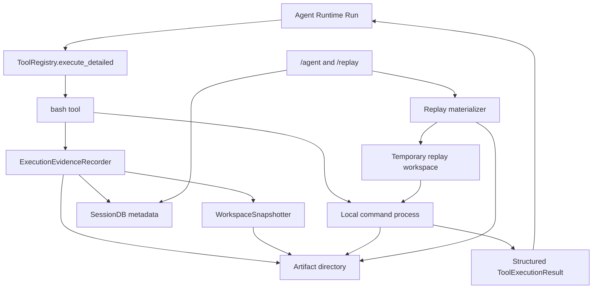

# 12 - 最小可复现执行闭环开发文档

> 状态：Phase R0、R1、R2、R3 已完成
>
> 适用基线：`6489bf5 生命周期的状态管理实现`
>
> 前置文档：[11-multi-agent-runtime-roadmap.md](11-multi-agent-runtime-roadmap.md)
>
> 后续文档：[13-worktree-write-parallelism.md](13-worktree-write-parallelism.md)

## 1. 目的与结论

MiniHermes 已经能够让 Agent 写代码、调用 `bash` 运行命令、读取报错后继续修改，也已经有 `Task / Run / Event / ToolExecution` 的运行状态记录。但是，当前一次 `bash` 运行的完整现场没有被持久保存：命令的完整输出先写入临时文件，结束后只把最多 50K 字符的结果交回 Agent；数据库只保存截断后的预览。因此，崩溃后可以知道“某个工具失败了”，但不能可靠回答以下问题：

1. 当时在什么代码状态下执行了哪条命令？
2. 命令的退出码、完整标准输出和标准错误分别是什么？
3. 当前代码已经被后续修改后，怎样在不碰主工作区的前提下重放当时的现场？
4. 某次修复后，是否确实用同一份输入和命令验证过？

本阶段建立一个最小、可发布的闭环：**为本地代码执行保存可审计证据，按需在临时副本中重放单条命令，保留失败现场，并把所有记录关联到现有 Agent Run。**

它不是自动回退系统，不引入多 Agent 写入并行，不替换现有 ReAct Loop，不改变 Agent 的工具决策权。它是下一阶段 Worktree 写入并行的必要基础。

### 1.1 完成本阶段后应能做到

```text
Agent 修改代码
  -> Agent 调用 bash 运行测试或程序
  -> 系统记录命令、运行目录、代码快照、环境摘要、退出码、完整脱敏日志
  -> 测试失败时，Agent 依据返回的错误继续修复
  -> 用户可查看该 Run 的执行记录
  -> 用户显式请求时，系统在临时副本中恢复该快照并重放同一条命令
  -> 重放成功、失败或无法重放，均生成新的证据记录
```

### 1.2 本阶段明确不做的事

- 不在失败后自动撤销 Agent 的文件修改。
- 不在每次失败后自动重新运行命令。
- 不自动创建 Git 提交、`stash` 或修改用户分支历史。
- 不把任意 Shell 命令当成安全的“沙箱命令”。重放仍需经过审批。
- 不保存 API Key、Cookie、密码、完整环境变量值或未经脱敏的终端输出。
- 不支持非 Git 项目、Git 子模块、Git LFS 特殊工作区、符号链接复杂项目的“已验证重放”。这类项目可以继续正常运行 Agent，只是记录为不可完整重放。
- 不允许后台 Nudge、Curator 因此获得写入或重放能力。

## 2. 当前真实基线

以下事实来自当前代码，不是目标假设。

| 已有能力 | 当前位置 | 本阶段如何复用 |
| --- | --- | --- |
| Run 生命周期、取消、超时、父子关系 | `agent/runtime.py` | 所有证据以既有 `run_id` 为归属，不新增第二套调度器。 |
| `agent_runs`、`agent_events` | `session/db.py` | Run 的最终状态仍由 Runtime 写入；证据表只补充运行现场。 |
| `tool_executions` | `session/db.py`、`tools/registry.py` | 每条本地命令记录关联已有 `execution_id`。 |
| 结构化工具结果 | `tools/registry.py` | 复用状态、错误码、时长、重试次数，不重新设计工具结果类型。 |
| `bash` 的取消与进程树终止 | `tools/bash.py` | 保留现有取消语义，改造输出落盘方式并补充退出码。 |
| 工具审批 | `approval/engine.py` | 重放历史命令仍要再次经过审批，Hardline 永远不能绕过。 |
| SQLite WAL 与短事务 | `session/db.py` | 新表通过增量迁移创建，不重建数据库。 |
| `/agents`、`/agent` | `cli/commands.py` | 在现有查看入口补充执行证据摘要，不另造管理界面。 |

当前缺口也应如实保留：

- `bash` 使用 `shell=True`，没有工作目录或路径边界参数。
- `write_file` 可以写任何调用方传入的相对或绝对路径。
- `bash` 目前只返回合并后的 stdout/stderr，完整临时输出在函数结束后被关闭。
- `tool_executions.output_preview` 只存预览，不适合保存完整日志。
- 现有 `agent_runs` 没有代码快照、命令记录、重放关系或制品路径字段。

因此，本阶段不能只在数据库里多写几列；必须同时建立受控的制品目录、快照格式和重放流程。

## 3. 术语与固定边界

| 术语 | 含义 |
| --- | --- |
| Run | Runtime 管理的一次主 Agent、Delegate、Plan 或后台 Agent 执行，已有稳定 `run_id`。 |
| Tool Execution | 一次工具调用，已有稳定 `execution_id`。 |
| 执行记录（Execution Record） | 一次本地 `bash` 调用的可复现元数据和日志，关联一个 Tool Execution。 |
| 工作区快照（Workspace Snapshot） | 某条命令开始前项目源码状态的只读描述和恢复材料。 |
| 制品（Artifact） | 保存在用户目录、由系统管理的 manifest、补丁、未跟踪文件包、环境摘要和日志。 |
| 重放（Replay） | 在新的临时目录中恢复一个工作区快照，再执行历史命令。 |
| 可复现状态 | 一条 Execution Record 的最终等级：`REPLAYABLE`、`PARTIAL` 或 `UNAVAILABLE`。它由快照、可执行命令、cwd、环境摘要和日志状态共同计算。 |
| 制品状态 | 制品当前是否仍可读取：`AVAILABLE`、`INCOMPLETE` 或 `PURGED`。它与历史可复现状态分开，避免清理后错误改写历史事实。 |
| 已验证可重放 | 快照、可执行命令、cwd、环境摘要和脱敏后完整日志均完整，且没有敏感信息或不支持的工作区元素被省略。 |
| 部分记录 | 命令或日志已记录，但快照无法安全、完整恢复；它可用于排错，不能宣称可精确重放。 |

以下规则为固定规则：

1. **SQLite 是元数据事实来源；制品目录是大文件事实来源。** 数据库只保存 ID、相对路径、哈希、状态和经过脱敏的预览，不保存完整日志或完整源代码快照。
2. **执行记录必须绑定已有 `run_id` 与 `tool_execution_id`。** 不允许出现无法定位到 Agent Run 的孤立日志。
3. **快照在命令开始前取得。** 重放的对象是“该命令当时看到的代码”，不是命令结束后的代码。
4. **快照不可变。** 同一内容可以复用同一个快照 ID，但完成后不允许就地改写。
5. **主工作区永远不是自动重放目标。** 重放只在系统创建的临时副本中执行。
6. **不可完整重放时必须显式标记，不能假装可复现。**
7. **失败现场默认保留。** 清理策略不得删除仍被标记为保留或正在被重放的制品。
8. **自动化不绕过安全审批。** 历史命令也不例外。
9. **历史等级与当前可用性分离。** `REPLAYABLE` 表示记录完成时满足重放条件；制品后来被保留策略清理后，记录仍保留该历史等级，但其制品状态为 `PURGED`，此时没有重放入口。

## 4. 范围与可复现等级

### 4.1 首版范围

首版只覆盖 `bash` 工具执行的本地命令。原因是：它是项目运行、测试、构建和大多数崩溃发生的位置；同时它已有完整的取消、超时和工具执行 ID 链路。

`execute_code` 是远程 E2B 沙箱，`web_search`、`web_extract`、`generate_image` 是外部服务。它们可以继续被现有 Runtime 记录，但不纳入本阶段的源码快照与本地重放承诺。

### 4.2 三个等级

| 等级 | 条件 | 可以承诺什么 |
| --- | --- | --- |
| `REPLAYABLE` | Git 快照完整且可读取、可执行命令未被替换、cwd 位于 Git 根内、日志在脱敏后完整、环境摘要完整、项目元素受支持 | 可在临时副本中尝试重放同一条命令。 |
| `PARTIAL` | 命令和日志存在，但快照、环境或输出有省略 | 可用于定位错误，不保证在同一源码状态下重放。 |
| `UNAVAILABLE` | 非 Git 工作区、快照超限、敏感内容无法安全保存、捕获过程中异常 | 仍保留原有 Tool Execution 状态和错误预览，但没有重放入口。 |

重放“失败”不自动表示系统有 Bug。它可能是依赖、操作系统、时钟、网络、数据库或外部服务变化所致。`replay_status` 的完整枚举固定为：`NOT_REQUESTED`、`REPLAY_SUCCEEDED`、`REPLAY_COMMAND_FAILED`、`REPLAY_SETUP_FAILED`、`REPLAY_DENIED`、`REPLAY_UNAVAILABLE`。它只描述最近一次对该记录发起的重放；每一次重放本身仍会生成一条新的 Execution Record。

## 5. 总体架构



新增的中心对象是 `ExecutionEvidenceRecorder`，但它不是新的 Agent，不调度任务，不拥有工具权限。它只是由 `ToolExecutionContext` 在 `bash` 执行前后调用，负责：

1. 规范化工作目录和命令描述。
2. 捕获或复用命令前快照。
3. 保存完整的脱敏 stdout/stderr、退出码、终止原因和环境摘要。
4. 将制品状态写入 SQLite。
5. 在进程重启后让 CLI 仍能定位到制品。

## 6. 数据与文件设计

### 6.1 SQLite 增量迁移

在 `SessionDB` 中新增 `v3` 迁移。不得修改或删除 `v1/v2` 表，不得把大日志塞入 SQLite。

#### `workspace_snapshots`

| 字段 | 说明 |
| --- | --- |
| `snapshot_id` | UUID 主键。 |
| `run_id` | 创建此快照的 Agent Run。 |
| `workspace_root` | 捕获时的项目根目录，仅限用户本地数据库可见。 |
| `git_root` | Git 根目录。 |
| `base_commit` | 捕获时 `HEAD` 的完整 commit SHA；无 Git 时为空。 |
| `state_hash` | manifest、补丁和未跟踪文件清单的综合 SHA-256。 |
| `capture_status` | `REPLAYABLE`、`PARTIAL`、`UNAVAILABLE`。 |
| `reason_code` | 如 `dirty_sensitive_file`、`snapshot_too_large`、`submodule_unsupported`。 |
| `manifest_relpath` | 相对制品路径。 |
| `base_tree_relpath` | 从 `base_commit` 导出的只读基础源码树归档（首版为 `base.tar` 或 `base.tar.gz`）；不得依赖未来仍存在的 Git 对象。 |
| `patch_relpath` | Git 二进制补丁相对路径，可为空。 |
| `untracked_relpath` | 未跟踪文件压缩包相对路径，可为空。 |
| `capture_fingerprint` | 捕获前后工作区指纹和稳定性结果的摘要。 |
| `created_at` | 创建时间。 |

#### `execution_records`

| 字段 | 说明 |
| --- | --- |
| `record_id` | UUID 主键。 |
| `run_id` | 所属 Agent Run。 |
| `tool_execution_id` | 对应 `tool_executions.execution_id`，首版要求唯一且非空。 |
| `snapshot_id` | 该命令开始前的快照，可为空。 |
| `node_run_id` | 可空的 `workflow_node_runs.node_run_id` 外键；图模式新记录必须指向实际执行该命令的 Agent NodeRun，历史记录保持为空。 |
| `tool_name` | 首版固定为 `bash`，为后续扩展保留。 |
| `command_preview` | 脱敏且长度受限的展示命令。 |
| `command_relpath` | 脱敏后命令元数据的制品路径。 |
| `working_directory_rel` | 相对于 Git 根目录的目录；禁止保存任意外部目录。 |
| `environment_relpath` | 环境摘要文件路径。 |
| `stdout_relpath` / `stderr_relpath` | 完整脱敏日志路径。 |
| `exit_code` | 子进程退出码；未启动、取消或超时为空。 |
| `termination_reason` | `exited`、`timed_out`、`cancelled`、`spawn_error`。 |
| `log_status` | `COMPLETE`、`TRUNCATED`、`REDACTED`、`UNAVAILABLE`。 |
| `reproducibility_status` | 该条记录的总等级：`REPLAYABLE`、`PARTIAL`、`UNAVAILABLE`；命令完成后由快照状态、命令脱敏结果、cwd、环境和日志状态统一计算。 |
| `artifact_status` | `AVAILABLE`、`INCOMPLETE`、`PURGED`；表示制品当前是否还存在，不替代 `reproducibility_status`。 |
| `replay_status` | 初始为 `NOT_REQUESTED`，重放后更新为终态。 |
| `replayed_from_record_id` | 重放生成的新记录时指向原记录。 |
| `created_at` / `finished_at` | 执行开始和完成时间。 |

索引至少包括：`run_id`、`tool_execution_id`、`snapshot_id`、`node_run_id`、`reproducibility_status`、`artifact_status`、`replay_status`。所有状态更新必须在短事务内完成；制品写入采用“先写临时文件、fsync 或关闭、再原子改名、最后更新数据库”的顺序，避免数据库指向半写入文件。任何制品写入异常都必须先把记录标为 `INCOMPLETE`，不能留下默认的 `AVAILABLE`。

原记录的 `replay_status` 表示最近一次重放的终态，只用于列表展示；每次重放都会新建独立的 Execution Record，并以 `replayed_from_record_id` 指向原记录，因此完整重放历史不会被这个便利字段覆盖。

### 6.2 制品目录

默认根目录为：

```text
~/.minihermes/artifacts/v1/
  <run_id>/
    run-manifest.json
    snapshots/
      <snapshot_id>/
        manifest.json
        base.tar.gz
        tracked.patch
        untracked.tar.gz
    executions/
      <record_id>/
        command.json
        environment.json
        stdout.log
        stderr.log
        result.json
```

规则：

- 数据库只保存相对于 `artifact_root` 的路径，读取时必须解析并验证仍在根目录内。
- 所有 JSON 使用 UTF-8、显式版本号和 SHA-256 清单。
- `run-manifest.json` 只汇总本 Run 的制品 ID，不重复保存完整请求、聊天历史或模型思考内容。
- `stdout.log` 与 `stderr.log` 分开保存，终端中仍可显示合并后的截断预览，保持现有体验。
- 单个日志流默认上限为 20 MiB；单个快照总上限为 200 MiB。这是暂定值，配置可调。
- 超出限制时进程不被强制终止，但日志或快照状态标为 `TRUNCATED` 或 `UNAVAILABLE`，对应执行记录不得标为 `REPLAYABLE`。
- 快照可被后续 Run 的多条记录复用；`workspace_snapshots.run_id` 只表示最初创建者，不表示唯一使用者。清理快照前必须查询所有引用它的记录，并在同一短事务内把受影响记录的 `artifact_status` 改为 `PURGED`。

### 6.3 快照格式

首版只支持普通 Git 工作区。快照由以下材料组成：

```text
base_commit
+ base.tar.gz：捕获时由 git archive 导出的受跟踪基础树
+ git diff --binary <base_commit> 还原的受跟踪改动
+ 未跟踪、非忽略、非敏感文件的归档
+ manifest 中的路径、大小、SHA-256 与环境兼容性信息
```

这使快照能覆盖“用户或 Agent 在尚未提交的状态下运行测试”的场景，不要求系统替用户创建 commit 或 stash。重放时只使用制品中的 `base.tar.gz`，再应用补丁和未跟踪文件归档；`base_commit` 只作为来源标识和一致性校验，不作为重放时对未来 Git 历史的依赖。

快照必须拒绝或降级以下情况：

- 仓库不存在或 `git rev-parse` 失败。
- 子模块、嵌套 Git 仓库、符号链接、Git LFS 工作区或无法稳定归档的特殊文件。
- `.git`、`.venv`、缓存目录、`image_tmp`、忽略文件等非源码材料。
- 路径名或文件内容命中敏感规则，例如 `.env`、私钥、已配置 API Key、明确 token 模式。
- 文件过大、总快照过大、读取错误或哈希不一致。

敏感或不支持的内容不会被“悄悄省略然后继续称为可复现”。系统应记录原因并将快照降级为 `PARTIAL` 或 `UNAVAILABLE`。

快照一致性必须显式处理竞态。捕获前和所有材料生成后分别计算工作区指纹，至少包含 `HEAD`、`git status --porcelain -z`、受跟踪 diff 哈希和未跟踪文件清单哈希。两次指纹不一致时最多重试一次；仍在变化则不宣称 `REPLAYABLE`，按已保存材料降级为 `PARTIAL` 或 `UNAVAILABLE`。`working_directory_rel` 必须相对于 Git 根计算；cwd 在 Git 根外时该条记录不可为 `REPLAYABLE`。

归档和材料化必须拒绝路径穿越、绝对路径、符号链接、硬链接和特殊文件。解压 `base.tar.gz`、补丁和未跟踪文件包前，先逐项验证归档成员的规范化相对路径与类型；任何不安全成员都使重放成为 `REPLAY_SETUP_FAILED`，不得尝试“尽量解压”。

### 6.4 环境摘要

环境摘要用于解释重放差异，不用于复制用户环境。它至少包含：

- MiniHermes 版本、Python 版本、可执行文件路径的哈希化描述。
- 操作系统、架构、Shell 类型、Git 版本、`uv` 版本（如可用）。
- 当前目录相对项目根的路径。
- `pyproject.toml`、`uv.lock`、`requirements*.txt` 等存在文件的 SHA-256。
- 命令执行时可见的白名单环境变量名及值哈希，例如 `PATH`、`VIRTUAL_ENV`、`PYTHONPATH`；不保存原始值。
- 当前模型名和运行配置版本，但不保存 API Key、base URL 中的凭据或用户私有路径以外的秘密。

环境摘要不足以保证跨操作系统的二进制一致性，因此文档和 CLI 必须使用“尝试重放”而不是“绝对复现”的措辞。

## 7. 执行链路改造

### 7.1 上下文传递

在 `ToolExecutionContext` 中新增可选字段，不改变已有工具 Schema：

```python
workspace_root: Path | None
working_directory: Path | None
evidence_recorder: ExecutionEvidenceRecorder | None
tool_execution_id: str | None
```

`ToolRegistry.execute_detailed()` 先创建已有的 `tool_executions.execution_id`，再把它填入仅本次调用可见的上下文副本并交给 `bash`。记录器不得从共享可变对象猜测“当前工具调用”，否则并发只读 Delegate 的日志可能串到同一记录。

这些字段只由 Runtime / Agent 内部建立，模型不能通过工具参数伪造工作目录、工具执行 ID 或制品路径。首版主 Agent 与串行 Delegate 的 `working_directory` 都是当前项目目录；Worktree 阶段会替换为各自的隔离目录。

### 7.2 `bash` 的新执行顺序

```text
ToolRegistry 创建 tool_execution
  -> ApprovalEngine 检查原命令
  -> EvidenceRecorder 在命令前捕获或复用快照
  -> bash 在内部指定的 cwd 启动子进程
  -> stdout/stderr 同时流向受控临时日志文件
  -> 取消或超时时终止进程树
  -> 记录退出码、终止原因、日志状态
  -> 返回截断且脱敏的模型输出
  -> ToolRegistry 完成已有 tool_execution
```

关键要求：

1. `bash` 继续支持现有 `_cancel_check`，取消和超时不改变现有 Runtime 状态语义。
2. 不增加 `cwd` 这个 LLM 可填写的工具参数。工作目录来自内部上下文，避免模型通过参数绕过后续 Worktree 边界。
3. stdout 和 stderr 需要在子进程执行期间分别写入日志，而不是只在结束后从临时文件读取。
4. 进程创建失败、取消、超时、非零退出码都必须有独立终止原因和记录。
5. `bash` 仍默认不自动重试。历史命令的重放也不是“工具重试”。
6. 交回 Agent 的文本继续受现有 `truncate_output()` 限制；完整日志仅在制品中保留。
7. 证据写入不能改变工具的原子语义：命令启动前先创建 `INCOMPLETE` 记录；命令终止后再一次性写入退出码、日志状态和总可复现状态。记录器自身失败不得掩盖原命令的退出结果，但必须在 Tool Execution 和 `agent_events` 中留下 `evidence_capture_failed`。

### 7.3 写文件与快照失效

无需为每次 `write_file` 立即创建完整快照。快照器在每次 `bash` 前计算工作区指纹：若 `HEAD`、受跟踪 diff、未跟踪清单与上次**稳定捕获**快照相同，则复用；否则创建新快照。

这样可保证某条命令的输入状态准确，又不会因 Agent 连续写多个小文件而生成大量重复归档。

`bash` 本身也可能修改项目文件，因此命令前后指纹不同是正常现象；下一条 `bash` 会据此创建或选择新的输入快照。

## 8. 脱敏、隐私与安全

可复现能力会增加本地持久化内容，必须比普通 Tool Preview 更严格。

### 8.1 不保存的内容

- 模型、搜索、沙箱和图片服务的 API Key。
- `.env`、私钥、凭据文件及其快照内容。
- 环境变量的原始值。
- 未经脱敏的完整命令和输出。
- Agent 的完整上下文、用户历史或 reasoning 文本。

### 8.2 命令与日志处理

- 命令先通过统一脱敏器扫描。若命令内含疑似密钥或密码，制品中只保存替换后的版本，记录设为 `PARTIAL`，不提供重放入口，因为系统不再持有可安全执行的原命令。
- stdout/stderr 使用同一套已知密钥和模式脱敏后再落盘。若检测到无法安全处理的二进制输出或敏感模式，记录 `REDACTED` 或 `UNAVAILABLE`；只要命令、快照或任一日志无法完整安全保存，`reproducibility_status` 都不得为 `REPLAYABLE`。
- 制品目录采用当前用户可读写权限；实现应尽力收紧权限，但不能在 Windows 上承诺跨版本 ACL 完全一致。
- CLI 展示永远使用脱敏预览，不直接 `cat` 完整日志。

### 8.3 重放审批

`/replay` 必须重新通过 `ApprovalEngine`：

- Hardline 命令始终拒绝。
- Dangerous 命令即使源自历史记录，也要求当前用户再次确认。
- 取消、超时、日志记录与普通 `bash` 完全一样。
- 重放不会访问原工作区，但 Shell 命令仍可能访问网络、用户目录或绝对路径；因此它不是安全沙箱。

真正限制 Shell 对宿主机影响的隔离能力留给 Worktree 文档中的严格 Runner；本阶段不能虚假宣称临时目录等于沙箱。

## 9. 重放设计

### 9.1 入口

在现有 CLI 中新增三个轻量入口：

```text
/agent <run_id>       在现有 Run 详情后显示执行记录摘要
/artifacts <run_id>   显示该 Run 的制品状态和本地目录，不直接打印日志
/replay <record_id>   在临时副本中重放一条 REPLAYABLE 执行记录
```

`record_id` 支持唯一前缀匹配，歧义时拒绝执行。首版不提供“重放整个 Agent Run”，因为多条命令可能依赖外部服务、交互输入或前序副作用；单条命令重放边界更清楚、更容易验证。

每次 `/replay` 都由 `AgentRuntimeManager` 创建一个新的非 LLM `replay` Task 和 Run：它不创建 `Agent` 实例、不调用 Provider、没有对话消息和迭代预算，但仍拥有独立的 `run_id`、取消信号、超时、审批、`tool_execution_id`、事件和终态。原执行记录所属的 Run 作为这个 Replay Run 的父 Run，重放生成的 Execution Record 也指向原记录。这样每一份新日志都遵守“必须关联 Run 与 Tool Execution”的固定规则，而不是由 CLI 在 Runtime 外直接执行命令。

重放 Run 在预检阶段就先创建 Tool Execution 和一条 `INCOMPLETE` Execution Record：若原记录不可重放、制品已清理、材料化失败或审批拒绝，也将该新记录收尾为 `UNAVAILABLE` 或 `PARTIAL`，并写入相应 `replay_status` 与诊断；只有预检、材料化和审批都通过后才启动 Shell 进程。原记录的 `replay_status` 同步更新为这次尝试的终态。这样“用户请求过但系统没有执行命令”的情况同样可查询，不会形成 CLI 外部的孤立拒绝。

### 9.2 临时副本材料化

重放不使用未来的 Git Worktree 功能，而使用临时目录：

```text
~/.minihermes/replays/<record_id>-<timestamp>/
  workspace/    base.tar.gz + patch + untracked archive 恢复出的源码
  replay.json   本次重放元数据
```

顺序固定如下：

1. 检查原记录、快照和所有哈希，非 `REPLAYABLE` 直接拒绝。
2. 创建系统管理的空临时目录，拒绝用户传入目标路径。
3. 解压并校验制品中的 `base.tar.gz` 建立基础树；不得从当前仓库运行 `git archive <base_commit>`。
4. 校验并应用 `tracked.patch`，恢复允许的未跟踪文件归档。
5. 根据 `working_directory_rel` 设置 cwd，恢复白名单环境描述，但不恢复秘密值。
6. 对历史命令重新走审批，然后调用同一个 `bash` 执行链路。
7. 新建一条执行记录，其 `replayed_from_record_id` 指向原记录。
8. 结束后保留临时目录直到重放制品清理策略处理，不自动复制回主工作区。

若任何恢复步骤失败，系统创建 `REPLAY_SETUP_FAILED` 记录并保留诊断，不执行命令。

重放资格只由原记录的 `reproducibility_status == REPLAYABLE`、`artifact_status == AVAILABLE` 和全部制品哈希共同决定。CLI 不能仅凭存在 `snapshot_id` 或看到旧的 `capture_status` 就允许运行。

### 9.3 与“修复后再跑”的关系

日常修复不是每次都需要 `/replay`：Agent 在当前代码上修复后，直接再次调用 `bash` 即可。这个新记录会关联修复后的新工作区快照，因此可以证明“新命令在新代码状态下通过”。

`/replay` 的用途是复查旧失败现场、确认环境差异、验证某条历史命令是否具有稳定问题，而不是替代正常开发循环。

## 10. 配置与保留策略

在 `config/config.yaml` 新增顶层 `reproducibility`，由 `Config` 以和 `agent_runtime` 相同的合并方式提供：

```yaml
reproducibility:
  enabled: true
  artifact_root: ""                 # 空值表示 ~/.minihermes/artifacts
  max_log_bytes_per_stream: 20971520 # 20 MiB
  max_snapshot_bytes: 209715200      # 200 MiB
  retention_days: 30
  max_total_artifact_bytes: 1073741824 # 1 GiB
  keep_failed_days: 30
```

固定规则：

- `enabled: false` 时不创建新制品，但既有 `/agents` 和工具执行不受影响。
- `artifact_root` 必须是用户目录下或经明确配置的本地绝对路径；解析后不得指向项目源码目录、Git 元数据目录或临时 Worktree 根。
- 存储上限达到后，优先清理超过保留期且未被标记保留的成功记录；失败、取消、超时记录至少保留 `keep_failed_days`。
- 清理只删除系统管理的相对制品路径，删除前再次检查根目录边界和数据库引用。
- 首版不自动把制品上传远程，不加入 Git，不写入用户项目目录。

## 11. 文件改动计划

遵循现有目录职责，只增加真正需要的模块：

| 文件 | 改动 |
| --- | --- |
| `agent/reproducibility.py` | 新增快照、制品、环境摘要和临时重放实现；不放入 `tools/`，因为它不是模型直接调用的工具。 |
| `agent/runtime.py` | 为每个 Run 创建并关闭证据记录器；提供查询和非 LLM `replay` Run 的协调入口。 |
| `tools/registry.py` | 扩展 `ToolExecutionContext`，将内部工作区和记录器传给 `bash`。 |
| `tools/bash.py` | 使用内部 cwd，保存分离的脱敏日志、退出码和终止原因；保留已有取消处理。 |
| `session/db.py` | 增加 v3 迁移、快照与执行记录 CRUD、原子状态更新。 |
| `cli/commands.py` | 实现 `/agent` 详情补充、`/artifacts`、`/replay`。 |
| `config/config.py`、`config/__init__.py`、`config/config.yaml` | 新增并加载 `reproducibility` 配置。 |
| `tests/` | 增加快照、日志、重放、脱敏、清理和迁移测试。 |

不得新建第二个数据库、守护进程、消息队列或顶层包。

## 12. 实施阶段与验收门禁

### Phase R0：数据模型和制品基础

实现 v3 数据库迁移、受控制品根目录、路径校验、manifest 原子写入和清理框架。

验收：

- 旧数据库可以无损迁移；v1/v2 的会话、Run、工具记录仍可查询。
- 制品相对路径无法通过 `..`、绝对路径或符号链接逃逸根目录。
- 进程在制品写入中断后，启动时不会把半成品标为完整。
- 执行记录的可复现状态与制品当前可用性可独立查询，清理后的记录不会被错误展示为仍可重放。
- 配置缺失时自动补齐，已有用户配置不被覆盖。

### Phase R1：`bash` 证据记录

实现命令、cwd、stdout/stderr、退出码、超时、取消和脱敏记录。先不启用重放。

**实施状态（2026-08-13）**：已完成。`ExecutionEvidenceRecorder` 在审批通过、实际启动 `bash` 前创建执行记录；命令元数据和环境摘要先原子写入，`bash` 结束后再分别原子写入 `stdout.log`、`stderr.log` 和 `result.json`，最后关闭数据库记录。已配置密钥、常见 token 模式和环境变量名会脱敏；单流日志按配置上限截断。真实 cwd 仅写入受控制品；由于 R1 还没有 Git 根和快照，数据库的 `working_directory_rel` 保持为空，不能伪造相对目录。记录器失败只发出 `evidence_capture_failed` 运行事件，不改变命令本身的输出或错误码。R1 尚未捕获 Git 快照，因此所有成功采集的记录固定为 `PARTIAL`，不能标为 `REPLAYABLE`。

`execution_records` 已通过 v5 增量迁移增加可空 `node_run_id`。写入时会验证其 `agent_run_id` 与执行记录的 `run_id` 相同，避免跨 NodeRun 归属；不属于图运行的历史或临时记录保持 `NULL`。

验收：

- 正常退出、非零退出、启动失败、超时、取消均有一条终态 Execution Record。
- 数据库预览与制品日志内容均不出现配置中的已知密钥。
- Agent 仍能收到与当前版本兼容的命令输出和错误码。
- 原有取消和超时测试全部通过。

### Phase R2：Git 快照与单条重放

实现普通 Git 工作区的快照、临时目录材料化、`/replay` 和重放记录链路。

**实施状态（2026-08-13）**：已完成。`WorkspaceSnapshotter` 在真实 `bash`
启动前封存普通 Git 工作区的 `HEAD` 基础树、二进制 diff 和非忽略未跟踪文件；
快照清单记录每个制品的大小与 SHA-256，并在捕获前后比对工作区指纹。敏感路径或内容、
符号链接、子模块、LFS、超限和捕获期间变化都会降级，绝不产生伪 `REPLAYABLE`。

`/replay <record_id>` 只通过 `AgentRuntimeManager` 创建非 LLM 的 `replay` Task/Run，
在 `~/.minihermes/replays/` 下的系统管理临时副本中材料化并执行。重放只使用已封存
制品，不依赖当前仓库或旧 Git 对象；命令制品和快照制品都要先通过哈希校验。每次重放
都使用新的 `ApprovalEngine` 状态重新审批，Hardline 永久拒绝；取消、超时、材料化失败、
制品损坏和命令失败均会关闭自己的 ToolExecution/ExecutionRecord，并回写源记录的最近
一次 `replay_status`。这一阶段不创建 Git commit、stash、分支或 Worktree，也不提供
自动回滚、自动重试或并行写入。

验收：

- 干净 Git 工作区可重放一条失败或成功测试命令，且临时副本与主工作区文件哈希不互相影响。
- 含未提交受跟踪修改和普通未跟踪测试文件的工作区可在快照中恢复。
- 重放只使用制品中的基础树；删除当前仓库中旧 commit 的可访问性后，保留的完整快照仍可材料化。
- 捕获期间工作区持续变化时，记录明确降级，不能产生伪 `REPLAYABLE` 结果。
- `.env`、私钥、超大文件、子模块等情况明确降级，不泄露内容。
- 审批拒绝、Hardline 拒绝、用户取消均不会启动或继续重放进程。

### Phase R3：CLI 可观察性与保留策略

完善 `/agent`、`/artifacts`、保留和清理提示。

**实施状态（2026-08-14）**：已完成。`/agent <run_id>` 和
`/artifacts <run_id>` 会显示每条执行记录的可复现等级、当前制品状态、最近
重放结果及关联快照的当前状态；`/artifacts retention` 只读展示可清理和受保护
分组，`/artifacts cleanup` 才会显式执行清理。清理以快照及其全部引用记录为
不可拆分分组，先在 SQLite 短事务中把快照和记录标记为 `PURGED`，再删除受控
制品目录。失败、取消、超时的 Run 会按 `keep_failed_days` 保留；运行中或作为
其父 Run 的重放不会被清理。容量超限只额外淘汰已结束的成功组，失败现场仍是
硬保留。若删除中断或失败，后续显式清理只会重试已标记 `PURGED` 的受控残留，
不会让数据库再次声称该制品可重放。`artifact_status` 一旦为 `PURGED` 不可由
晚到的完成回调恢复为 `AVAILABLE`。崩溃在数据库登记前留下的孤立制品目录仅在
超过一小时宽限期、路径符合受控布局且不存在任何数据库归属时才会删除。

验收：

- 用户能从 `/agents -> /agent` 找到 Run，再找到对应执行记录与制品状态。
- 存储清理不会删除仍在执行、重放、保留期内失败或数据库仍引用的制品。
- `pytest -q`、`compileall`、`git diff --check` 通过；无真实网络、真实 API Key 或真实 destructive command 测试。

## 13. 测试矩阵

至少覆盖：

1. 数据库从 v2 迁移至 v3，重复启动幂等。
2. 正常命令的 stdout 与 stderr 分离、退出码正确。
3. 非零退出码、超时、取消、子进程树终止的证据状态正确。
4. 命令、输出、环境摘要中的已知 Key 和 token 模式均被脱敏。
5. 干净 Git 工作区快照和重放成功，且重放材料化不需要当前仓库保留原 `base_commit` 对象。
6. 受跟踪未提交 diff 与普通未跟踪文件恢复成功。
7. 捕获期间修改工作区时，指纹不一致会重试一次并正确降级。
8. `.env`、私钥、符号链接、子模块、超大文件、损坏补丁被安全拒绝或降级。
9. 重放材料化失败时主工作区保持不变。
10. 重放命令重新经过审批，Hardline 不可绕过。
11. 并发只读 Delegate 的执行记录不会互相覆盖，记录器拿到的 `tool_execution_id` 与数据库行一致。
12. Runtime 取消和进程重启后的遗留 Run 能正确关联已完成或未完成制品。
13. 制品清理对路径穿越、无主文件、保留期和大小上限行为正确，并把可复现记录更新为 `artifact_status=PURGED`。

## 14. 发布判断

本阶段可以单独发布，前提是 R0-R3 门禁全部通过。发布后应保持：

```text
默认 Agent 开发体验不变
+ 可选、可查询的运行证据
+ 用户显式触发的单命令重放
- 不改变主工作区
- 不自动回退
- 不启用写入并行
```

只有当本文件的快照、日志、重放、脱敏和失败保留测试稳定后，才可以进入下一份 Worktree 文档。若这些能力未完成，当前“只读子 Agent 可并行，修改类工具串行”的策略必须继续保持。
