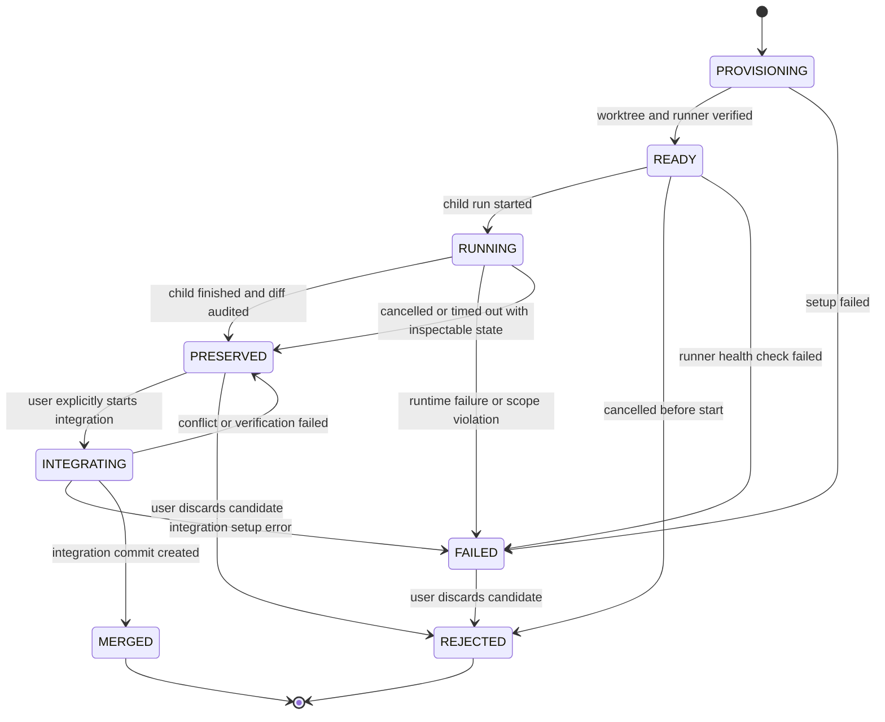

# 13 - Worktree 写入并行开发文档

> 状态：Phase W0-W3 已完成；本机真实 Docker 双任务验收通过
>
> 适用基线：完成 [12-reproducible-execution-foundation.md](12-reproducible-execution-foundation.md) 的 R0-R3 后
>
> 前置文档：[11-multi-agent-runtime-roadmap.md](11-multi-agent-runtime-roadmap.md)、[12-reproducible-execution-foundation.md](12-reproducible-execution-foundation.md)
>
> 后续扩展：[15-failure-recovery-and-rollback.md](15-failure-recovery-and-rollback.md)（在 W1 后接入失败分类、修复重跑与受控撤销）

## 1. 目的与结论

MiniHermes 默认只开放受控的只读 Delegate 并行：当一批请求全部是 `delegate_task`，且每个子 Agent 的最终有效工具只属于 `PARALLEL_SAFE_DELEGATE_TOOLS` 时，Runtime 才通过线程池并行执行。W3 另外允许把默认关闭的 `worktree_write` 并发从 1 显式提高到 2，但仅限严格 Docker Runner、各自合法的冻结写入范围和固定工具白名单。不同 Worktree 可以修改同一个仓库相对路径；它们操作的是不同磁盘副本，冲突留到串行集成阶段处理。普通 Delegate 永远不能获得宿主 `write_file` 或 `bash`，不会退化为串行修改主项目。

这个限制是正确的。多个 Agent 在同一工作目录中同时修改、运行测试或启动服务，会产生文件覆盖、测试污染、端口冲突和不可解释的日志交错。

本阶段的目标不是放宽所有限制，而是新增一种受严格条件约束的 Delegate：**每个写入任务拥有独立 Git Worktree、独立分支、独立工作目录、独立日志和严格命令运行环境；多个这样的任务可以并行完成候选修改，但最终集成到主分支始终串行且由用户显式发起。**

```text
主 Agent 拆分独立写入任务
  -> Runtime 为每个任务创建独立 Worktree 和分支
  -> 子 Agent 在自己的目录内修改、测试、生成证据
  -> Runtime 保留候选差异和失败现场
  -> 用户查看候选并显式要求集成
  -> 集成器逐个合并、验证、提交
  -> 失败则中止合并，保留候选 Worktree 供继续修复
```

Worktree 只解决“源码目录相互覆盖”。它不能单独隔离 Shell、网络、端口、数据库、用户目录或远程 API。因此，写入并行必须建立在文档 12 的证据基础和额外的严格执行条件上。

## 2. 与已有机制的关系

| 已有机制 | 本阶段处理方式 |
| --- | --- |
| `AgentRuntimeManager` | 继续作为唯一调度器、取消传播者和 Run 状态所有者。 |
| `ThreadPoolExecutor` 与 `max_concurrency` | 继续复用；只扩大“可并行”的资格判断，不另建线程池。 |
| `ToolAccessPolicy` | 继续是 Schema 与执行层共用的权限快照；新增工作区模式和路径范围约束。 |
| `ToolRegistry.execute_detailed` | 继续执行所有工具；从内部上下文获得 Worktree 根和严格 Runner。 |
| `ApprovalEngine` | 写入 Delegate 强制 `DENY_SENSITIVE`；主机侧创建、集成、丢弃和历史重放仍走用户交互审批；Hardline 始终拒绝。 |
| `SessionDB` | 继续保存 Task、Run、Event、Tool Execution；新增 Worktree lease 元数据。 |
| 文档 12 的 Execution Record | 每个 Worktree 内的测试命令都按同一格式记录快照、日志和退出码。 |
| 当前主 Agent 会话 | 仍在主工作区串行运行，不移动到 Worktree。 |

本阶段不引入预先常驻的“编程 Agent”“审查 Agent”角色。仍使用同一个 `Agent` 类；差异由 `AgentSpec`、工具策略、工作区 lease 和严格 Runner 决定。

## 3. 先决条件与硬门禁

以下条件全部满足，Runtime 才能创建 `worktree_write` Delegate。用户或模型已经明确请求 `worktree_write` 时，任何一项不满足都必须以结构化拒绝结果结束该委派，不能把它降级成会写主工作区的串行 Delegate。普通 Delegate 省略模式时也会显式剥离 `write_file` 和 `bash`；需要代码写入或 Shell 的子任务必须重新以 `worktree_write` 发起。

### 3.1 文档 12 的前置门禁

- R0-R3 已完成并通过测试。
- 每次 `bash` 已可保存快照、完整脱敏日志、退出码和终止原因。
- 失败的候选任务和测试记录可查询、可保留。
- 项目启动时可安全处理上一次崩溃留下的未完成 Run 与制品。

### 3.2 Git 工作区门禁

创建 Worktree 前必须逐项检查：

1. 当前目录属于普通、非 bare Git 仓库。
2. `git rev-parse HEAD` 成功，工作树和 index 均无未提交、未暂存或未跟踪文件。
3. 仓库没有进行中的 merge、rebase、cherry-pick、revert 或 index lock。
4. 首版拒绝含子模块、嵌套仓库、无法识别的 Git worktree 状态和需要特殊材料化的 LFS 场景。
5. Git 版本满足项目确定的最低版本，且 `git worktree add/remove/prune` 可用。
6. 当前主工作区不在 Runtime 已知的集成或清理操作中。

**不允许自动 stash、自动 commit、自动 reset 或自动清理用户的脏工作区。** 如果用户有未提交修改，Runtime 只返回可操作原因：先由用户提交、stash，或者继续使用现有串行主 Agent 修改流程。

这一要求看似严格，但它解决了最危险的问题：并行子 Agent 不能从不一致、无法恢复的用户工作状态开始。

### 3.3 严格 Runner 门禁

当前 `bash` 使用宿主机 `shell=True`。只设置 `cwd=<worktree>` 不是隔离：命令仍可 `cd ..`、使用绝对路径、访问用户目录、占用端口或修改主仓库。因此，**严格模式下不允许把当前本地 `bash` 直接授予并行写入 Delegate。**

首版只支持一个严格 Runner：Docker 容器。启用前必须确认：

- Docker CLI 和守护进程可用。
- 配置的运行镜像存在，镜像摘要已记录。
- 容器只挂载该 Worktree 的源码目录和任务专属临时目录。
- 容器默认 `--network none`，没有宿主机端口映射，没有用户 home、主仓库、Docker socket 或凭据目录挂载。
- 容器内工作目录固定为 `/workspace`，临时目录和 HOME 指向任务私有挂载。
- Runner 超时、取消、退出码和日志可被 Runtime 控制并写入文档 12 的 Execution Record。
- Docker Desktop/Windows 的实际挂载行为已通过启动探针验证：镜像中存在指定的非 root 用户，Worktree 和任务临时目录对该用户可写，其余根文件系统保持只读。

如果 Docker 不可用，`worktree_write` 不启用；系统仍可运行只读并行和现有串行写入。不得把 `trusted_local` 伪装成严格并行模式。

## 4. 工作区模式和权限模型

### 4.1 三种模式

| 模式 | 使用者 | 目录 | 是否可并行 | 允许写入 |
| --- | --- | --- | --- | --- |
| `shared_main` | 主 Agent、现有串行流程 | 用户项目目录 | 否 | 按现有权限。 |
| `shared_read_only` | 研究、检索、分析 Delegate | 用户项目目录 | 是 | 否。 |
| `worktree_write` | 独立代码修改 Delegate | 任务专属 Git Worktree | 满足门禁时是 | 仅限范围内源码与任务临时目录。 |

`workspace_mode` 是 Runtime 的内部决策，不是模型可以靠一句 Prompt 获得的权限。`delegate_task` 可提交“希望采用写入 Worktree”的请求和所需文件范围，但 Runtime 会结合父策略、Git 门禁、Runner 可用性和审批结果计算最终模式。

### 4.2 `delegate_task` 请求扩展

在保留现有 `task`、`context`、`tools` 的前提下，增加以下可选字段：

```json
{
  "execution_mode": "worktree_write",
  "write_scope": ["agent/", "tests/"],
  "verification_hint": "python -m pytest -q tests/test_agent_runtime.py"
}
```

字段含义：

- `execution_mode` 只能是 `read_only` 或 `worktree_write`。省略时按非写入 Delegate 处理，Runtime 和 `AgentSpec` 都会剥离宿主 `write_file` 与 `bash`。
- `write_scope` 是候选修改允许涉及的相对路径前缀。`worktree_write` 必填，且至少有一个有效前缀。
- `verification_hint` 只是给子 Agent 的任务提示，不是可绕过审批自动执行的命令。

模式和范围验证规则：

1. 模式请求必须被父 Agent 的有效工具策略允许；父策略没有 `write_file` 或 `bash` 时，子 Agent 不可能借 Worktree 获得它们。
2. `write_scope` 只能是以 `/` 结尾的相对目录前缀，或一个明确的相对文件路径；不得使用通配符，且不得含绝对路径、`..`、`.git`、驱动器前缀、空值或指向工作区外的链接。
3. Runtime 将请求范围冻结到 Worktree lease，Agent 后续不能扩大。
4. `worktree_write` 的实际工具白名单固定为：`read_file`、`list_dir`、`write_file`、受严格 Runner 管理的 `bash`、`skill_view`。新工具默认不加入。
5. `delegate_task`、`clarify`、`memory`、`skill_manage`、`todo`、`web_search`、`web_extract`、`web_open`、`execute_code`、`generate_image`、`process` 一律不授予写入 Worktree Delegate。
6. `worktree_write` 的 `AgentSpec.approval_mode` 由 Runtime 固定为 `ApprovalMode.DENY_SENSITIVE`，模型、请求参数和父 Agent 都不能升级成 `TRUSTED` 或打开并行交互审批。Hardline 或危险操作被拒绝后，以普通工具结果返回给子 Agent。
7. 即使工具调用在 Worktree 内成功，任务结束时仍以 Git diff 和未跟踪清单做最终范围审计；范围外修改使候选任务变为 `SCOPE_VIOLATION`，永远不能集成。
8. 不同 Worktree 的 `write_scope` 可以相同、包含或交叉；范围只约束本任务能修改什么，不用于阻止隔离候选并行。最终集成按最新主分支逐个执行，冲突候选保持 `PRESERVED`。

这里的审批边界需要区分两类操作：**子 Agent 在 Docker 内调用 `bash` / `write_file` 时不弹出交互界面**，危险操作按 `DENY_SENSITIVE` 返回拒绝；**宿主 `WorkspaceManager` 创建或删除 Worktree、创建候选 commit、最终合并和重放历史命令时**，仍使用现有交互审批。宿主 Git 操作不经模型的 `bash` Schema 暴露，必须由结构化参数、固定步骤和事件记录驱动。

禁止外部工具并非因为它们永远不可用，而是因为它们会引入共享网络、用户状态、远程副作用、端口或不可重复输入。首版先让“改指定文件并运行本地测试”成为可信能力。

### 4.3 路径约束

`read_file`、`write_file`、`list_dir` 在 `worktree_write` 模式下必须使用同一个内部路径解析器：

```text
用户/模型路径
  -> 以 Worktree 根解析
  -> resolve(strict=False)
  -> 验证结果仍位于 Worktree 根内
  -> 验证不是 .git 或 Runtime 私有目录
  -> 对写操作验证命中 frozen write_scope
```

工具 Schema 不新增可任意指定 root 的参数。相对路径永远相对于 Worktree 根；绝对路径一律拒绝。符号链接、junction 和重解析点必须在解析后再次验证，首版遇到不确定路径时拒绝。

这条执行前约束适用于文件工具。`bash` 在容器内可以执行任意 Shell 组合，普通 Docker bind mount 不能把同一个 Worktree 再按 `write_scope` 分割挂载，因此无法在每一条 Shell 指令前证明其只写了范围内文件。对 `bash` 的规则必须更保守：命令结束后立刻生成相对基线的受跟踪 diff、`git status --porcelain -z` 未跟踪清单和未跟踪文件哈希；一旦发现范围外文件被新建、修改、删除或重命名，Runtime 立即终止后续工具调用，把 lease 标为 `FAILED`、失败码设为 `scope_violation`，并永久禁止集成。`write_scope` 因此是“可集成候选边界”，不是任意 Shell 写入的即时防火墙。

## 5. Worktree Lease 生命周期

每个 `worktree_write` Run 有且只有一个 Worktree lease。Run 可以重试，但每次重试必须新建 lease，不能复用失败目录继续伪装成同一次运行。

### 5.1 数据模型

当前代码的 Graph 与可复现制品迁移已使用到 v7，因此 W0 新增 `SessionDB` v8 迁移，创建 `worktree_leases`：

| 字段 | 说明 |
| --- | --- |
| `workspace_id` | UUID 主键。 |
| `task_id` / `run_id` | 所属 Runtime Task 和本次运行；`run_id` 唯一。 |
| `parent_run_id` | 发起委派的父 Run。 |
| `git_root` | 主仓库根目录。 |
| `worktree_path` | 系统管理的 Worktree 本地路径。 |
| `branch_name` | `minihermes/worktree/<workspace_id>`。 |
| `base_commit` | 创建时的主仓库 HEAD。 |
| `write_scope_json` | 已冻结的路径范围。 |
| `runner_backend` / `runner_image_digest` | 严格 Runner 类型和镜像身份。 |
| `lease_status` | 下文状态机。 |
| `cleanup_status` | `PENDING`、`SUCCEEDED`、`FAILED`。 |
| `diff_relpath` / `diff_hash` | 最终候选差异的制品位置和哈希。 |
| `change_manifest_relpath` / `change_manifest_hash` | 受跟踪 diff、未跟踪清单、文件哈希、删除和重命名的完整候选审计清单。 |
| `failure_code` / `failure_message` | 创建、运行、范围审计或集成失败原因。 |
| `created_at` / `updated_at` / `preserve_until` | 生命周期与保留信息。 |

文档 12 的 `workspace_snapshots` 和 `execution_records` 增加可空 `workspace_id` 外键。这样每条测试日志既可从 Run 找到，也可从 Worktree 候选找到。

### 5.2 状态机



`cleanup_status` 与 `lease_status` 分离。例如 `MERGED + cleanup_status=FAILED` 表示代码已成功集成，但遗留 Worktree 尚待人工清理；不能因为清理失败而篡改集成结果。

固定规则：

- 取消、超时、崩溃和范围审计失败都默认保留 Worktree，不自动 `git clean`。
- 应用启动时发现 `PROVISIONING`、`READY`、`RUNNING` 的遗留 lease，标记为 `FAILED` 或 `PRESERVED` 并写事件，不自动重跑。
- 只有用户显式丢弃、或成功集成且全部验证通过后，才允许清理 Worktree 和专属分支。

### 5.3 目录和分支命名

Worktree 根目录固定为用户目录，不放在项目目录内：

```text
~/.minihermes/worktrees/
  <repository-fingerprint>/
    <workspace-id>/
```

分支固定使用：

```text
minihermes/worktree/<workspace-id>
```

路径由 Runtime 生成，模型和用户不能传入任意 Worktree 路径。创建方式等价于：

```text
git worktree add -b minihermes/worktree/<workspace-id> <managed-path> <base-commit>
```

实际实现必须使用结构化子进程参数，不得通过拼接 Shell 字符串执行 Git 命令。

## 6. 严格 Runner 设计

### 6.1 为什么 Worktree 还不够

Worktree 能阻止两个 Agent 写同一个实际源码文件，但不能阻止这些命令：

```text
cd ..
Remove-Item C:\Users\1\Desktop\miniHermes\agent\agent.py
curl ...
git push
python -m http.server 8000
```

因此，`worktree_write` 不能调用当前宿主机 `bash`。必须通过 `WorkspaceCommandRunner` 接口执行：

```text
WorkspaceCommandRunner.run(
  workspace_id,
  command,
  cwd_relative_to_workspace,
  timeout,
  cancel_check,
  evidence_recorder,
)
```

### 6.2 Docker 首版约束

Docker Runner 的最低约束：

```text
docker run --rm
  --network none
  --read-only
  --user <non-root-uid>:<non-root-gid>
  --cap-drop ALL
  --pids-limit <configured-limit>
  --memory <configured-limit>
  --workdir /workspace
  --mount type=bind,source=<worktree>,target=/workspace
  --mount type=bind,source=<task-temp>,target=/tmp/minihermes
  --mount type=bind,source=<readonly-git-sentinel>,target=/workspace/.git,readonly
  --env HOME=/tmp/minihermes/home
  --env TMPDIR=/tmp/minihermes/tmp
  <pinned-image-digest>
  <approved-shell-and-command>
```

实现还必须：

- 禁止 Docker socket、主项目根、用户 home、SSH 目录、全局凭据目录和宿主端口映射。
- 容器以非 root 用户运行，根文件系统只读；仅任务专属临时挂载和 Worktree 源码挂载可写入。镜像必须预先准备好运行项目所需的依赖。
- 将网络固定关闭；需要下载依赖或调用外部服务的测试不在子 Agent 内并行运行。
- 为每个任务提供独立临时目录，避免 pytest 临时文件、SQLite 测试库和缓存相互污染。
- 将容器 stdout/stderr、退出码、镜像摘要、运行参数摘要写入文档 12 的证据系统。
- 进程取消时终止容器及其子进程；超时、Docker 守护进程故障均映射为结构化工具失败。
- Worktree 的 `.git` 在宿主通常是指向主仓库 gitdir 的文件。启动容器时必须以受控、只读 sentinel 覆盖 `/workspace/.git`，并在子 Agent Prompt 明确声明容器内不得运行 Git；Git diff、提交、合并全部由宿主 `WorkspaceManager` 处理。这样容器即使能写源码，也不能借 `.git` 间接修改主仓库元数据。
- `worktree_write` 子 Agent 的系统提示需额外写入运行环境事实：命令运行在 Linux/POSIX Docker 容器中、工作目录是 `/workspace`、网络关闭、没有 Git、可写范围受 lease 审计。不得把 Windows 主机的 Shell、路径或可用命令提示透传给它。

项目依赖必须包含在用户配置的镜像中，或能在无网络条件下安装。Docker 镜像准备本身是用户显式的环境操作，不由子 Agent 自动构建或拉取。Runner 探针、镜像拉取、镜像构建或 Docker 无法满足上述约束时，`worktree_write` 必须保持关闭，不能降级到共享宿主 Shell 并行。

### 6.3 兼容模式

可以为未来保留 `trusted_local` Runner，但它只能用于**串行** Worktree 调试，不能让 Runtime 把它判定为并行安全。配置中即使出现该值，也必须将并行资格判定为 false。

这条规则避免了最常见的退化：机器没有 Docker 时，系统为了“好用”而悄悄回到共享宿主 Shell 并行执行。

## 7. 调度与并行资格

### 7.1 新的资格判断

当前 `is_parallel_safe_delegate_policy(policy)` 只接受安全只读工具。Worktree 阶段替换为一个更完整、仍然保守的判断：

```text
delegate 可并行，当且仅当：
  A. 它是 shared_read_only，且有效工具属于现有只读安全集合；或
  B. 它是 worktree_write，且：
     - Worktree、Docker Runner 和冻结范围的批次预检通过
     - Docker strict runner 已验证
     - write_scope 已冻结且非空
     - 有效工具完全属于 worktree_write 固定白名单
     - 本任务获得全局 Delegate 槽位和 Worktree 写入槽位
     - 父 Run、批次和本 Run 都未取消或超时
     - 全局并发上限与写入并发上限均允许
```

任何未知工具、没有显式工具白名单的写入 Delegate、网络工具、共享状态工具或 Runner 不可用，均使**并行资格**为 false。显式 `worktree_write` 请求不满足硬门禁时直接拒绝；普通 Delegate 即使串行执行也不能持有 `write_file` 或 `bash`，绝不猜测安全性或共享主工作区写入。

### 7.2 批次行为

当前主 Agent 只有在一轮返回全部 `delegate_task` 时才走批次处理。该边界保持不变：混合 `delegate_task + write_file`、`delegate_task + bash` 的响应继续串行。

批次中可以同时出现只读 Delegate 与 `worktree_write` Delegate。所有子项先登记为 `QUEUED`；worker 只有取得全局 Delegate 槽位后才继续，写入项还必须取得 Worktree 写入槽位。Worktree 创建受生命周期锁保护、始终串行，但已经准备好的隔离候选无需等待整批准备完毕即可开始执行。所有子项结果仍按父 Agent 原始 tool call 顺序写回消息历史，不能按完成顺序插入。

同一时刻最多运行两个 `worktree_write` 项；第三、第四个及后续写入项保持 `QUEUED`，槽位释放后按线程池调度继续执行，不把整批降级为串行。写入范围重叠不影响排队和并行资格。单个子项失败、取消或超时不取消无关兄弟项；父 Run 或批次取消会通知运行中和排队中的全部子项。排队项被取消或超时时不会创建 Worktree；已经启动的 Worktree writer 必须完成候选审计和 lease 收尾，Runtime 才能返回父 Run，避免后台线程继续修改数据库或遗留无归属现场。

### 7.3 并发配置

在现有 `agent_runtime.max_concurrency` 下增加受限子配置：

```yaml
worktree:
  enabled: false
  max_write_concurrency: 1
  runner: "docker"
  docker_image: ""
  docker_user: "65532:65532"
  pids_limit: 256
  memory_limit: "1g"
  integration_verification_command: ""
  preserve_failed_days: 30
```

规则：

- `enabled` 默认 `false`。即使实现完成，用户未显式启用时仍保持现有只读并行策略。
- W3 将 `max_write_concurrency` 校验到 `1..2`；只有它和全局 `max_concurrency` 都大于 1 时，写入批次才可能并行。
- `max_write_concurrency` 是同时运行的写入槽位，不是任务总数限制。当前上限固定为 2；更多任务排队等待，不提高为 3 或 4。
- `docker_image` 为空时，写入并行不可用。
- `docker_user` 必须是非 root 的数字 `uid:gid`；`pids_limit` 和 `memory_limit` 由 Runtime 夹紧并传给 Docker。
- `integration_verification_command` 为空时不允许集成候选，避免系统猜测项目测试命令。
- 配置变更只影响新建 lease，不追溯修改正在运行的任务。

推荐启用顺序：先 `enabled=true, max_write_concurrency=1`，通过真实项目的创建、失败保留、集成、清理验证后，再提高到 2。不要一开始设为 4 或更高。

## 8. 候选审计与集成

### 8.1 子 Agent 的完成不等于主分支完成

子 Agent 的 Run 可以是 `SUCCEEDED`，表示它在自己的 Worktree 中完成了任务；Worktree lease 仍为 `PRESERVED`，表示它只是一个待审查候选。两者不能混为一个状态。

子 Agent 永远不得：

- 在候选分支或主分支执行 `git commit`。
- 执行 `git push`、创建 PR、改远程配置。
- 直接修改主工作区。
- 在完成后自行删除 Worktree 或日志。

任务结束时 `WorkspaceManager` 必须：

1. 获取相对 `base_commit` 的二进制 diff、`git status --porcelain -z`、普通及被 `.gitignore` 忽略的未跟踪文件清单，并记录每个现存普通文件的哈希和大小；同时拒绝 `assume-unchanged`、`skip-worktree` 和不安全文件类型。不能只用 `git diff`，因为它不包含这些内容。
2. 校验新增、修改、删除、重命名和未跟踪文件全部落在 `write_scope` 内。
3. 将 diff、候选审计清单、哈希和子 Agent 的测试记录摘要保存到制品。
4. 把 lease 标记为 `PRESERVED` 或 `FAILED`，并通知父 Agent 结果已准备好。

### 8.2 用户显式集成

首版不向主 Agent 暴露“自动合并”工具。集成只能由用户在 CLI 中发起：

```text
/worktrees
/worktree <workspace_id>
/integrate-worktree <workspace_id>
/discard-worktree <workspace_id>
```

所有命令都调用同一个 `WorkspaceManager`，CLI 不自行拼 Git 命令。

`/integrate-worktree` 的固定步骤：

1. 再次确认主工作区干净、没有 Git 操作进行中，并确认候选仍为 `PRESERVED`。
2. 校验候选分支、lease 的 `base_commit`、候选审计清单哈希和写入范围没有被篡改；复算当前候选状态，任何新变更或哈希差异都拒绝集成并保留候选。
3. 在候选 Worktree 内由宿主 `WorkspaceManager` 创建不可变候选 commit 对象。它只能使用候选审计清单中明确列出的路径执行 `git add -f -- <paths>`，绝不使用 `git add -A`；随后通过 `git write-tree` 和 `git commit-tree` 创建对象，再恢复候选 index。候选分支始终停在 `base_commit`，提交消息固定且不由子 Agent 决定。该主机侧动作走用户交互审批。
4. 创建系统管理的 detached 临时集成 Worktree，从当前主分支 HEAD 出发，在其中执行 `git merge --no-commit --no-ff <candidate-commit>`。主工作区在冲突和验证失败时绝不被写入。
5. 如发生冲突，立即在临时集成 Worktree 执行 `git merge --abort`，lease 保持 `PRESERVED`，记录 `integration_conflict` 事件和冲突文件清单。
6. 使用配置中明确给出的 `integration_verification_command` 在临时集成 Worktree 运行集成验证，并按文档 12 保存证据。
7. 验证失败时在临时集成 Worktree 执行 `git merge --abort`，不创建主分支 commit，候选 Worktree 保留。
8. 验证成功后记录临时合并 index 的 tree 哈希并清理临时 Worktree；重新确认主分支、HEAD、候选 commit 和审计哈希未变化后，才在主工作区执行同一条 `--no-commit --no-ff` 合并。主工作区 `git write-tree` 必须与已验证 tree 完全相同，之后才创建固定消息的本地 merge commit；任一事实变化都 abort 并保留候选。此最终主机侧合并走第二次用户交互审批，**不自动 push**。
9. 最终落地命令如异常中断，启动恢复只报告主工作区存在未完成 Git 操作，禁止自动 `reset` 或 `merge --abort`；用户显式处理后才可重试。只有主分支合并 commit 成功后才尝试清理 Worktree 和候选分支。清理失败单独记录，不回滚已合并代码。

这套流程的核心是：候选修改在用户明确要求集成前永远不会进入主工作区；冲突和验证失败发生在临时集成 Worktree，不会留下主工作区半合并状态。

### 8.3 合并顺序

多个候选必须一个一个集成。即使它们在不同 Worktree 中并行完成，也不能并行 merge 到 `main`。

当主分支在候选运行期间已经前进，集成器可以尝试三方合并，但必须使用当前主分支重新验证。若冲突或验证失败，保留候选供主 Agent 或用户决定如何调整；不自动使用“最后写入者获胜”。

## 9. 失败、取消、超时与清理

### 9.1 运行中失败

| 场景 | Run 状态 | Lease 状态 | 处理 |
| --- | --- | --- | --- |
| 子 Agent 正常完成，测试失败 | `SUCCEEDED` 或 `FAILED`，取决于任务最终输出 | `PRESERVED` | 保存 diff 和测试日志，可继续修复。 |
| Runtime 超时或用户取消 | `TIMED_OUT` / `CANCELLED` | `PRESERVED` | 停止 Runner，保留目录和已有日志。 |
| Docker 启动失败 | `FAILED` | `FAILED` | 不创建候选修改，保留诊断。 |
| 路径范围违规 | `FAILED` | `FAILED` | 不允许集成；保留 diff 供审计。 |
| 进程崩溃后恢复 | `INTERRUPTED` | `PRESERVED` 或 `FAILED` | 启动时只登记事实，不自动重跑或清理。 |

这里的“保留”与文档 15 的受控回滚不冲突：测试失败通常要保留候选供 Agent 根据日志继续修复；只有已停止的、系统独占的写事务明确进入丢弃或撤销流程，且检查点、范围和当前哈希均通过校验时，才允许回到检查点或清理候选。任何候选都不会自动合并到主工作区，主工作区也不作为自动回滚目标。

### 9.2 人工丢弃

`/discard-worktree` 必须：

1. 拒绝丢弃 `RUNNING` 或 `INTEGRATING` lease，除非先成功取消并等待 Runner 退出。
2. 让用户看到候选 diff 摘要和未合并警告。
3. 使用系统管理路径调用结构化 Git 命令删除 Worktree，再删除候选分支。
4. 只清理 `~/.minihermes/worktrees/.../<workspace-id>`，绝不递归删除用户传入路径。
5. 保留文档 12 的日志和快照，按其保留策略后续清理。

### 9.3 启动恢复

Runtime 启动时除了已有 `reconcile_agent_runs()`，还要调用 `reconcile_worktree_leases()`：

- 检查数据库 `RUNNING` lease 对应目录和 Docker 容器是否仍存在。
- 不存在或无法确认时标记为 `PRESERVED` / `FAILED`，写入原因。
- 不自动 `git worktree prune` 全局仓库；只能清理本系统拥有、数据库可证明归属且不在运行的目录。

## 10. 文件改动计划

在文档 12 完成后的预期改动如下：

| 文件 | 改动 |
| --- | --- |
| `agent/worktree.py` | 新增 `WorkspaceManager`、Git 门禁、lease 生命周期、候选审计、集成和清理。 |
| `agent/workspace_runner.py` | 新增 Runner 抽象和 Docker 严格实现；不把 Docker 逻辑散落到 `bash.py`。 |
| `agent/runtime.py` | 创建 lease、调度 `worktree_write` 批次、取消传播、启动恢复、查询入口。 |
| `agent/delegate.py` | 扩展 `DelegationRequest` 与 `AgentSpec` 的工作区请求字段。 |
| `tools/delegate.py` | 扩展 Schema，明确请求模式和 `write_scope` 的语义。 |
| `tools/registry.py` | 扩展 `ToolExecutionContext`，在执行层强制工作区与路径范围。 |
| `tools/files.py` | 使用统一工作区路径解析器，拒绝越界和 `.git` 写入。 |
| `tools/bash.py` | 仅通过 Runner 执行 Worktree Delegate 命令；主 Agent 旧路径保持兼容。 |
| `session/db.py` | 新增 v8 的 `worktree_leases`、外键和查询方法。 |
| `cli/commands.py` | W1 增加 Worktree 查看和丢弃命令；W2 再增加集成命令。 |
| `config/config.py`、`config/config.yaml` | 新增 `worktree` 配置并校验。 |
| `tests/` | 增加 Git 健康、路径边界、lease、Docker fake runner、集成和恢复测试。 |

不新增顶层包，不替换 Runtime，不迁移 SessionDB 到其他数据库，不让每个 Agent 自己执行 Git 生命周期命令。

## 11. 实施阶段与验收门禁

### Phase W0：只读设计验证

实现数据模型、Git 健康检查和 `WorkspaceManager` 的纯函数校验，但不创建真实 Worktree，不修改并行资格。

验收：

- 干净、脏、冲突中、无 Git、子模块等场景的拒绝原因可测试且明确。
- `write_scope` 解析拒绝路径穿越、绝对路径、`.git` 和符号链接逃逸。
- v8 迁移不影响已有 Run、执行记录和 v3-v7 制品/Graph 查询。

**验收记录（2026-08-14）**：新增只读 `WorkspaceManager`、Git 门禁、冻结 `write_scope`、工作区路径解析、`worktree_leases` v8 迁移及状态机。实现未调用 `git worktree add/remove`，未接入 Runtime、Docker 或写入并行。全量离线回归为 `135 passed, 3 skipped`；跳过项均为当前 Windows 环境不可用的符号链接/连接测试。`python -m compileall -q agent session tests` 与 `git diff --check` 通过。

### Phase W1：串行 Worktree 写入

实现 lease 创建、独立分支、受限文件工具、Docker fake runner 和失败保留，但 `max_write_concurrency` 固定为 1。

验收：

- 子 Agent 只能修改自己的 Worktree，主工作区哈希不变。
- 子 Agent 无法写 `.git`、工作区外路径或范围外文件。
- 显式 `worktree_write` 在 Git 或 Docker 门禁失败时返回拒绝，不会退化为共享主工作区写入。
- 取消、超时、Docker 失败后目录、diff、日志和状态一致。
- 一个候选可以被查看、丢弃，且清理不会删除主项目内容。

**验收记录（2026-08-14，当时状态）**：新增 `worktree_write` 委派请求、固定工具白名单和 `DENY_SENSITIVE` 审批模式；Runtime 在干净 Git 基线上串行创建独立 Worktree 与候选分支，严格 Docker Runner 关闭网络并限制用户、权限、进程和内存。文件工具执行前限制根目录与冻结范围，Shell 执行后及 Run 结束前再次审计 tracked、untracked、ignored、重命名、特殊文件和 Git 隐藏标记。取消、超时、Runner 故障、最终审计失败和启动恢复均保留可查询现场；CLI 已提供 `/worktrees`、`/worktree`、`/discard-worktree`。主工作区不被修改，失败不降级到共享写入，写入并发固定为 1，功能默认关闭。全量离线回归为 `151 passed, 3 skipped`；`16` 个 W1 定向测试及 `55 passed, 1 skipped` 的核心回归通过。该记录描述 W1 验收时点；W2、W3 后续状态见下文。

### Phase W2：集成闭环

实现用户显式集成、冲突 abort、验证命令、候选 commit、合并 commit 和清理。

验收：

- 成功候选经验证后合并到主分支，不自动 push。
- 冲突、验证失败、用户取消都能恢复主工作区到集成前干净状态。
- 范围外 diff、基线不匹配、主工作区变脏时集成拒绝。
- 集成验证的日志可通过文档 12 的 `/agent` 和 `/artifacts` 查询。

**验收记录（2026-08-14，当时状态）**：新增 `worktree_integration_records` v13 迁移和 `PREPARING → VERIFYING → READY_TO_APPLY → MERGED` 状态链；终态与 lease 在同一数据库事务中关闭。`/integrate-worktree` 只接受源 Run 为 `SUCCEEDED` 的冻结候选，要求配置固定验证命令和可用证据存储，并在候选 commit 与最终主分支写入前分别请求一次用户审批。候选 commit 不移动候选分支；临时 detached Worktree 先合并和验证，最终主工作区再以 tree 哈希证明内容一致后提交。冲突、验证失败、超时、取消、候选篡改、脏主目录、Git identity 缺失、detached HEAD、分支或 HEAD 变化均失败关闭且不自动 push。集成 Run 已接入 Runtime 取消令牌；成功后的清理可单独重试，不能重复合并或把 `MERGED` 改回失败。W2 专项测试为 `20 passed`，全量离线回归为 `225 passed, 3 skipped`。该记录描述 W2 验收时点；W3 后续状态见下文。

### Phase W3：受控并行

只有 W0-W2 全部稳定后，才将 `max_write_concurrency` 的上限从 1 放开到 2。

验收：

- 两个 Worktree Delegate 可以同时修改不同文件或同一个仓库相对文件，日志、快照、Run 状态和结果顺序均正确。
- 三个及以上写入 Delegate 只允许两个进入 `RUNNING`，其余保持 `QUEUED` 并在槽位释放后继续。
- 其中一个取消、超时或失败不会终止另一个无关候选，但父 Run 取消会通知全部子项。
- 两个候选都不能影响主工作区、彼此 Worktree、用户 home、网络或宿主端口。
- 最终集成仍严格串行，第二个候选在第一个合并后必须重新通过基线和验证检查。

**验收记录（2026-08-15，初版）**：初版实现验证了两个隔离 Worktree 的并行执行、取消传播和串行集成，但曾把重叠 `write_scope` 禁止并行，并让三个及以上写入项整批回退串行。后续审核确认这两个限制混淆了“隔离执行”与“最终集成”，已由下方修订验收替代。

**修订验收记录（2026-08-15）**：允许不同 Worktree 修改同一个仓库相对路径；写入并发仍固定最多两个，额外任务以 `QUEUED` 状态等待槽位；普通 Delegate 的宿主 `write_file` 和 `bash` 在规格层与 Runtime 层双重拒绝。专项测试验证了四任务两槽排队、排队项独立取消、父级 deadline 同时关闭运行项与排队项、同文件候选相互隔离，以及第一份同文件候选合并后第二份冲突并保持 `PRESERVED`。修订后的 W0-W3 核心回归为 `80 passed`，全量离线回归为 `245 passed, 3 skipped`。使用本机 `minihermes-python:local`（镜像 ID `sha256:9c6d2ab9...20f7a`）进行四个真实 Docker 写任务验收：初始状态为两个 `RUNNING`、两个 `QUEUED`，四个 Run 最终均为 `SUCCEEDED`，最大并发写入数和最大重叠容器命令数均严格为 2；两个候选同时修改 `src/one.py` 互不覆盖，主工作区保持不变。

## 12. 测试矩阵

至少应包含：

1. Git 工作区干净门禁与所有拒绝场景。
2. 分支、目录和 lease 记录的一一对应关系。
3. Worktree 内外路径解析、junction / symlink 逃逸、`.git` 保护。
4. 父策略不含 `write_file` 或 `bash` 时，写入 Worktree 请求被拒绝。
5. Docker Runner 参数不含网络、用户 home、Docker socket、主项目路径或宿主端口。
6. Runner 的取消、超时、退出码、日志与文档 12 的 Execution Record 正确关联。
7. 子 Agent 产生范围外 diff 或未跟踪文件时不可集成，且后续工具调用被停止。
8. 两个 Worktree 的同名文件修改互不影响，主工作区不变。
9. 集成成功、冲突、验证失败、用户取消、Git identity 缺失、分支基线变化，以及临时集成结果与最终落地结果不一致。
10. 启动恢复不会错误删除遗留 Worktree，显式 discard 只删除系统管理目录。
11. 并行结果按父 Agent tool call 原顺序回写。
12. 三个及以上写入项保持最多两个 `RUNNING`，排队项取消或超时不创建 Worktree。
13. 两个 Worktree 修改同一相对文件时互不覆盖；第一份集成后，冲突的第二份保持 `PRESERVED`。
14. 回归现有只读 Delegate 并行、Plan、Nudge、Curator、主会话取消与审批测试。

所有测试使用临时 Git 仓库、fake Docker Runner 或 mock 子进程；不得依赖真实 Docker、真实网络、真实 API Key 或真实 GitHub 仓库。

## 13. 发布与回退策略

发布顺序固定：

```text
文档 12 完整闭环
  -> W0 数据和门禁
  -> W1 串行 Worktree
  -> E0-E3 失败分类、修复重跑与受控撤销
  -> W2 显式集成
  -> W3 并发上限 2
```

任何阶段发现安全边界、日志关联、主工作区恢复或集成验证存在问题时：

- 立即把 `worktree.enabled` 保持或恢复为 `false`。
- 保留现有只读并行和串行写入路径。
- 不删除已经保留的候选 Worktree，先收集证据再决定人工清理。
- 不通过放宽 `bash`、降低路径检查或跳过集成验证来“修复可用性”。

达到 W3 且本机严格 Docker Runner 验收通过后，MiniHermes 可以合理宣称支持“受控的并行写入子 Agent”：**同一纯 Delegate 批次最多同时运行两个隔离 Worktree 候选，更多写入项排队；不同候选可以修改同一个仓库相对文件；候选不会自动进入主分支，创建、集成、丢弃和清理始终串行。** 未启用 Worktree 或并发上限仍为 1 时，系统继续保持安全只读并行和串行写入行为。
