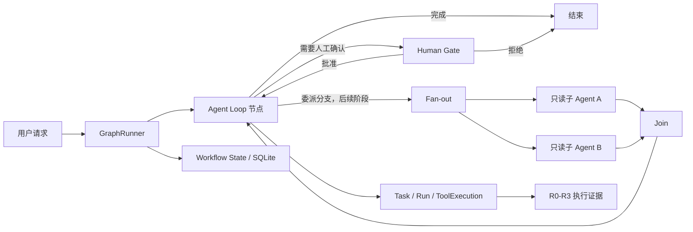
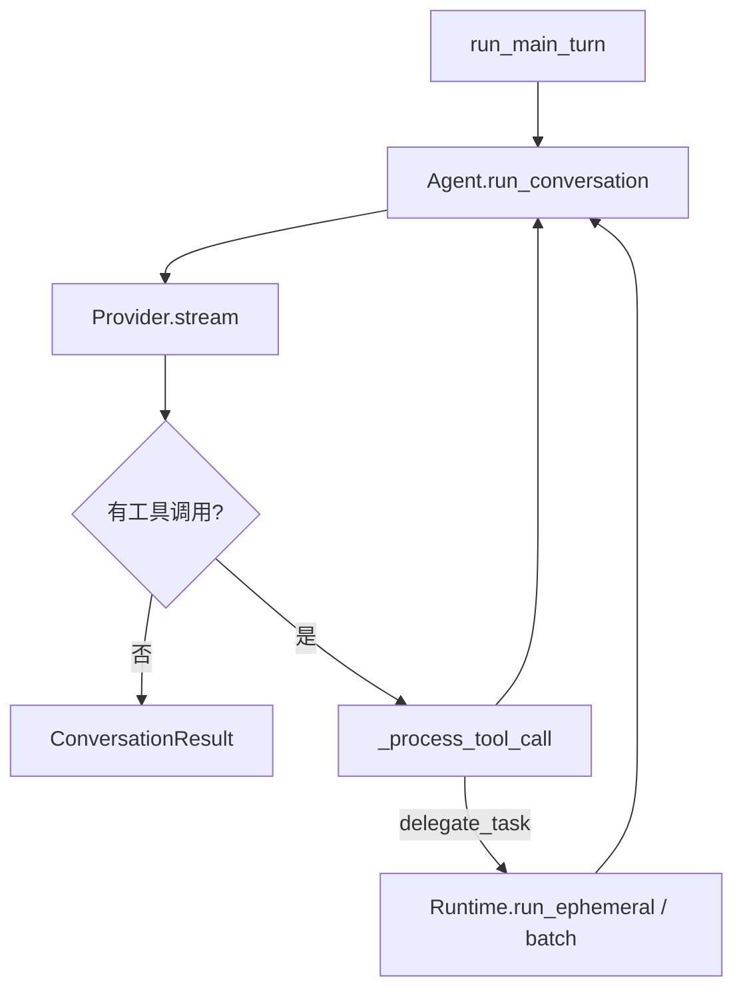
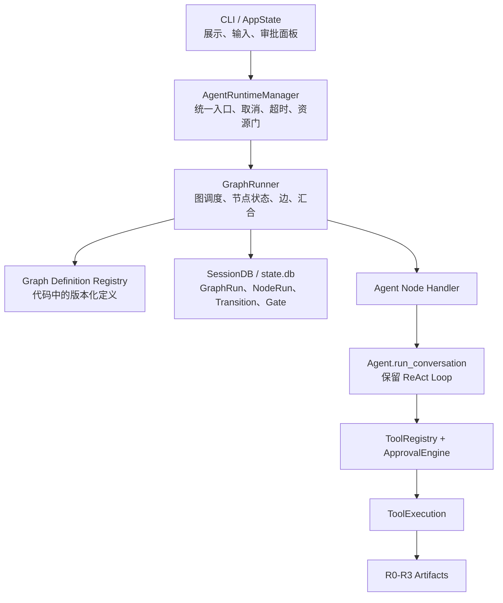
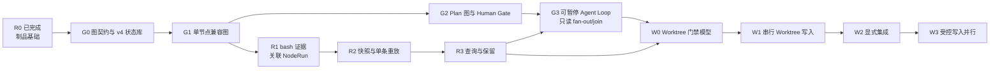
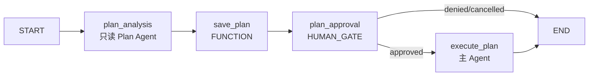

# 14 - Graph Engineering 工作流运行时开发规划

> 状态：Phase G0、G1 与 R1、R2、R3 已完成；G2、G3 及 Worktree 阶段待实施
>
> 核对基线：MiniHermes 当前代码，2026-08-13
>
> 前置文档：[11-multi-agent-runtime-roadmap.md](11-multi-agent-runtime-roadmap.md)、[12-reproducible-execution-foundation.md](12-reproducible-execution-foundation.md)、[13-worktree-write-parallelism.md](13-worktree-write-parallelism.md)
>
> 当前前置完成情况：文档 11 的 Runtime 生命周期基础已存在；文档 12 的 Phase R0-R3 已完成；本文 Phase G0、G1 已完成。本文 G2-G3 和文档 13 的 W0-W3 尚未开始。
>
> 协调规则：本文为文档 12、13 增加工作流归属和实施顺序约束。涉及节点、边、状态、审批等待或并行调度时，本文优先；涉及 bash 证据、快照、重放、Worktree、Docker 和 Git 操作时，仍以文档 12、13 为准。

## 0. 文档用途

本文定义 MiniHermes 从“代码中隐式串行流程”逐步演进到 Graph Engineering 的开发路线。

它不是把项目改造成一个可任意拖拽节点的低代码平台，也不是要求引入 LangGraph。目标是把本项目已经具备的 Agent、工具、审批、状态管理和受控制品能力，提升为一个**可观察、可恢复、可验证的工作流编排层**。

后续涉及多 Agent、并行、人工审批、失败返工、Worktree 写入和集成的改动，必须以本文为准。实现前如发现本文与真实代码不一致，应先更新本文和测试，再修改运行时；不能靠在现有循环中继续追加零散 `if` 来绕过流程边界。

本文的决策标记：

| 标记 | 含义 |
| --- | --- |
| 固定 | 生命周期、安全边界、状态所有权和兼容性规则，实施时不得悄悄改变。 |
| 暂定 | 数值、数据字段的展示方式、内部函数拆分，可根据测试调整。 |
| 门禁 | 只有满足前置验收后才能开启的能力，例如并行写入、自动恢复。 |

---

## 1. 结论和边界

### 1.1 要解决的问题

当前项目已经能完成单 Agent 的 ReAct 循环，也能临时委派子 Agent。它的问题不在于“不能执行”，而在于复杂任务的流程关系仍隐含在 Python 调用栈中：

```text
Agent.run_conversation()
  -> Provider 返回 tool_calls
  -> Agent 逐个执行工具
  -> 如果工具是 delegate_task，则 Runtime 启动临时子 Agent
  -> 子 Agent 返回文本结果
  -> 回到同一个主 Agent 循环
```

这套机制能处理普通任务，但不能清楚表达以下事实：

1. 哪些步骤是独立节点，哪些只是同一节点内部的工具调用。
2. 某个节点完成后究竟为什么进入下一节点。
3. 多个子任务是否同时开始，何时汇合，哪个分支失败后需要返工。
4. 用户审批等待在流程中的位置，以及进程重启后如何安全恢复等待状态。
5. 某条测试日志、快照和工具调用属于图中的哪一个执行节点。

Graph Engineering 要补的是这些“节点之间”的调度问题；它**不替代**单个 Agent 内部的 ReAct Loop。

### 1.2 目标形态



这张图表达的是最终能力，不表示所有节点会在第一阶段同时出现。第一个真正启用的图只有：

```text
START -> agent_loop -> END
```

它的作用是先证明“图运行时包住现有主 Agent 后，行为完全不变”。只有这个最小闭环稳定后，才引入 Plan 审批、分支、汇合和 Worktree。

### 1.3 明确不做的事

以下内容不属于本文首版范围：

1. 不引入 LangGraph、Celery、消息队列、第二个数据库或分布式调度器。
2. 不允许模型在运行时任意创建节点、执行任意 Python 回调或修改图定义。
3. 不把每一个 token、每一轮 reasoning、每一次普通工具调用都建成图节点。
4. 不替换 `Provider`、`ToolRegistry`、`ApprovalEngine`、`ContextCompressor`、Skills、Memory 或 SessionDB。
5. 不在 Graph 阶段提前放开写入类子 Agent 并行；写入并行仍严格受文档 13 的 Worktree 门禁控制。
6. 不自动恢复或重放被中断的写入节点；恢复必须有明确的节点状态、输入证据和用户入口。
7. 不让图调度器绕过 HARDLINE、工具权限白名单或用户审批。

---

## 2. 真实系统基线与映射

### 2.1 当前项目已有的基础

当前代码并非从零开始。下面是可直接复用的真实模块：

| 现有能力 | 真实位置 | 图运行时中的定位 | 是否替换 |
| --- | --- | --- | --- |
| 主 Agent ReAct Loop | `agent/agent.py:Agent.run_conversation()` | `agent_loop` 节点内部执行器 | 不替换 |
| Agent 生命周期、取消、超时 | `agent/runtime.py:AgentRuntimeManager` | GraphRunner 的 Agent 节点执行后端 | 重构职责，不删除 |
| `Task / Run / Event` | `session/db.py` | Agent 节点自身的执行审计 | 不替换 |
| `ToolExecution` | `session/db.py`、`tools/registry.py` | Agent 节点内部的工具审计 | 不替换 |
| 只读 Delegate 批次并行 | `Agent._run_delegate_batch()`、`run_delegate_batch()` | 后续 fan-out 的临时前身 | 逐步改造 |
| 工具白名单和参数约束 | `tools/registry.py:ToolAccessPolicy` | 节点工具权限的执行层约束 | 不替换 |
| 工具审批 | `approval/engine.py`、`cli/approval.py` | 工具级审批，仍在工具执行链中 | 不替换 |
| Plan 分析与确认 | `cli/conversation.py:_execute_plan_mode()` | 后续第一个 Human Gate 工作流 | 逐步迁移 |
| CLI 会话和 UI 状态 | `cli/state.py`、`cli/conversation.py` | 展示/输入层，不是图状态来源 | 不替换 |
| R0 制品根和执行记录 | `agent/reproducibility.py`、`session/db.py` | 后续节点日志、快照的证据基础 | 不替换 |

### 2.2 当前有哪些“隐含图”

当前实现已经有节点和跳转，只是它们没有作为一等对象保存：



这里的 `B -> C -> D -> F -> B` 是单个 Agent 的 ReAct 自循环。它应继续留在 Agent 节点内部，不需要被拆成大量图节点。

当前 `agent_runs.parent_run_id` 也不是图中的“依赖边”。它只说明哪个 Run 创建了哪个 Run，不能表达“后端、前端、测试均成功后才允许集成”这样的汇合条件。

### 2.3 当前缺失的能力

| 图概念 | 当前情况 | 必须补充的内容 |
| --- | --- | --- |
| 图定义 | 没有 | 版本化、代码所有的节点和边定义。 |
| 节点运行 | 只有 Agent Run | `NodeRun`，可表示 Agent、普通函数、等待人工确认、Join 等。 |
| 显式边 | 散落在 `if`、循环和函数调用中 | 可审计的 transition，记录哪条边、什么理由、从哪里到哪里。 |
| 图状态 | 分散于 AppState、Agent、DB、文件 | 一个受限、可持久化、结构化的 Workflow State。 |
| 图恢复 | 只有 Agent Run 启动时标记中断 | 已完成节点保持结果，等待节点可重新展示，符合条件时创建新尝试。 |
| 分支/汇合 | 仅支持纯 `delegate_task` 批次的有限并行 | 显式 fan-out、join、分支结果和失败返工。 |

---

## 3. 固定设计原则

### 3.1 两层职责，不能混淆

```text
GraphRunner：节点之间
  - 创建节点、选择边、并行资格、等待/恢复、汇合、状态检查点。

Agent Loop：节点内部
  - 理解任务、调用模型、调用工具、根据工具结果继续思考、输出结果。
```

GraphRunner 不替 Agent 决定每一步要调用什么普通工具；Agent 也不直接在运行栈中决定并行写入、人工流程或跨节点汇合。

### 3.2 图定义由代码拥有

首版工作流定义写在受版本控制的 Python 代码中，而不是由模型生成 JSON/YAML 后直接执行。

原因：

1. 节点是否可写、可并行、需要审批，是安全策略，不是语言模型可自由决定的内容。
2. 可测试的图必须有稳定的 `workflow_id`、版本、节点 ID 和边 ID。
3. 模型可在一个受限节点内给出“路由建议”，但 GraphRunner 必须只从预注册的目标中选择。

将来如果需要用户自定义工作流，应另行设计签名、权限、校验和隔离；本文不提前开放。

### 3.3 状态必须是结构化、受限和可检查的

Graph State 不保存完整聊天历史、完整 reasoning、API Key、原始环境变量或完整工具日志。它只保存后续节点真正需要的结构化摘要和引用 ID。

固定状态骨架：

```json
{
  "schema_version": 1,
  "root": {
    "task_id": "...",
    "conversation_id": "...",
    "session_id": "..."
  },
  "routing": {},
  "node_outputs": {},
  "branches": {},
  "gates": {},
  "artifacts": {},
  "usage": {
    "prompt_tokens": 0,
    "completion_tokens": 0,
    "reasoning_tokens": 0
  },
  "errors": []
}
```

字段规则：

- `node_outputs` 按 `node_run_id` 或稳定 `node_id + branch_key` 命名空间写入，兄弟分支不得覆写彼此内容。
- `artifacts` 只保存 `execution_record_id`、`snapshot_id`、受控相对路径、计划文件路径及哈希等引用；不内嵌大文件。
- `usage` 由 GraphRunner 从关联 `AgentRun` 汇总，不信任模型自行报告的数字。
- `errors` 只保存脱敏代码、摘要和引用，不保存完整异常栈或密钥。
- 每次节点完成、暂停、失败、取消或选择边后，都在短事务内持久化最新状态版本。

首版状态序列化上限暂定为 64 KiB。超过上限时，节点必须将大内容写为受控制品或既有会话/计划文件引用，并把状态降级为引用；不得静默截断后假装完整。

### 3.4 边必须优先确定性

边分为三类：

| 类型 | 例子 | 首版策略 |
| --- | --- | --- |
| 固定边 | `plan_analysis -> save_plan` | 直接执行。 |
| 条件边 | `human_gate` 批准/拒绝后进入不同目标 | 读取受控状态字段，由代码判断。 |
| 模型决策边 | 内容路由给不同研究节点 | 暂不启用；后续也只能在有限候选中选择。 |

固定规则：能通过退出状态、测试结果、审批结果、白名单、预算和配置判断的边，必须由代码判断，不能交给模型猜。

### 3.5 一个节点只承担一个可验证职责

好的节点可以独立测试、替换和审计。以下是本项目允许的节点类别：

| 节点类别 | 例子 | 是否关联 AgentRun |
| --- | --- | --- |
| `AGENT` | 主 Agent Loop、Plan Agent、Delegate Agent | 是 |
| `FUNCTION` | 保存计划文件、校验汇合结果、计算确定性路由 | 否 |
| `HUMAN_GATE` | 批准 Plan、批准 Worktree 集成 | 否 |
| `JOIN` | 等待所有分支，并汇总状态 | 否 |

普通 `bash`、`read_file`、`write_file` 等仍是 `AGENT` 节点内部的工具调用。它们已有 `ToolExecution`，不在首版重复包装为图节点。

### 3.6 默认安全，不能因图而扩大权限

1. 每个 `AGENT` 节点都必须携带现有 `AgentSpec` 和 `ToolAccessPolicy`。
2. 节点权限由 Runtime/Registry 执行层强制，不依赖系统提示。
3. `ApprovalEngine` 仍负责具体工具调用前的 HARDLINE 和敏感操作检查。
4. `HUMAN_GATE` 是工作流级确认，不等于放行某个危险工具，不能替代工具审批。
5. 未知节点、未知边、未知状态版本、未知权限策略一律失败关闭。
6. 并行资格由 Runtime 根据有效工具集合和未来 Worktree lease 判断，模型不能声明“我这个任务安全”。

---

## 4. 目标架构与状态所有权



状态所有权固定如下：

| 对象 | 唯一所有者 | 说明 |
| --- | --- | --- |
| 工作流定义 | `GraphDefinitionRegistry` | 静态代码定义和版本校验。 |
| GraphRun / NodeRun / Transition / Gate | `GraphRunner` + `SessionDB` | GraphRunner 发起合法状态迁移，SQLite 是事实来源。 |
| Agent Task / Run / Event | `AgentRuntimeManager` + `SessionDB` | GraphRunner 通过 Runtime 创建/等待 Agent 节点，不能私自伪造 AgentRun。 |
| 工具权限与工具结果 | `ToolRegistry` | GraphRunner 只传入节点上下文和策略。 |
| 工具审批 | `ApprovalEngine` + CLI 审批 UI | 继续保持现有机制。 |
| 工作流级人工确认 | `GraphRunner` + `workflow_gates` + CLI | 与工具级审批分开。 |
| 终端展示 | Renderer / AppState | 只显示，不作为状态来源。 |
| 代码日志/快照制品 | R0 的 `ArtifactStore` | 后续通过 NodeRun 引用，不复制到图状态。 |

`AgentRuntimeManager` 不会被删除。它会从“既管理 Agent 生命周期、又逐渐散落流程决定”的位置，收敛为 GraphRunner 的运行后端：负责创建 AgentRun、提供线程池/Provider limiter、取消传播、超时和资源门。

---

## 5. 领域模型

### 5.1 GraphDefinition

图定义是不可变的 Python 数据结构，至少包含：

```python
WorkflowDefinition(
    workflow_id="main_turn_v1",
    version=1,
    nodes=(...),
    edges=(...),
    start_node_id="agent_loop",
)
```

每个 `NodeDefinition` 的固定字段：

| 字段 | 说明 |
| --- | --- |
| `node_id` | 稳定、唯一、仅 ASCII 标识符，例如 `agent_loop`。 |
| `kind` | `AGENT`、`FUNCTION`、`HUMAN_GATE`、`JOIN`。 |
| `handler_id` | Runtime 内注册的处理器 ID，不存储任意可调用对象。 |
| `tool_policy_ref` | 对 `Agent` 节点使用的现有 ToolAccessPolicy 来源。 |
| `approval_mode` | Agent 节点的工具审批模式；Human Gate 不使用它。 |
| `input_contract` / `output_contract` | 允许读写的结构化状态字段。 |
| `retry_policy` | 默认 `max_attempts=1`，禁止隐式自动重试。 |
| `parallel_class` | `serial`、`read_only_parallel`、未来 `worktree_write`。 |

每个 `EdgeDefinition` 的固定字段：

| 字段 | 说明 |
| --- | --- |
| `edge_id` | 稳定唯一 ID，例如 `plan_approved`。 |
| `source_node_id` / `target_node_id` | 静态起点和终点。 |
| `rule` | `ALWAYS`、`OUTCOME_EQUALS`、`STATE_EQUALS`。 |
| `expected_value` | 条件边允许的受控值。 |
| `priority` | 同一来源有多条候选边时的确定性排序。 |

注册时必须验证：所有节点和边 ID 唯一、所有边端点存在、存在且只有一个起点、所有非终端节点有出口、没有未声明的循环、每个循环都有明确预算或重试上限。

首版允许 `agent_loop -> agent_loop` 作为 Agent 内部继续执行的概念描述，但不会把每次普通工具调用转成真实的 Graph transition。

### 5.2 GraphRun

`GraphRun` 是一张定义图的一次真实执行。它不等同于 AgentRun：

- `GraphRun` 记录整个流程是否等待审批、完成、失败或中断。
- `AgentRun` 记录某个 Agent 节点的一次模型运行。
- 一个 GraphRun 可以包含零个、一个或多个 AgentRun。
- 一个 AgentRun 在首版只属于一个 NodeRun；普通工具仍挂在此 AgentRun 下。

GraphRun 状态：

```text
QUEUED -> RUNNING
RUNNING -> SUCCEEDED | FAILED | CANCELLED | TIMED_OUT | INTERRUPTED
RUNNING -> WAITING_HUMAN -> RUNNING
```

规则：

1. 终态 GraphRun 永不重新打开；“继续”必须创建新的 NodeRun attempt，并通过审计事件说明来源。
2. `WAITING_HUMAN` 不是失败，不占用 Agent 线程或 Provider 并发槽位。
3. 进程启动时，遗留的 `RUNNING` GraphRun 必须标为 `INTERRUPTED`，不能自动重跑。
4. 遗留的 `WAITING_HUMAN` 保持等待，可由用户显式恢复并再次展示确认内容。

### 5.3 NodeRun

NodeRun 是某个节点在某个分支的一次尝试。

```text
PENDING -> RUNNING -> SUCCEEDED
                   -> FAILED
                   -> CANCELLED
                   -> TIMED_OUT
                   -> WAITING_HUMAN
                   -> WAITING_CHILDREN
PENDING -> SKIPPED
WAITING_HUMAN -> RUNNING（用户对 Gate 作出响应）
WAITING_CHILDREN -> RUNNING（全部子节点已汇合）
RUNNING / WAITING_CHILDREN -> INTERRUPTED（启动恢复时）
```

说明：

- `WAITING_CHILDREN` 只在后续 Graph-native Delegate 阶段用于可暂停的 Agent Loop 节点。
- `SKIPPED` 用于条件边没有选中该节点，不当作失败。
- 每次重试或恢复使用新的 `attempt`，旧 NodeRun 永远保留原终态。
- NodeRun 如关联 Agent，则保存 `agent_task_id` 和 `agent_run_id`；如为 FUNCTION、JOIN、HUMAN_GATE，则二者为空。

### 5.4 Transition

每一次真实的节点派发、边选择、结束和拒绝，都记录为 Transition：

```text
from_node_run_id
edge_id（正常边或保留值 `__end__`）
to_node_run_id 或 END
reason_code
state_version
created_at
```

Transition 是图中的“边”的运行记录，不用 `parent_run_id` 冒充。它必须告诉用户：

```text
计划分析完成
  --[plan_saved]-->
等待计划审批
  --[user_approved]-->
执行批准后的计划
```

### 5.5 Workflow Gate

`HUMAN_GATE` 的持久化请求单独记录，至少包含：

```text
gate_id
workflow_run_id
node_run_id
gate_kind
status: WAITING / APPROVED / DENIED / CANCELLED / EXPIRED
request_summary
artifact_refs
requested_at / responded_at
response_summary
```

它用于 Plan 审批和未来 Worktree 集成审批。不能复用 `ApprovalEngine` 的 session allowlist，因为两类确认的含义不同：

- `ApprovalEngine`：是否允许执行某一个敏感工具动作。
- `Workflow Gate`：是否允许工作流沿某一条业务边继续。

---

## 6. 持久化设计和迁移

### 6.1 不新建数据库

所有工作流状态继续存放在 `~/.minihermes/state.db`。在 R0 的 schema v3 基础上，Graph 基础阶段增加 **v4 增量迁移**，不重建也不删除 `sessions`、`agent_tasks`、`agent_runs`、`tool_executions`、`workspace_snapshots` 或 `execution_records`。

建议表结构如下，字段细节可在实施时微调，但关系和状态语义固定：

```sql
CREATE TABLE workflow_runs (
    workflow_run_id TEXT PRIMARY KEY,
    root_task_id TEXT NOT NULL REFERENCES agent_tasks(task_id),
    root_agent_run_id TEXT REFERENCES agent_runs(run_id),
    workflow_id TEXT NOT NULL,
    workflow_version INTEGER NOT NULL,
    definition_snapshot_json TEXT NOT NULL,
    conversation_id TEXT,
    status TEXT NOT NULL,
    state_json TEXT NOT NULL,
    state_version INTEGER NOT NULL DEFAULT 0,
    pause_reason TEXT,
    completion_reason TEXT,
    error_code TEXT,
    error_message TEXT,
    created_at REAL NOT NULL,
    started_at REAL,
    finished_at REAL
);

CREATE TABLE workflow_node_runs (
    node_run_id TEXT PRIMARY KEY,
    workflow_run_id TEXT NOT NULL REFERENCES workflow_runs(workflow_run_id)
        ON DELETE CASCADE,
    node_id TEXT NOT NULL,
    branch_key TEXT NOT NULL DEFAULT 'main',
    attempt INTEGER NOT NULL DEFAULT 1,
    node_kind TEXT NOT NULL,
    status TEXT NOT NULL,
    input_state_version INTEGER NOT NULL,
    output_state_version INTEGER,
    agent_task_id TEXT REFERENCES agent_tasks(task_id),
    agent_run_id TEXT REFERENCES agent_runs(run_id),
    output_summary_json TEXT NOT NULL DEFAULT '{}',
    error_code TEXT,
    error_message TEXT,
    created_at REAL NOT NULL,
    started_at REAL,
    finished_at REAL,
    UNIQUE(workflow_run_id, node_id, branch_key, attempt)
);

CREATE TABLE workflow_transitions (
    transition_id INTEGER PRIMARY KEY AUTOINCREMENT,
    workflow_run_id TEXT NOT NULL REFERENCES workflow_runs(workflow_run_id)
        ON DELETE CASCADE,
    from_node_run_id TEXT REFERENCES workflow_node_runs(node_run_id)
        ON DELETE SET NULL,
    to_node_run_id TEXT REFERENCES workflow_node_runs(node_run_id)
        ON DELETE SET NULL,
    edge_id TEXT NOT NULL,
    reason_code TEXT NOT NULL,
    state_version INTEGER NOT NULL,
    created_at REAL NOT NULL
);

CREATE TABLE workflow_gates (
    gate_id TEXT PRIMARY KEY,
    workflow_run_id TEXT NOT NULL REFERENCES workflow_runs(workflow_run_id)
        ON DELETE CASCADE,
    node_run_id TEXT NOT NULL UNIQUE REFERENCES workflow_node_runs(node_run_id)
        ON DELETE CASCADE,
    gate_kind TEXT NOT NULL,
    status TEXT NOT NULL,
    request_summary TEXT NOT NULL,
    artifact_refs_json TEXT NOT NULL DEFAULT '[]',
    response_summary TEXT,
    requested_at REAL NOT NULL,
    responded_at REAL
);
```

索引至少覆盖：`workflow_runs(conversation_id, created_at)`、`workflow_runs(status, created_at)`、`workflow_node_runs(workflow_run_id, status)`、`workflow_node_runs(agent_run_id)`、`workflow_transitions(workflow_run_id, transition_id)`、`workflow_gates(status, requested_at)`。

### 6.2 与 R0 执行证据的关系

R0 已建立 `workspace_snapshots` 和 `execution_records`。G0 完成 v4 后，后续 R1 必须以 **v5 增量迁移** 为 `execution_records` 增加可空 `node_run_id`：

```text
execution_records.node_run_id -> workflow_node_runs.node_run_id
```

规则：

1. 历史记录保持 `NULL`，不得为了“补图”伪造旧 NodeRun。
2. Graph 模式下新产生的 `bash` 证据必须关联当前 Agent NodeRun。
3. Runtime 必须验证 `execution_records.run_id == workflow_node_runs.agent_run_id`，防止把 A 节点日志挂到 B 节点。
4. `reproducibility_status` 和 `artifact_status` 的语义不因图而改变。

### 6.3 状态更新原子性

一个节点完成后的最小事务顺序：

```text
节点完成并写好外部制品
  -> 验证 NodeRun 仍处于合法非终态
  -> 合并受限状态补丁，state_version + 1
  -> 写 NodeRun 终态和 output_summary
  -> 创建 Transition 与下游 PENDING NodeRun（或 Gate）
  -> 更新 WorkflowRun 最新 state_json / status
  -> 提交事务
```

若在制品写入前崩溃，NodeRun 和 Execution Record 必须保持 `INCOMPLETE`/`RUNNING`，启动恢复后标为 `INTERRUPTED`，不能显示为成功。

若在事务后崩溃，所有状态已经能从 SQLite 一致读出；GraphRunner 不通过扫描目录猜测执行成功。

### 6.4 状态补丁和并发合并

首版不支持任意 JSON Patch 或节点直接写整个状态对象。节点只能返回经类型校验的 `NodeResult`：

```python
NodeResult(
    outcome="success | failure | approved | denied | waiting",
    output_summary={...},
    artifact_refs=[...],
    route_key="...",
)
```

GraphRunner 将其写入该 NodeRun 专属命名空间后，再由定义中声明的 JOIN/FUNCTION 节点读取。这样并行分支不会因为共享可变字典而发生“最后写入者覆盖前一个结果”。

---

## 7. 运行和安全语义

### 7.1 取消、超时和失败

GraphRunner 必须复用 `AgentRuntimeManager` 的取消链：

```text
用户 /cancel 或 Ctrl+C
  -> WorkflowRun 请求取消
  -> 当前 NodeRun 标记取消请求
  -> 关联 AgentRun.cancel_event
  -> Agent / Provider / ToolRegistry 协作停止
  -> 未开始的节点标记 CANCELLED
  -> 已完成节点和制品保留
```

规则：

- 父 GraphRun 取消会传播给全部活动子节点。
- 单一分支失败默认只使该分支失败；是否终止全图由图定义中的显式失败边决定。
- 单一节点超时只由该节点自身或父 GraphRun deadline 判定，不能取消无关 GraphRun。
- 无自动“从头重跑”或“自动回滚文件”的行为。
- 工具调用已经写入 assistant message 时，现有“一一补齐 tool result”的不变量继续成立。

### 7.2 重试和返工

工具重试、Agent 节点重试、图返工是三件不同的事：

| 类型 | 所属层 | 默认策略 |
| --- | --- | --- |
| Provider 网络重试 | Provider 内部 | 保留现有指数退避和 attempt 记账。 |
| 工具重试 | ToolRegistry/retry | 保留当前只读网络工具策略；`bash` 仍不自动重试。 |
| 节点重试 | GraphRunner | 默认禁止，必须是图定义声明的有限次数。 |
| 返工 | Graph 边 | 测试失败后回到指定修复节点，创建新 NodeRun attempt。 |

不能因为 GraphRunner 看见失败，就再次执行可能有副作用的节点。尤其在 Worktree 阶段，返工必须保留失败候选、diff 和日志。

### 7.3 并行资格

当前项目已实现的并行仅限于：同一轮中全部为 `delegate_task`、且每个子 Agent 有明确只读安全工具白名单的批次。

GraphRunner 不能放宽这条规则。首版并行资格：

```text
node.parallel_class == read_only_parallel
AND ToolAccessPolicy 有明确 include 白名单
AND effective_tools 全部属于 PARALLEL_SAFE_DELEGATE_TOOLS
AND 节点不使用 shared mutable state 工具
AND 父 GraphRun 未取消/超时
```

未来 `worktree_write` 只有在文档 13 的 Docker strict runner、lease、写入范围、集成和恢复门禁全部满足后，才可成为第二种并行资格。没有 Docker 或 lease 时，显式写入并行请求必须失败关闭，绝不降级为共享主工作区并行 Shell。

### 7.4 Graph 恢复

恢复能力按风险分层：

1. **G1**：启动时把遗留 `RUNNING` 图和节点登记为 `INTERRUPTED`，只支持查看，不自动恢复。
2. **G2**：`WAITING_HUMAN` Gate 可重新展示，用户可批准或拒绝，不会重新跑已完成的 Plan 分析节点。
3. **G3 以后**：只对输入可从持久化消息/制品引用重建、且图定义版本仍可用的节点提供显式 `/workflow resume`。
4. **写入节点**：在 Worktree 机制稳定前，恢复只保留证据，不自动重新执行。

恢复前必须检查：图定义 ID/版本仍注册、状态 schema 可解析、输入引用可用、关联 AgentRun/制品状态一致、当前用户明确请求继续。任一条件不满足时，保留 `INTERRUPTED` 并给出原因。

---

## 8. 分阶段实施路线

### 依赖总览



这是一张依赖图，不要求同一时间并行开发多个阶段。实际执行顺序固定为：完成一阶段，实现测试和审核通过后，再进入下一阶段。

### Phase G0：图契约和持久化基础

**目标**：建立节点、边、状态、GraphRun/NodeRun 的数据模型和 SQLite v4 迁移，但不让用户请求实际走图。

**实施状态（2026-08-13）**：已完成并通过全量离线回归。已实现静态图定义/处理器标识注册、64 KiB 受限状态、v4 增量迁移、GraphRun/NodeRun/Transition/Gate 状态机、定义快照回查、乐观锁和原子节点完成事务。启动对账只把遗留运行态标为 `INTERRUPTED`；没有自动恢复、模型调用、工具执行或普通对话路径改动。

**新增/修改文件**：

| 文件 | 改动 |
| --- | --- |
| `agent/graph.py` | 新增纯数据模型：Definition、Node、Edge、NodeResult、状态验证、注册表。不得执行 Agent 或线程。 |
| `session/db.py` | 新增 v4：`workflow_runs`、`workflow_node_runs`、`workflow_transitions`、`workflow_gates` CRUD 与启动对账。 |
| `agent/runtime.py` | 仅加入 GraphRunner 的注入点/上下文类型，不改变 `run_main_turn()` 的行为。 |
| `tests/test_graph_model.py` | 纯模型验证：重复节点、悬空边、无出口、非法循环、非法状态补丁。 |
| `tests/test_graph_state_store.py` | v3 -> v4 迁移、状态机、事务、旧 Task/Run/Execution Record 查询回归。 |

**固定实现规则**：

1. 图定义必须可序列化为稳定快照，GraphRun 保存定义快照和版本。
2. 不允许节点处理器由字符串动态 import 或 `eval` 执行。
3. Workflow/Node 状态迁移必须由 `SessionDB` 方法检查，不允许任意 SQL 更新。
4. Graph 状态 JSON 必须脱敏、大小受限、可解析；不满足即拒绝创建或失败关闭。
5. `workflow_gates` 此阶段可建表但不展示 UI。

**验收门禁**：

- v1-v3 数据库迁移后，原 Session、Task、Run、ToolExecution、R0 制品记录仍可查询。
- 非法图定义在启动前被拒绝，不能拖到运行中才报错。
- 一个 NodeRun 不能跨 GraphRun、跨 branch 或跨 AgentRun 关联。
- 状态版本冲突和终态二次写入被拒绝。
- `reconcile_workflow_runs()` 只将遗留运行态标为 `INTERRUPTED`，不创建新 Agent、不执行工具。
- 所有现有 Runtime/工具/审批测试继续通过。

### Phase G1：单节点兼容图

**目标**：让每次普通用户请求真正经过 `main_turn_v1`：

```text
START -> agent_loop -> END
```

但 Agent 的 ReAct 行为、CLI 体验、消息写入、取消和预算必须与当前版本一致。

**设计**：

1. `AgentRuntimeManager.run_main_turn()` 保持对 CLI 的公开接口不变。
2. 它内部先创建 `workflow_run` 和 `agent_loop` NodeRun，再通过现有 Runtime 路径执行主 Agent。
3. `agent_loop` NodeRun 关联当前已有的主 `AgentTask` / `AgentRun`。
4. `ConversationResult` 仍原样返回给 `cli/conversation.py:_post_process()`。
5. Agent 内部普通工具调用仍留在 `Agent.run_conversation()`，不生成额外 Graph NodeRun。
6. `AgentRunContext` 增加只读的 `workflow_run_id`、`node_run_id`；`Agent` 只将它们向下传递给需要审计归属的执行层，不直接操作图状态。

**实际文件改动**：

| 文件 | 改动 |
| --- | --- |
| `agent/graph_runner.py` | 新增最小 GraphRunner，只支持串行 `AGENT -> END`。 |
| `agent/runtime.py` | 在既有主 Run 启动后、首个 Provider 调用前原子登记图；沿用统一终态收束路径。 |
| `agent/agent.py` | 保持 ReAct Loop 不拆分；非交互运行压缩时不写终端进度。 |
| `cli/conversation.py` | 不应有行为改动，仅验证返回值兼容。 |
| `tests/test_agent_runtime.py` | 覆盖正常完成、Provider 失败、预算耗尽、取消、超时、压缩换 Session、重启对账和收束事务回滚。 |

**验收门禁**：

- 普通对话的消息历史、`ConversationResult`、工具调用顺序与 Graph 接入前一致。
- 每次 Provider 调用前都已有 Task、AgentRun、WorkflowRun 和 NodeRun。
- `/agents` 仍能显示 AgentRun；新查询能从 AgentRun 反查所属 NodeRun/WorkflowRun。
- `/clear`、`/resume`、压缩创建子 Session、Ctrl+C、Provider 异常都不会留下 RUNNING GraphRun。
- 没有任何新的并发，也没有权限扩大。

**验收记录（2026-08-13）**：普通主请求已默认走 `main_turn_v1`；成功、失败、取消、预算耗尽和超时均与既有 AgentRun 状态一致。压缩后的物理 Session 会更新 AgentRun 的结束会话，但 GraphRun 始终绑定原逻辑会话。进程重启仅将遗留 AgentRun、GraphRun 和 NodeRun 标为 `INTERRUPTED`，不会重放任务。Graph 收束事务任一步失败时，Agent、Task、Graph、Node 和边的状态会整体回滚。全量离线回归：`103 passed, 2 skipped`。

### Phase R1：`bash` 证据记录接入 NodeRun

**目标**：按文档 12 实现命令、cwd、stdout/stderr、退出码、取消/超时和脱敏记录；Graph 模式下记录当前 `node_run_id`。

**为什么放在 G1 后面**：如果先做 R1，后续再增加 NodeRun 外键会产生额外迁移和归属不清。G1 已保证每个 AgentRun 都有一个实际 NodeRun，因此 R1 可以一次接对归属关系。

**固定规则**：

- 只有 `bash` 的 Execution Record 写入 `node_run_id`；普通工具不伪造执行证据。
- 记录器失败不得掩盖原命令结果，但必须留下 `evidence_capture_failed` 事件。
- `bash` 仍不自动重试。

R1 的其他设计、隐私与验收以文档 12 为准。

**实施记录（2026-08-13）**：已通过 v5 增量迁移和运行时接入实现。普通主请求的 `bash` 证据会关联 `main_turn_v1.agent_loop` 的实际 NodeRun；数据库拒绝把其他 AgentRun 的节点关联进来。审批拒绝、无效参数和执行前取消不创建伪 `bash` 证据；证据采集故障只产生 `evidence_capture_failed` 事件，不改变工具结果。当前没有 Git 快照，所以记录均为 `PARTIAL` 或 `UNAVAILABLE`，尚无重放入口。

### Phase G2：Plan 工作流和持久化 Human Gate

**目标**：将当前 `/plan` 的两段流程从 `cli/conversation.py:_execute_plan_mode()` 迁移为第一个多节点图，同时保留用户输入 `/plan <描述>` 和当前 UI 体验。

目标图：



**节点职责**：

| 节点 | 真实复用点 | 输出 |
| --- | --- | --- |
| `plan_analysis` | 现有 `AgentSpec(kind="plan")`、`PLAN_ALLOWED_TOOLS`、`DENY_SENSITIVE` | Plan Agent 的成功/失败和计划文本引用。 |
| `save_plan` | 现有 `generate_plan_path()` | `.minihermes/plans/...md` 相对路径、SHA-256、摘要。 |
| `plan_approval` | 当前 plan 审批 UI，但改为持久化 gate | 批准、拒绝或取消。 |
| `execute_plan` | 当前“Execute the following approved implementation plan”主 Agent 请求 | 既有 ConversationResult。 |

**固定规则**：

1. Plan 分析消息仍不写入主对话历史，保持文档 11 的隔离规则。
2. Plan 文件是用户可查看的结果，Graph State 只保存路径、哈希和摘要，不内嵌整份 Plan。
3. Human Gate 前进程退出后，GraphRun 保持 `WAITING_HUMAN`；重新打开时用户可通过 `/workflow resume <id>` 再看同一份哈希匹配的 Plan。
4. Plan 文件被用户修改或哈希不匹配时，拒绝自动执行，要求重新生成或用户显式新建 Plan。
5. “批准 Plan”不等于允许危险工具；执行 Plan 期间的工具仍按主 Agent `interactive` 审批。

**CLI 增量**：

```text
/workflows                 列出当前逻辑会话的 GraphRun
/workflow <workflow_run_id> 查看节点、边、状态摘要和 Gate
/workflow resume <id>      仅恢复等待 Gate 或明确可恢复的节点
/workflow cancel <id>      请求取消整个 GraphRun
```

`/plan` 保持为主入口；`/workflows` 只是可观察和恢复入口，不要求用户学习图概念才能使用计划功能。

**验收门禁**：

- `/plan` 的只读工具限制、拒绝敏感操作、计划保存和确认后执行行为与当前一致。
- 取消 Plan 分析、拒绝 Plan、审批等待时退出、重新展示 Gate 都有明确终态/状态。
- 已批准且 Plan 文件哈希未变时只执行一次；重复点击或重复恢复不能创建两次执行节点。
- 主会话历史中只有批准后的执行请求，不包含 Plan Agent 的推理过程。
- 工具审批与 Workflow Gate 分别测试，互不绕过。

### Phase R2 / R3：快照、重放、查询与保留

按文档 12 完成 Git 快照、单条重放、`/agent`/`/artifacts` 查询和保留策略。

Graph 侧增加的要求：

1. `/workflow <id>` 能显示节点关联的 AgentRun、ToolExecution 和 Execution Record 引用，但不直接打印完整日志。
2. `/replay` 产生的新 Execution Record 必须指向新 NodeRun 或明确标注为非工作流重放，不能修改旧节点的历史终态。
3. 清理制品后，NodeRun 仍显示历史结果，但对应制品状态为 `PURGED`，不可被误展示为可重放。

R2/R3 未完成前，不进入任何写入并行或 Worktree 实施。

### Phase G3：可暂停 Agent Loop 与只读 fan-out / join

**目标**：将当前“同一模型响应中纯 `delegate_task` 批次才可能并行”的隐式路径，升级为可观察的图分支：

```text
agent_loop
  -> delegate_branch[A]
  -> delegate_branch[B]
  -> join_delegates
  -> 同一个 agent_loop 继续
```

这是 Graph Engineering 中风险最高的 Agent 改造之一，不能用“开几个线程然后 join”冒充完成。当前 `Agent.run_conversation()` 是一个连续函数调用，想让它在委派处暂停后继续，必须先提取可持久化的 Loop 检查点。

**必要改造**：

1. 将 `Agent.run_conversation()` 内“单次 Provider 响应 + 消息配对 + 工具批次处理”的部分提取为可测试的 step/continuation 边界。
2. 当发现一批全为 `delegate_task` 的调用时，持久化 assistant tool_calls、当前运行上下文引用、待处理 call ID 顺序，NodeRun 进入 `WAITING_CHILDREN`。
3. GraphRunner 为每个 delegate 创建独立 NodeRun 与已有 Runtime 管理的临时 AgentRun。
4. Join 仅在所有分支到达终态后运行，并按原始 tool call 顺序把每条结果写回主 Agent 消息历史，保证 Provider tool-call/result 配对。
5. 主 Agent Loop 从检查点继续，而不是重新向模型发送一份丢失工具结果的历史。

**并行限制**：

- 只支持满足当前 `is_parallel_safe_delegate_policy()` 的明确只读白名单。
- `delegate_task` 与 `write_file`、`bash` 等混合调用继续串行，保持现有行为。
- 同一分支失败时，Join 将结构化失败结果回传主 Agent；其他成功分支不重跑。
- 仍不允许子 Agent 再委派，仍禁用 `clarify`。

**恢复限制**：

在进程重启后，已完成分支可复用其结果；运行中的 Delegate Run 由现有对账标为 `INTERRUPTED`。只有能从已保存 assistant tool_calls 和受控输入引用重建的分支才允许显式重新尝试。不能重建时，Join 返回明确的 `INTERRUPTED` 结果给主 Agent，不能凭空续跑。

**验收门禁**：

- 两个只读 Delegate 的确可并发，结果按父 tool-call 原顺序回写。
- 一个分支超时/取消/失败不破坏另一个分支的 NodeRun、日志和最终结果。
- 父 Run 取消传播给全部子节点，且每个已声明工具调用都有最终 tool result。
- 混合工具调用不并发；未知工具、空白名单、共享状态工具不并发。
- 中断恢复不重复执行已完成只读节点，不丢失已完成结果。

### Phase W0-W3：Worktree 写入节点

当且仅当文档 12 的 R0-R3 和本文 G3 均通过后，才按文档 13 实施 Worktree。

本文对文档 13 的补充约束：

| Worktree 阶段 | 图中的表达 |
| --- | --- |
| W0 | `FUNCTION` 门禁节点：Git 健康、write_scope、Docker runner 配置校验。 |
| W1 | `AGENT` 写入节点绑定一个 Worktree lease；默认写入并发为 1。 |
| W2 | `HUMAN_GATE` 集成审批 -> `FUNCTION` 集成验证/合并节点。 |
| W3 | 只有多个 `worktree_write` 分支各自 lease/范围均有效时，允许 fan-out；最终合并仍串行。 |

GraphRunner 不自行拼 Git 命令，也不让 Agent 直接调用主机 Git 生命周期命令。所有 Worktree 创建、差异审计、集成、丢弃与恢复仍由文档 13 中的 `WorkspaceManager` 统一负责。

---

## 9. 首批内置工作流

为避免一开始出现大量抽象但没有真实用途，首批只注册以下定义：

| workflow_id | 版本 | 用途 | 启用阶段 |
| --- | --- | --- | --- |
| `main_turn_v1` | 1 | 包住当前普通主 Agent 请求 | G1 |
| `plan_execute_v1` | 1 | 分析 -> 保存 -> 人工确认 -> 执行 | G2 |
| `delegate_readonly_v1` | 1 | 可暂停主 Loop 的只读分支/汇合 | G3 |
| `worktree_write_v1` | 1 | Worktree 候选修改和后续集成 | W1 以后 |

不预先创建 explorer、researcher、editor、verifier 等常驻角色。角色是否需要独立 AgentSpec，应由真实的工作流节点、工具白名单、审批模式和输入/输出契约决定，而不是先堆名词。

---

## 10. 查询和用户交互

### 10.1 查询层级

用户需要能从高层到低层定位问题：

```text
/workflows
  -> WorkflowRun：整体进度、当前节点、等待原因、总 token
  -> /workflow <id>
     -> NodeRun：每个节点状态、分支、开始/结束时间、错误摘要
     -> AgentRun：已有 /agent <run_id>
     -> ToolExecution / ExecutionRecord：已有工具和制品证据
```

`/agents` 不应被删除。它继续是“Agent 跑了什么”的视图；`/workflows` 是“整个流程跑到哪”的视图。

### 10.2 CLI 展示原则

- 默认展示节点名、状态、分支、耗时、错误摘要、等待原因和制品 ID。
- 默认不显示完整 prompt、reasoning、环境变量、完整日志或模型 API Key。
- GraphRun 等待审批时，界面只显示当前一个 Gate；同一逻辑会话不得同时弹出互相竞争的多个输入面板。
- `/cancel` 继续支持 AgentRun；`/workflow cancel` 取消整个流程。CLI 必须明确用户取消的是哪一层。

---

## 11. 测试矩阵

所有图阶段必须使用 fake Agent、fake Provider、临时 SQLite、临时目录和 mock/fake runner，不依赖真实 API Key、网络、GitHub、Docker 或用户项目。

### 11.1 G0/G1 基础

1. v3 -> v4 迁移幂等，历史 Session、Task、Run、ToolExecution、R0 记录可查询。
2. 图定义的孤立节点、悬空边、重复 ID、无终点循环、未知 handler 均被拒绝。
3. NodeRun、Transition、Gate 不可跨 WorkflowRun 关联。
4. Workflow/Node 的非法状态迁移、二次完成、过期 state version 均被拒绝。
5. 主 Agent 成功、Provider 失败、预算耗尽、取消、超时的 Graph 状态与原 Run 状态正确映射。
6. 压缩导致物理 `session_id` 改变后，`conversation_id`、GraphRun 和 NodeRun 关联稳定。
7. 进程重启只标记中断，不产生新的模型调用、工具调用或写文件。

### 11.2 G2 Human Gate

1. Plan Agent 只看到计划白名单，参数级工具限制依旧生效。
2. Plan 成功但保存计划文件失败时，不能进入审批；NodeRun 明确失败。
3. 批准、拒绝、取消、重复提交、进程重启后重新展示分别可测。
4. Plan 文件哈希变化后不能执行旧批准。
5. 主历史不混入 Plan Agent 消息。
6. Plan 批准不会放宽执行阶段的工具审批。

### 11.3 G3 fan-out / join

1. 两个只读分支并行，完成顺序不同但 tool result 回写顺序稳定。
2. 分支失败、取消、超时、Provider 失败的状态、错误摘要和 Join 结果正确。
3. 父取消会取消所有活动子节点；子节点取消不误伤无关 GraphRun。
4. 混合 `delegate_task + bash`、未知工具、空 include、共享状态工具均走串行或拒绝，不出现偷跑并行。
5. 已完成分支在恢复后不再次运行；不可重建输入时给出明确中断结果。

### 11.4 与 R0-R3 / Worktree 的交叉回归

1. `ExecutionRecord.node_run_id` 与 AgentRun 一致，制品清理后图查询正确显示 `PURGED`。
2. 快照、重放和图节点之间不存在跨 Run 引用。
3. Worktree 失败、取消、范围违规、集成冲突后，GraphRun/NodeRun/lease/制品的状态一致。
4. 现有主会话、Plan、Nudge、Curator、工具权限、审批、压缩和只读 Delegate 测试全量回归。

---

## 12. 发布、回退和审核规则

### 12.1 功能开关

GraphRunner 在 G0/G1 可通过内部配置启用，但默认用户体验应保持现有行为。只有 G1 的兼容测试稳定后，才让普通主请求默认走 `main_turn_v1`。

发生问题时的回退策略：

```text
关闭新的图入口
  -> 保留已有 GraphRun/NodeRun/Transition 供排查
  -> 主请求回到已验证的 Runtime 兼容路径
  -> 不删除状态库、不修改历史 Run、不自动重试写入
```

数据库迁移不可通过“删表回退”。代码回退必须保持对 v4 及后续 schema 的只读兼容，或先提供明确迁移策略。

### 12.2 每阶段审核清单

每完成一个阶段，实施者必须以审核者视角回答：

1. 本阶段的固定不变量是否都由执行层和测试保证，而非 Prompt 约定？
2. 是否改变了普通单 Agent 的既有行为、消息顺序、审批或取消语义？
3. 是否新增了并发、写入、恢复或权限扩大？若有，是否满足前置门禁？
4. 进程崩溃时数据库、NodeRun、AgentRun、工具调用和制品是否会一致地显示“不完整”，而不是伪成功？
5. 是否出现重复状态来源、跨层直接修改或无主后台线程？
6. 是否新增了与项目现状无关的目录、框架或依赖？
7. 全套测试、目标阶段测试、迁移测试和 `git diff --check` 是否通过？

发现任何一项答案是否定的，停止进入下一阶段，先修正当前阶段。

---

## 13. 最终判断

MiniHermes 不需要把现有系统替换成 LangGraph，也不应该为了“有图”把 ReAct Loop 拆碎。正确路线是：

```text
保留 Agent Loop、Provider、工具、审批、上下文和现有 Runtime
  -> 先给一次主请求增加可持久化的 GraphRun / NodeRun / Transition
  -> 再把 Plan 的审批等待变成真正的 Human Gate
  -> 再让只读 Delegate 的 fan-out / join 有明确状态与恢复边界
  -> 最后以 R0-R3 和 Worktree lease 为基础引入受控写入并行
```

这样做后，图不是额外套在系统外面的展示层，而是用来统一解释和约束真实运行行为：谁在做事、为什么走到下一步、哪里等待、哪条分支失败、哪些结果可复用，以及哪些修改仍需要用户确认。
