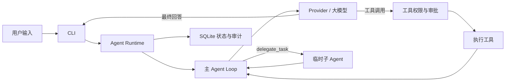

# MiniHermes

MiniHermes 是一个用 Python 编写、运行在本地终端中的 AI Agent。它通过
OpenAI 兼容接口连接大模型，让模型在对话中读取项目、修改文件、执行命令、搜索资料、
管理记忆和调用 Skills。项目重点不只是“能调用工具”，还包括工具权限、危险操作审批、
上下文压缩、会话恢复、子 Agent 生命周期、失败审计和隔离写入。

> 当前项目适合个人开发、学习 Agent 工程和本地代码辅助。普通主 Agent 仍可在宿主机上
> 执行命令和修改文件；Docker Worktree 隔离只用于显式声明为 `worktree_write` 的子 Agent，
> 不能把整个程序当作通用安全沙箱。


## 工作方式



一轮对话由主 Agent 的 ReAct 风格循环驱动：调用模型，执行模型返回的工具，再把结果交回
模型，直到模型给出最终回答、用户中断、运行超时或迭代预算耗尽。Runtime 负责登记每次
Task、Run、Event 和 Tool Execution；SQLite 负责保存会话、运行状态与审计数据。

## 主要能力

- **本地 Agent Loop**：流式输出、reasoning 展示、工具调用、迭代预算、取消和超时。
- **17 个内置工具**：文件、Shell、网页搜索与提取、浏览器打开、代码沙箱、记忆、会话搜索、
  Todo、Skills、图片生成、进程查看、用户澄清和子任务委派。
- **权限与审批**：每次 Run 冻结工具白名单；子 Agent 只能继承并缩小父 Agent 权限；
  高风险操作需要确认，硬性危险命令直接拒绝。
- **上下文管理**：token 预算、`@file:` 文件引用、HEAD/MIDDLE/TAIL 分段、工具输出裁剪、
  LLM 结构化摘要和会话压缩链。
- **会话与长期记忆**：SQLite WAL 保存历史会话，FTS5 支持全文检索；`MEMORY.md` 与
  `USER.md` 保存跨会话信息。
- **Skills**：支持用户级和项目级 Skill，包含条件激活、缓存、辅助文件、使用记录、
  安全扫描和生命周期维护。
- **多 Agent Runtime**：统一管理主 Agent、Plan Agent、Delegate 以及后台记忆/Skill
  复盘任务的状态、父子关系、截止时间和取消信号。
- **可复现执行**：为本地 `bash` 保存脱敏日志、Git 工作区快照和执行记录，可在临时副本中
  显式重放单条历史命令。
- **Worktree 隔离写入**：写入子 Agent 可在独立 Git Worktree 和无网络 Docker 容器中
  生成候选修改，验证后再由用户显式合并。

## 快速开始

环境要求：

- Python 3.11 或更高版本
- [uv](https://docs.astral.sh/uv/)
- 一个支持 OpenAI Chat Completions 与 function calling 的模型接口

```bash
git clone https://github.com/12365448949845/miniHermes.git
cd miniHermes
uv sync
uv run python main.py
```

首次启动会进入配置向导。配置文件保存在：

- Windows：`C:\Users\<用户名>\.minihermes\config.yaml`
- macOS/Linux：`~/.minihermes/config.yaml`

最少需要配置模型名称、API Key 和 OpenAI 兼容接口地址：

```yaml
model:
  name: "your-model"
  base_url: "https://your-provider.example/v1"
  api_key: "your-api-key"
```

不要把真实密钥提交到 Git。模型 API Key 只负责模型调用，不能代替下面这些独立服务的
凭据：

| 功能 | 配置项 | 是否必需 |
| --- | --- | --- |
| 大模型 | `model.name`、`model.base_url`、`model.api_key` | 必需 |
| 联网搜索 | `search.api_key`，使用 Exa | 仅使用 `web_search` 时需要 |
| 云端代码沙箱 | `code_execution.api_key`，使用 E2B 兼容服务 | 仅使用 `execute_code` 时需要 |
| 图片生成 | `image_generation.base_url` | 可选，留空使用默认服务 |

已安装项目后，也可以直接运行：

```bash
minihermes
```

## 基本使用

直接输入需求即可，例如：

```text
分析这个项目的入口和调用链
修复登录接口的参数校验，并运行相关测试
读取 @file:agent/agent.py:300-420，解释这段循环
```

`@file:` 支持整文件、单行和行范围：

```text
@file:agent/agent.py
@file:agent/agent.py:120
@file:agent/agent.py:120-180
@file:"path with spaces/example.py":10-30
```

需要先分析再执行时使用：

```text
/plan 为 Provider 增加新的错误分类
```

Plan Agent 只用受限工具分析项目并生成 Markdown 计划，计划保存在
`.minihermes/plans/`。用户批准后，计划会作为新消息交给主 Agent 执行。
生成计划不等于已经创建子 Agent；只有模型实际调用 `delegate_task`，Runtime 才会登记并
运行 Delegate。

## 常用命令

### 对话与会话

| 命令 | 作用 |
| --- | --- |
| `/help` | 查看终端内的命令说明 |
| `/clear` | 清空当前上下文并创建新会话 |
| `/compress` | 下一次模型调用前强制压缩上下文 |
| `/history` | 查看当前会话和消息数量 |
| `/sessions` | 列出最近会话 |
| `/resume [session_id]` | 恢复历史会话，并自动跟随压缩链 |
| `/title <name>` | 设置当前会话标题 |
| `/plan <需求>` | 只读分析、展示计划，批准后交给主 Agent 执行 |
| `/init` | 扫描当前项目并生成 `minihermes.md` 项目上下文 |
| `/setup` | 重新运行配置向导 |
| `/sysprompt` | 输出当前完整 system prompt，用于调试 |
| `/exit`、`/quit` | 退出程序 |

### Runtime、失败与制品

| 命令 | 作用 |
| --- | --- |
| `/agents` | 查看当前对话中的 Agent Runs |
| `/agent <run_id>` | 查看一次 Run 的状态、用量、工具和错误 |
| `/cancel <run_id>` | 请求取消指定 Run |
| `/recoveries [run_id]` | 查看失败分类和恢复决定 |
| `/recovery <recovery_id>` | 查看一条恢复记录及其证据链 |
| `/artifacts <run_id>` | 查看本地命令的日志、快照和重放状态 |
| `/artifacts retention` | 查看制品保留情况 |
| `/artifacts cleanup` | 清理已过期且未受保护的制品 |
| `/replay <record_id>` | 在临时副本中重放一条已记录的 `bash` 命令 |

### Worktree 候选

| 命令 | 作用 |
| --- | --- |
| `/worktrees` | 列出隔离写入产生的候选工作区 |
| `/worktree <workspace_id>` | 查看候选状态、写入范围和文件变更 |
| `/integrate-worktree <workspace_id>` | 验证并经过两次审批后合并候选 |
| `/discard-worktree <workspace_id>` | 校验、回滚并清理尚未合并的候选 |

按 `Ctrl+C` 可中断当前响应；`Shift+Enter` 或 `Cmd+Enter` 可在输入框中换行。
输入 `/<skill-name>` 可加载已发现的 Skill。

## 子 Agent 与并行

MiniHermes 没有预先常驻的“研究员”“程序员”“审核员”等角色。主 Agent、Plan Agent 和
Delegate 复用同一个 `Agent` 类，由 `AgentSpec` 为每次 Run 设置不同的 system prompt、
工具权限、预算、审批模式和超时。

Delegate 的规则如下：

1. 子 Agent 使用独立上下文，只接收父 Agent 明确提供的任务和背景，不复制主会话历史。
2. 子 Agent 不能再次委派，也不能向用户调用 `clarify`。
3. 工具白名单在执行层过滤，子 Agent 请求的权限必须是父 Agent 权限的子集。
4. 普通 Delegate 不能获得 `write_file` 或 `bash`；写代码必须声明
   `execution_mode=worktree_write` 和明确的 `write_scope`。
5. 只有同一次模型响应返回纯 `delegate_task` 批次，且每个任务都满足并行门禁时，任务才会
   真正并行；模型只是在 reasoning 里写“并行处理”不会触发并行。
6. 默认 `agent_runtime.max_concurrency: 1`，所以项目开箱运行时仍是串行模式。

当前默认工具集中，可用于只读并行的工具是 `read_file`、`list_dir`、`process`、
`session_search` 和 `skill_view`。未知工具、网络工具、远程沙箱、UI 工具或有副作用工具
会让整个批次回退为串行。

## Docker Worktree 写入

该功能默认关闭。启用前需要满足：

- 当前目录是至少有一次提交的 Git 仓库，主工作区干净且没有进行中的 Git 操作。
- Docker Desktop 正在运行，本地已有适合项目的镜像。
- 配置一个可在容器内执行的集成验证命令。
- 主 Agent 必须在同一次响应中实际发出符合要求的 `worktree_write` Delegate 调用。

用户配置示例：

```yaml
agent_runtime:
  max_concurrency: 2
  worktree:
    enabled: true
    max_write_concurrency: 2
    runner: "docker"
    docker_image: "your-local-image:tag"
    integration_verification_command: "uv run pytest"
```

系统最多同时执行两个写入子 Agent，更多任务保持 `QUEUED`。每个任务拥有独立 Worktree，
所以两个 Agent 可以修改同一个仓库相对路径；但候选按顺序集成到最新主分支，后集成的候选
如果与前一个候选冲突会被保留，不会强行覆盖。

容器运行时默认无网络、隐藏 Git 元数据，并限制用户、内存和进程数。子 Agent 完成后只生成
候选，不会自动修改主分支。`/integrate-worktree` 会重新验证候选，并在用户确认后串行合并。

## 可复现执行与失败处理

可复现系统当前只对本地 `bash` 建立完整证据闭环：记录命令、工作目录、脱敏后的
stdout/stderr、执行结果和命令开始前的 Git 工作区快照。`/replay` 会把快照恢复到新的临时
目录后重新执行历史命令，绝不会把主工作区当作重放目标。

失败处理遵守以下边界：

- 只有明确标记为无副作用、幂等且属于瞬时故障的调用可以自动原样重试；当前主要是
  `web_search` 和 `web_extract` 的受控网络错误。
- `bash` 非零退出、测试失败、文件不存在、缺少依赖、权限拒绝和配置错误不会盲目重试。
- 可修复错误会生成结构化恢复摘要交给现有 Agent；修复后的验证是一次新的工具执行，保留
  独立证据。
- 用户取消、审批拒绝和硬性安全拦截不会被换工具或换 Agent 绕过。
- 主工作区不会自动执行 `git reset --hard`。未合并的 Worktree 候选可通过
  `/discard-worktree` 进行归属、哈希和范围校验后安全清理。
- `execute_code`、联网搜索和图片生成属于外部服务，不在本地源码快照与重放承诺内。

## Graph Runtime 当前状态

项目已经实现 Graph 的基础数据模型和持久化结构，包括版本化 Workflow、Node、Edge、
受限 State、NodeRun、Transition 和 Gate；当前主 Agent Run 也会被映射到一个固定的单节点
工作流，用于统一登记和原子收尾。

但它目前还不是完整的可视化或通用图编排系统：Plan 的持久化 Human Gate、跨节点恢复以及
显式 fan-out/join 尚未接入日常执行链。现有 Delegate 并行仍由
`AgentRuntimeManager.run_delegate_batch()` 管理，而不是由 GraphRunner 调度。

## 项目结构

```text
main.py                  启动入口与依赖装配
agent/agent.py           主 ReAct 循环
agent/runtime.py         Task/Run 生命周期、子 Agent、取消、超时与并发
agent/graph*.py          Graph 数据模型和最小运行器
agent/reproducibility.py 本地命令证据、快照、重放与保留策略
agent/recovery.py        失败分类、恢复审计和 Worktree 撤销
agent/worktree.py        Git Worktree 门禁、候选、集成与清理
approval/                危险操作审批
context/                 token 预算和五阶段上下文压缩
provider/                OpenAI 兼容接口、流式响应与 API 重试
tools/                   工具注册、权限过滤和具体工具
session/                 SQLite 会话与 Runtime 状态存储
skills/                  Skill 发现、加载、缓存和安全检查
evolution/               记忆复盘、Skill 复盘与 Curator
cli/                     prompt_toolkit 界面、命令和 Plan 模式
renderer/                主 Agent 与子 Agent 的终端渲染
tests/                   Runtime、Graph、恢复、重放和 Worktree 测试
docs/                    架构说明与阶段开发文档
```

## 测试与构建

安装测试依赖并运行测试：

```bash
uv sync --extra test
uv run pytest
```

构建 wheel：

```bash
uv build --wheel -o dist
```

macOS、Linux 或 Git Bash 也可以运行 `bash build_wheel.sh`。

产物位于 `dist/`，可使用以下任一方式安装：

```bash
pip install dist/minihermes-*.whl
uv tool install dist/minihermes-*.whl
```

## 设计文档

- [整体架构](docs/整体架构.md)
- [Agent 调用链路](docs/01-call-chain.md)
- [上下文压缩](docs/03-context-compression.md)
- [工具系统](docs/05-tools.md)
- [会话存储](docs/09-session.md)
- [多 Agent Runtime 路线](docs/11-multi-agent-runtime-roadmap.md)
- [可复现执行](docs/12-reproducible-execution-foundation.md)
- [Worktree 写入并行](docs/13-worktree-write-parallelism.md)
- [Graph Workflow Runtime](docs/14-graph-engineering-workflow-runtime.md)
- [失败恢复与回滚](docs/15-failure-recovery-and-rollback.md)

项目当前没有单独的 `LICENSE` 文件。
