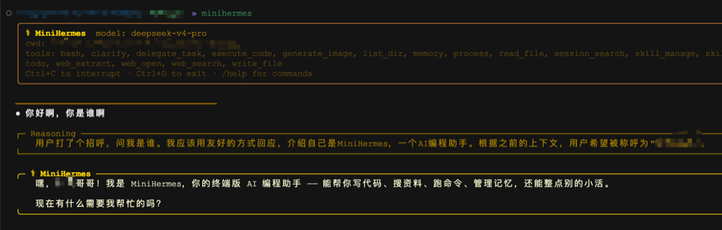

# MiniHermes

MiniHermes 是一个使用 Python 编写的本地 AI 编程助手 CLI。它支持 OpenAI
兼容接口，并提供流式对话、工具调用、上下文压缩、长期记忆、Skills、计划模式和
多 Agent 任务执行。目前主要使用 `deepseek-v4-pro` 测试。

## 快速开始

要求：Python 3.11+、[uv](https://docs.astral.sh/uv/)。

```bash
git clone https://github.com/12365448949845/miniHermes.git
cd miniHermes
uv sync
uv run python main.py
```

首次启动会进入配置向导。配置保存在 `~/.minihermes/config.yaml`，至少需要填写
模型名称、API Key 和 OpenAI 兼容接口地址。

构建并安装命令行版本：

```bash
bash build_wheel.sh
pip install dist/minihermes-*.whl
minihermes
```

## 核心能力

- **Agent Loop**：模型可以连续调用工具，直到完成任务、被中断或达到预算。
- **工具与审批**：内置 17 个工具，危险操作需要确认，硬性危险命令直接拒绝。
- **上下文与记忆**：支持 token 预算、文件引用、摘要压缩、会话恢复和跨会话记忆。
- **Skills**：支持项目级与用户级技能、条件激活、缓存、安全扫描和生命周期管理。
- **多 Agent Runtime**：统一记录主 Agent、Plan Agent、Delegate 和后台任务的状态、事件与工具执行。
- **可复现执行**：保存命令日志、工作区快照和执行证据，支持显式重放与失败审计。
- **受控并行**：只读子 Agent 可安全并行；写入子 Agent 在 Docker Worktree 中隔离运行。
- **Graph 工作流**：用节点、边和状态记录工作流执行，为后续恢复与扩展提供统一基础。

## 常用命令

| 命令 | 作用 |
| --- | --- |
| `/help` | 查看全部命令 |
| `/plan <需求>` | 只读分析、生成计划，批准后执行 |
| `/agents` / `/agent <id>` | 查看 Agent 运行状态和错误 |
| `/worktrees` / `/worktree <id>` | 查看隔离写入候选及其改动 |
| `/integrate-worktree <id>` | 验证并合并一个 Worktree 候选 |
| `/artifacts <run_id>` | 查看执行日志和制品 |
| `/recoveries <run_id>` | 查看失败分类与处理记录 |
| `/sessions` / `/resume <id>` | 查看和恢复历史会话 |
| `/setup` | 修改模型与外部服务配置 |

输入 `@file:path.py` 可以把文件内容加入当前问题；输入 `/<skill-name>` 可以加载
对应 Skill。按 `Ctrl+C` 中断当前任务，输入 `/exit` 退出。

## Worktree 并行写入

这是可选能力，不影响普通对话和主 Agent 直接工作。启用前需要：

1. Docker Desktop 正在运行，并准备好配置中的本地镜像。
2. MiniHermes 从主 Git 工作区启动，仓库至少有一次提交且当前状态干净。
3. 在用户配置中启用 `agent_runtime.worktree`，并将并发数设置为 2。

写入子 Agent 不会直接修改主工作区。系统最多同时运行两个写入任务，更多任务排队；
完成后保留候选，只有执行 `/integrate-worktree <id>` 并通过验证与审批才会合并。

## 测试

```bash
uv sync --extra test
uv run pytest
```

## 文档

详细设计见 [`docs/`](docs/)：

- [整体架构](docs/整体架构.md)
- [Agent 调用链路](docs/01-call-chain.md)
- [上下文压缩](docs/03-context-compression.md)
- [工具与审批](docs/05-tools.md)
- [多 Agent Runtime 规划](docs/11-multi-agent-runtime-roadmap.md)
- [可复现执行](docs/12-reproducible-execution-foundation.md)
- [Worktree 并行写入](docs/13-worktree-write-parallelism.md)
- [Graph 工作流](docs/14-graph-engineering-workflow-runtime.md)
- [失败恢复与回滚](docs/15-failure-recovery-and-rollback.md)

## 演示



## License

MIT
